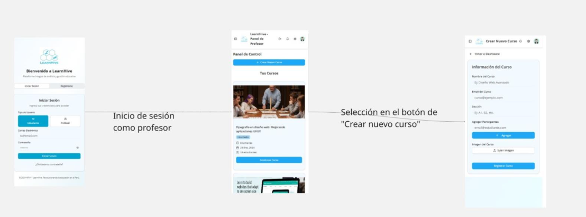
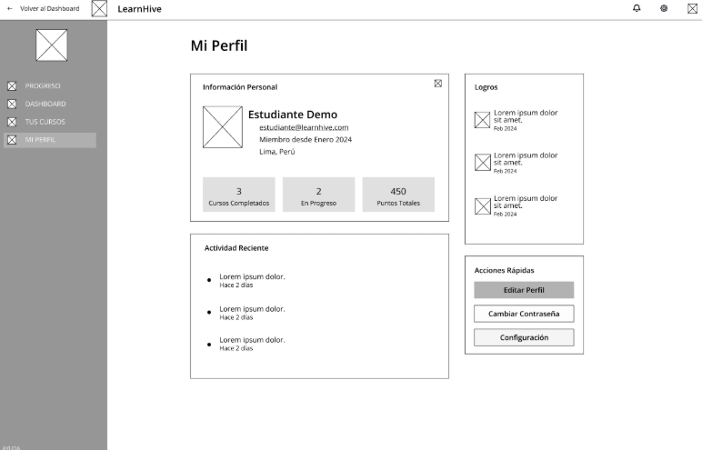
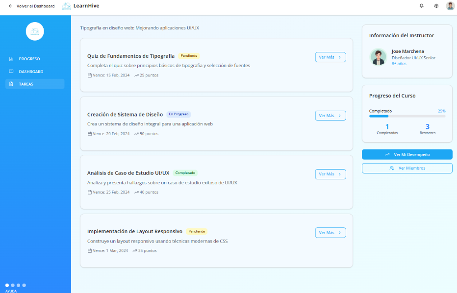
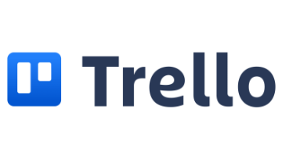

# Universidad Peruana de Ciencias Aplicadas

### **CURSO:** Diseño de Experimentos de Ingeniería de Software

### **NRC**: 7505

### **Profesor:** Julio Manuel Noriega Melendez

### **Ingeniería de software**

## Informe de Trabajo Final

### **Nombre del startup:** APX-3

### **Nombre del producto:** LearnHive

## **Integrantes**


| **Nombre**                                | **Código** |
|-------------------------------------------|------------|
| **Alejo Cardenas, Jose Antonio**             | U202122484 |
| **Real Calderon, Sebastian Omar**       | U20221D964 |
| **Luquillas Asto, Omar** | U20211G641 |
| **Olivera Barzola, Eric Marlon**          | U202315032  |


**Septiembre 2025**

## Registro de Versiones del Informe

<table>
  <thead>
    <tr>
      <th>Versión</th>
      <th>Fecha</th>
      <th>Autor</th>
      <th>Descripción de modificación</th>
    </tr>
  </thead>
  <tbody>
    <tr>
      <td>0.1</td>
      <td>09/09/2025</td>
      <td>Real Calderón Sebastián Omar y<br>Alejo Cárdenas José Antonio</td>
      <td>Desarrollo de los ítems: 1.1.1 Descripción de la Startup, 1.1.2 Perfiles de integrantes del equipo, 1.2.1 Nombre del producto</td>
    </tr>
    <tr>
      <td>0.2</td>
      <td>10/09/2025</td>
      <td>Real Calderón Sebastián Omar,<br>Olivera Barzola Eric Marlon y<br>Luquillas Asto Omar</td>
      <td>Desarrollo de los ítems: 1.2.2 Antecedentes y problemática, 1.2.3.1 Lean UX Problem Statement, 1.2.3.2 Lean UX Assumptions, 1.2.3.3 Lean UX Hypothesis, 1.2.3.4 Lean UX Canvas y 1.3 Segmentos objetivo</td>
    </tr>
    <tr>
      <td>0.3</td>
      <td>11/09/2025</td>
      <td>Alejo Cárdenas José Antonio,<br>Olivera Barzola Eric Marlon</td>
      <td>Desarrollo de los ítems: 2.1 Competidores, 2.2 Entrevistas, 2.3.1 User Personas, 2.3.2 User Task Matrix, 2.3.3 Empathy Maps y 2.3.4 As-is Scenario Mapping</td>
    </tr>
    <tr>
      <td>0.4</td>
      <td>12/09/2025</td>
      <td>Luquillas Asto Omar,<br>Olivera Barzola Eric Marlon y<br>Real Calderón Sebastián Omar</td>
      <td>Desarrollo de los ítems: 3.1 To-Be Scenario Mapping, 3.2 User Stories, 3.3 Impact Map, 3.4 Product Backlog</td>
    </tr>
    <tr>
      <td>0.5</td>
      <td>13/09/2025</td>
      <td>Real Calderón Sebastián Omar y<br>Alejo Cárdenas José Antonio</td>
      <td>Revisión completa hasta el capítulo 3, corrección ortográfica y coherencia global del reporte.</td>
    </tr>
    <tr>
      <td>0.6</td>
      <td>14/09/2025</td>
      <td>Real Calderón Sebastián Omar</td>
      <td>Desarrollo de los items: 4.1. Style Guidelines, 4.1.1. General Style Guidelines, 4.1.2. Web Style Guidelines, 4.1.3. Mobile Style Guidelines, 4.1.3.1. iOS Mobile Style Guidelines, 4.1.3.2. Android Mobile Style Guidelines. 4.2. Information Architecture, 4.2.1. Organization Systems, 4.2.2. Labeling Systems, 4.2.3. SEO Tags and Meta Tags, 4.2.4. Searching Systems y 4.2.5. Navigation Systems</td>
    </tr>
    <tr>
      <td>0.7</td>
      <td>14/09/2025</td>
      <td>Luquillas Asto Omar y<br>Olivera Barzola Eric Marlon</td>
      <td>Desarrollo de los items: 4.3. Landing Page UI Design, 4.3.1. Landing Page Wireframe, 4.3.2. Landing Page Mock-up, 4.4. Mobile Applications UX/UI Design, 4.4.1. Mobile Applications Wireframes, 4.4.2. Mobile Applications Wireflow Diagrams, 4.4.3. Mobile Applications Mock-ups, 4.4.4. Mobile Applications User Flow Diagrams, 4.5. Mobile Applications Prototyping, 4.5.1. Android Mobile Applications Prototyping, 4.5.2. iOS Mobile Applications Prototyping, 4.6. Web Applications UX/UI Design, 4.6.1. Web Applications Wireframes, 4.6.2. Web Applications Wireflow Diagrams, 4.6.3. Web Applications Mock-ups, 4.6.4. Web Applications User Flow Diagrams, 4.7. Web Applications Prototyping, 4.8. Domain-Driven Software Architecture, 4.8.1. Software Architecture Context Diagram, 4.8.2. Software Architecture Container Diagrams y 4.8.3. Software Architecture Components Diagrams</td>
    </tr>
    <tr>
      <td>0.8</td>
      <td>15/09/2025</td>
      <td>Real Calderón Sebastián Omar y<br>Alejo Cárdenas José Antonio</td>
      <td>Desarrollo de los items: 4.9. Software Object-Oriented Design, 4.9.1. Class Diagrams, 4.9.2. Class Dictionary, 4.10. Database Design y 4.10.1. Relational/Non-Relational Database Diagram, 5.1. Software Configuration Management, 5.1.1. Software Development Environment Configuration, 5.1.2. Source Code Management, 5.1.3. Source Code Style Guide & Conventions, 5.1.4. Software Deployment Configuration y 5.2. Product Implementation & Deployment.</td>
    </tr>
    <tr>
      <td>0.9</td>
      <td>17/09/2025</td>
      <td>Real Calderón Sebastián Omar,<br>Alejo Cárdenas José Antonio,<br>Luquillas Asto Omar y<br>Olivera Barzola Eric Marlon</td>
      <td>Desarrollo de los items: 5.2.1. Sprint Backlogs, 5.2.2. Implemented Landing Page Evidence, 5.2.3. Implemented Frontend-Web Application Evidence, 5.2.4. Acuerdo de Servicio – SaaS, 5.2.5. Implemented Native-Mobile Application Evidence, 5.2.6. Implemented RESTful API and/or Serverless Backend Evidence, 5.2.7. RESTful API documentation, 5.2.8. Team Collaboration Insights, 5.3. Video About-the-Product, Avance de Conclusiones, Bibliografía y Anexos</td>
    </tr>
    <tr>
      <td>1.0</td>
      <td>18/09/2025</td>
      <td>Real Calderón Sebastián Omar,<br>Alejo Cárdenas José Antonio,<br>Luquillas Asto Omar y<br>Olivera Barzola Eric Marlon</td>
      <td>Revisión completa hasta el capítulo 5, corrección ortográfica y coherencia global del reporte.</td>
    </tr>
  </tbody>
</table>

# Project Report Collaboration Insights 

| Tipo de Enlace           | URL                                                          |
|---------------------------|--------------------------------------------------------------|
| **Repositorio del reporte** | `https://github.com/APX-03-Experimentos/Project-Report` |

Entrega TB1 (18/09/2025):


Para esta primera entrega se desarollaron los capítulos del 1 al 5 y el sprint 1, en imagenes adjuntadas se evidencia del trabajo colaborativo de github. Todos los integrantes del grupo trabajaron en el proyecto.

Distribución de commits:

- Alejo Cárdenas, José Antonio: 7 commits
- Luquillas Asto, Omar: 28 commits
- Real Calderón, Sebastián Omar: 3 commits
- Olivera Barzola, Eric Marlon: 7 commits


# Contenido  

- [Student Outcome](#student-outcome) → Ver anexo A al final de este documento  

- [Part I: As-Is Software Project](#part-i-as-is-software-project)  
- [Capítulo I: Introducción](#capítulo-i-introducción)  
    - [1.1 Startup Profile](#11-startup-profile)  
      - [1.1.1 Descripción de la Startup](#111-descripción-de-la-startup)  
      - [1.1.2 Perfiles de integrantes del equipo](#112-perfiles-de-integrantes-del-equipo)  
    - [1.2 Solution Profile](#12-solution-profile)  
      - [1.2.1 Antecedentes y problemática](#121-antecedentes-y-problemática)  
      - [1.2.2 Lean UX Process](#122-lean-ux-process)  
        - [1.2.2.1 Lean UX Problem Statements](#1221-lean-ux-problem-statements)  
        - [1.2.2.2 Lean UX Assumptions](#1222-lean-ux-assumptions)  
        - [1.2.2.3 Lean UX Hypothesis Statements](#1223-lean-ux-hypothesis-statements)  
        - [1.2.2.4 Lean UX Canvas](#1224-lean-ux-canvas)  
    - [1.3 Segmentos objetivo](#13-segmentos-objetivo)  

- [Capítulo II: Requirements Elicitation & Analysis](#capítulo-ii-requirements-elicitation--analysis)  
    - [2.1 Competidores](#21-competidores)  
      - [2.1.1 Análisis competitivo](#211-análisis-competitivo)  
      - [2.1.2 Estrategias y tácticas frente a competidores](#212-estrategias-y-tácticas-frente-a-competidores)  
    - [2.2 Entrevistas](#22-entrevistas)  
      - [2.2.1 Diseño de entrevistas](#221-diseño-de-entrevistas)  
      - [2.2.2 Registro de entrevistas](#222-registro-de-entrevistas)  
      - [2.2.3 Análisis de entrevistas](#223-análisis-de-entrevistas)  
    - [2.3 Needfinding](#23-needfinding)  
      - [2.3.1 User Personas](#231-user-personas)  
      - [2.3.2 User Task Matrix](#232-user-task-matrix)  
      - [2.3.3 User Journey Mapping](#233-user-journey-mapping)  
      - [2.3.4 Empathy Mapping](#234-empathy-mapping)  
      - [2.3.5 As-is Scenario Mapping](#235-as-is-scenario-mapping)  
    - [2.4 Ubiquitous Language](#24-ubiquitous-language)  

- [Capítulo III: Requirements Specification](#capítulo-iii-requirements-specification)  
    - [3.1 To-Be Scenario Mapping](#31-to-be-scenario-mapping)  
    - [3.2 User Stories](#32-user-stories)  
    - [3.3 Product Backlog](#33-product-backlog)  
    - [3.4 Impact Mapping](#34-impact-mapping)  

- [Capítulo IV: Product Design](#capítulo-iv-product-design)  
  - [4.1 Style Guidelines](#41-style-guidelines)  
    - [4.1.1 General Style Guidelines](#411-general-style-guidelines)  
    - [4.1.2 Web Style Guidelines](#412-web-style-guidelines)  
    - [4.1.3 Mobile Style Guidelines](#413-mobile-style-guidelines)  
      - [4.1.3.1 iOS Mobile Style Guidelines](#4131-ios-mobile-style-guidelines)  
      - [4.1.3.2 Android Mobile Style Guidelines](#4132-android-mobile-style-guidelines)  
  - [4.2 Information Architecture](#42-information-architecture)  
    - [4.2.1 Organization Systems](#421-organization-systems)  
    - [4.2.2 Labeling Systems](#422-labeling-systems)  
    - [4.2.3 SEO Tags and Meta Tags](#423-seo-tags-and-meta-tags)  
    - [4.2.4 Searching Systems](#424-searching-systems)  
    - [4.2.5 Navigation Systems](#425-navigation-systems)  
  - [4.3 Landing Page UI Design](#43-landing-page-ui-design)  
    - [4.3.1 Landing Page Wireframe](#431-landing-page-wireframe)  
    - [4.3.2 Landing Page Mock-up](#432-landing-page-mock-up)  
  - [4.4 Mobile Applications UX/UI Design](#44-mobile-applications-uxui-design)  
    - [4.4.1 Mobile Applications Wireframes](#441-mobile-applications-wireframes)  
    - [4.4.2 Mobile Applications Wireflow Diagrams](#442-mobile-applications-wireflow-diagrams)  
    - [4.4.3 Mobile Applications Mock-ups](#443-mobile-applications-mock-ups)  
    - [4.4.4 Mobile Applications User Flow Diagrams](#444-mobile-applications-user-flow-diagrams)  
  - [4.5 Mobile Applications Prototyping](#45-mobile-applications-prototyping)  
    - [4.5.1 Android Mobile Applications Prototyping](#451-android-mobile-applications-prototyping)  
    - [4.5.2 iOS Mobile Applications Prototyping](#452-ios-mobile-applications-prototyping)  
  - [4.6 Web Applications UX/UI Design](#46-web-applications-uxui-design)  
    - [4.6.1 Web Applications Wireframes](#461-web-applications-wireframes)  
    - [4.6.2 Web Applications Wireflow Diagrams](#462-web-applications-wireflow-diagrams)  
    - [4.6.3 Web Applications Mock-ups](#463-web-applications-mock-ups)  
    - [4.6.4 Web Applications User Flow Diagrams](#464-web-applications-user-flow-diagrams)  
  - [4.7 Web Applications Prototyping](#47-web-applications-prototyping)  
  - [4.8 Domain-Driven Software Architecture](#48-domain-driven-software-architecture)  
    - [4.8.1 Software Architecture Context Diagram](#481-software-architecture-context-diagram)  
    - [4.8.2 Software Architecture Container Diagrams](#482-software-architecture-container-diagrams)  
    - [4.8.3 Software Architecture Components Diagrams](#483-software-architecture-components-diagrams)  
  - [4.9 Software Object-Oriented Design](#49-software-object-oriented-design)  
    - [4.9.1 Class Diagrams](#491-class-diagrams)  
    - [4.9.2 Class Dictionary](#492-class-dictionary)  
  - [4.10 Database Design](#410-database-design)  
    - [4.10.1 Relational/Non-Relational Database Diagram](#4101-relationalnon-relational-database-diagram)    

- [Capítulo V: Product Implementation](#capítulo-v-product-implementation)  
  - [5.1 Software Configuration Management](#51-software-configuration-management)  
    - [5.1.1 Software Development Environment Configuration](#511-software-development-environment-configuration)  
    - [5.1.2 Source Code Management](#512-source-code-management)  
    - [5.1.3 Source Code Style Guide & Conventions](#513-source-code-style-guide--conventions)  
    - [5.1.4 Software Deployment Configuration](#514-software-deployment-configuration)  
  - [5.2 Product Implementation & Deployment](#52-product-implementation--deployment)  
    - [5.2.1 Sprint Backlogs](#521-sprint-backlogs)  
    - [5.2.2 Implemented Landing Page Evidence](#522-implemented-landing-page-evidence)  
    - [5.2.3 Implemented Frontend-Web Application Evidence](#523-implemented-frontend-web-application-evidence)  
    - [5.2.4 Acuerdo de Servicio - SaaS](#524-acuerdo-de-servicio---saas)  
    - [5.2.5 Implemented Native-Mobile Application Evidence](#525-implemented-native-mobile-application-evidence)  
    - [5.2.6 Implemented RESTful API and/or Serverless Backend Evidence](#526-implemented-restful-api-andor-serverless-backend-evidence)  
    - [5.2.7 RESTful API Documentation](#527-restful-api-documentation)  
    - [5.2.8 Team Collaboration Insights](#528-team-collaboration-insights)  
  - [5.3 Video About-the-Product](#53-video-about-the-product)  


- [Part II: Verification, Validation & Pipeline](#part-ii-verification-validation--pipeline)  
  
- [Capítulo VI: Product Verification & Validation](#capítulo-vi-product-verification--validation)  
  - [6.1 Testing Suites & Validation](#61-testing-suites--validation)  
    - [6.1.1 Core Entities Unit Tests](#611-core-entities-unit-tests)  
    - [6.1.2 Core Integration Tests](#612-core-integration-tests)  
    - [6.1.3 Core Behavior-Driven Development](#613-core-behavior-driven-development)  
    - [6.1.4 Core System Tests](#614-core-system-tests)  
  - [6.2 Static Testing & Verification](#62-static-testing--verification)  
    - [6.2.1 Static Code Analysis](#621-static-code-analysis)  
      - [6.2.1.1 Coding Standard & Code Conventions](#6211-coding-standard--code-conventions)  
      - [6.2.1.2 Code Quality & Code Security](#6212-code-quality--code-security)  
    - [6.2.2 Reviews](#622-reviews)  
  - [6.3 Validation Interviews](#63-validation-interviews)  
    - [6.3.1 Diseño de Entrevistas](#631-diseño-de-entrevistas)  
    - [6.3.2 Registro de Entrevistas](#632-registro-de-entrevistas)  
    - [6.3.3 Evaluaciones según heurísticas](#633-evaluaciones-según-heurísticas)  
  - [6.4 Auditoría de Experiencias de Usuario](#64-auditoría-de-experiencias-de-usuario)  
    - [6.4.1 Auditoría realizada](#641-auditoría-realizada)  
      - [6.4.1.1 Información del grupo auditado](#6411-información-del-grupo-auditado)  
      - [6.4.1.2 Cronograma de auditoría realizada](#6412-cronograma-de-auditoría-realizada)  
      - [6.4.1.3 Contenido de auditoría realizada](#6413-contenido-de-auditoría-realizada)  
    - [6.4.2 Auditoría recibida](#642-auditoría-recibida)  
      - [6.4.2.1 Información del grupo auditor](#6421-información-del-grupo-auditor)  
      - [6.4.2.2 Cronograma de auditoría recibida](#6422-cronograma-de-auditoría-recibida)  
      - [6.4.2.3 Contenido de auditoría recibida](#6423-contenido-de-auditoría-recibida)  
      - [6.4.2.4 Resumen de modificaciones para subsanar hallazgos](#6424-resumen-de-modificaciones-para-subsanar-hallazgos)  

- [Capítulo VII: DevOps Practices](#capítulo-vii-devops-practices)  
  - [7.1 Continuous Integration](#71-continuous-integration)  
    - [7.1.1 Tools and Practices](#711-tools-and-practices)  
    - [7.1.2 Build & Test Suite Pipeline Components](#712-build--test-suite-pipeline-components)  
  - [7.2 Continuous Delivery](#72-continuous-delivery)  
    - [7.2.1 Tools and Practices](#721-tools-and-practices)  
    - [7.2.2 Stages Deployment Pipeline Components](#722-stages-deployment-pipeline-components)  
  - [7.3 Continuous Deployment](#73-continuous-deployment)  
    - [7.3.1 Tools and Practices](#731-tools-and-practices)  
    - [7.3.2 Production Deployment Pipeline Components](#732-production-deployment-pipeline-components)  
  - [7.4 Continuous Monitoring](#74-continuous-monitoring)  
    - [7.4.1 Tools and Practices](#741-tools-and-practices)  
    - [7.4.2 Monitoring Pipeline Components](#742-monitoring-pipeline-components)  
    - [7.4.3 Alerting Pipeline Components](#743-alerting-pipeline-components)  
    - [7.4.4 Notification Pipeline Components](#744-notification-pipeline-components) 

- [Part III: Experiment-Driven Lifecycle](#part-iii-experiment-driven-lifecycle)  
  
- [Capítulo VIII: Experiment-Driven Development](#capítulo-viii-experiment-driven-development)  
  - [8.1 Experiment Planning](#81-experiment-planning)  
    - [8.1.1 As-Is Summary](#811-as-is-summary)  
    - [8.1.2 Raw Material: Assumptions, Knowledge Gaps, Ideas, Claims](#812-raw-material-assumptions-knowledge-gaps-ideas-claims)  
    - [8.1.3 Experiment-Ready Questions](#813-experiment-ready-questions)  
    - [8.1.4 Question Backlog](#814-question-backlog)  
    - [8.1.5 Experiment Cards](#815-experiment-cards)  
  - [8.2 Experiment Design](#82-experiment-design)  
    - [8.2.1 Hypotheses](#821-hypotheses)  
    - [8.2.2 Domain Business Metrics](#822-domain-business-metrics)  
    - [8.2.3 Measures](#823-measures)  
    - [8.2.4 Conditions](#824-conditions)  
    - [8.2.5 Scale Calculations and Decisions](#825-scale-calculations-and-decisions)  
    - [8.2.6 Methods Selection](#826-methods-selection)  
    - [8.2.7 Data Analytics: Goals, KPIs and Metrics Selection](#827-data-analytics-goals-kpis-and-metrics-selection)  
    - [8.2.8 Web and Mobile Tracking Plan](#828-web-and-mobile-tracking-plan)  
  - [8.3 Experimentation](#83-experimentation)  
    - [8.3.1 To-Be User Stories](#831-to-be-user-stories)  
    - [8.3.2 To-Be Product Backlog](#832-to-be-product-backlog)  
    - [8.3.3 Pipeline-supported, Experiment-Driven To-Be Software Platform Lifecycle](#833-pipeline-supported-experiment-driven-to-be-software-platform-lifecycle)  
      - [8.3.3.1 To-Be Sprint Backlogs](#8331-to-be-sprint-backlogs)  
      - [8.3.3.2 Implemented To-Be Landing Page Evidence](#8332-implemented-to-be-landing-page-evidence)  
      - [8.3.3.3 Implemented To-Be Frontend-Web Application Evidence](#8333-implemented-to-be-frontend-web-application-evidence)  
      - [8.3.3.4 Implemented To-Be Native-Mobile Application Evidence](#8334-implemented-to-be-native-mobile-application-evidence)  
      - [8.3.3.5 Implemented To-Be RESTful API and/or Serverless Backend Evidence](#8335-implemented-to-be-restful-api-andor-serverless-backend-evidence)  
      - [8.3.3.6 Team Collaboration Insights](#8336-team-collaboration-insights)  
    - [8.3.4 To-Be Validation Interviews](#834-to-be-validation-interviews)  
      - [8.3.4.1 Diseño de Entrevistas](#8341-diseño-de-entrevistas)  
      - [8.3.4.2 Registro de Entrevistas](#8342-registro-de-entrevistas)  
  - [8.4 Experiment Aftermath & Analysis](#84-experiment-aftermath--analysis)  
    - [8.4.1 Analysis and Interpretation of Results](#841-analysis-and-interpretation-of-results)  
    - [8.4.2 Re-scored and Re-prioritized Question Backlog](#842-re-scored-and-re-prioritized-question-backlog)  
  - [8.5 Continuous Learning](#85-continuous-learning)  
    - [8.5.1 Shareback Session Artifacts: Learning Workflow](#851-shareback-session-artifacts-learning-workflow)  
  - [8.6 To-Be Software Platform Pre-launch](#86-to-be-software-platform-pre-launch)  
    - [8.6.1 About-the-Product Intro Video](#861-about-the-product-intro-video)  

- [Conclusiones](#conclusiones)  
  - [Conclusiones y recomendaciones](#conclusiones-y-recomendaciones)  
  - [Video App Validation](#video-app-validation)  
  - [Video About-the-Team](#video-about-the-team)  

- [Bibliografía](#bibliografía)  

- [Anexos](#anexos)  

# Student Outcome  

| Criterio específico | Acciones realizadas | Conclusiones |
|----------------------|---------------------|--------------|
| **4.c.1 Reconoce responsabilidad ética y profesional en situaciones de ingeniería de software** | **Alejo Cardenas, Jose Antonio**<br>TB1: Alejo Cárdenas Jose Antonio – TB1: Desarrollé mi comunicación oral al presentar los Lean UX Problem Statements, Assumptions y el análisis competitivo de los principales actores del mercado, explicando con claridad las estrategias frente a competidores. También participé en la definición de User Stories y en la exposición de la gestión de la configuración del software, donde aseguré que tanto el equipo técnico como no técnico comprendieran los procesos<br><br>**Real Calderon, Sebastian Omar**<br>TB1: Contribuí en la elaboración del Startup Profile y en la redacción técnica de los entregables de Needfinding, estructurando user personas, empathy maps y escenarios con un lenguaje claro y coherente. También desarrollé la arquitectura de la información y el diseño de software orientado a objetos, incluyendo diagramas de clases y el diseño de base de datos, y el front<br>**Luquillas Asto, Omar**<br>TB1: Me encargué de elaborar el Solution Profile, desarrollando antecedentes, problemática y el Lean UX Canvas, explicando de manera clara los supuestos y las hipótesis del proyecto. También expuse la definición del To-Be Scenario Mapping, el Product Backlog y el Impact Mapping, conectando cada necesidad detectada con funcionalidades específicas También me enfoqué en la implementación del backend<br><br>**Olivera Barzola, Eric Marlon**<br>TB1: Desarrollé entregables relacionados con el diseño de interfaces, creando Style Guidelines y propuestas visuales para la Landing Page, las aplicaciones móviles y web, garantizando accesibilidad e inclusión. También participé en la documentación de la implementación, presentando evidencias de la landing<br><br> |El equipo demostró responsabilidad ética y profesional en cada etapa del proyecto al considerar las necesidades reales de los usuarios (estudiantes y profesores), garantizando la transparencia en la recopilación de información mediante entrevistas y priorizando siempre soluciones que aporten valor académico. Asimismo, se mantuvo un compromiso con las buenas prácticas de ingeniería de software|
| **4.c.2 Emite juicios informados considerando el impacto de las soluciones de ingeniería de software en contextos globales, económicos, ambientales y sociales** | **Alejo Cardenas, Jose Antonio**<br>TB1: Desarrollé mi comunicación escrita al redactar el análisis de competidores, el Product Backlog y la documentación del Software Configuration Management, asegurando claridad y adaptación a distintas audiencias.<br>TB2: BBB…<br>**Real Calderon, Sebastian Omar**<br>TB1: Contribuí en la redacción del Startup Profile, los entregables de Needfinding y el diseño orientado a objetos, cuidando que los textos fueran claros y comprensibles para técnicos y no técnicos<br>**Luquillas Asto, Omar**<br>TB1: Redacté el Solution Profile, el To-Be Scenario Mapping y el Impact Mapping, presentando la información con precisión y lenguaje accesible para distintos públicos del proyecto.<br><br>**Olivera Barzola, Eric Marlon**<br>TB1:Elaboré Style Guidelines, documentación de interfaces y evidencias de implementación, manteniendo una comunicación escrita clara, inclusiva y adecuada para diferentes tipos de lectores.<br><br> |A lo largo del desarrollo del proyecto, el equipo fortaleció su capacidad de comunicación escrita, elaborando documentos técnicos y no técnicos que fueron claros, estructurados y adaptados a diferentes audiencias.|


# Part I: As-Is Software Project  

## Capítulo I: Introducción  

### 1.1 Startup Profile  
#### 1.1.1 Descripción de la Startup

APX-4 es una startup fundada por estudiantes de la Universidad Peruana de Ciencias Aplicadas (UPC), con la misión de revolucionar la educación en el Perú mediante soluciones tecnológicas accesibles y de alto impacto. 

Nuestro producto principal, LearnHive, es una plataforma integral de análisis y gestión educativa diseñada específicamente para los institutos de Lima Metropolitana que carecen de un sistema unificado. 

Para los profesores, ofrecemos un dashboard intuitivo que les permite supervisar el estado general de sus cursos en tiempo real. Esta visión integral les facilita el monitoreo continuo del progreso del aula, asegurando que siempre tengan una visión general del estado de su clase. 

Por otro lado, para los alumnos, proporcionamos un portal de acceso seguro donde pueden visualizar sus propias estadísticas y progreso académico de forma clara y transparente, así como acceder a herramientas que les permitan organizar mejor sus actividades y tiempo. Este acceso empodera a los estudiantes, dándoles mayor control sobre su educación. 

- Misión: Potenciar el éxito académico en los institutos de Lima Metropolitana mediante una plataforma de apoyo educativo intuitiva y poderosa. Brindamos a los educadores las herramientas para tomar decisiones proactivas e impactar positivamente en el aprendizaje de cada estudiante. 

- Visión: Ser la plataforma de gestión educativa de referencia en Lima Metropolitana, reconocida por transformar el ambiente académico para un mejor desempeño. elevando la calidad de la enseñanza y convirtiendo a los institutos en centros de innovación pedagógica.

#### 1.1.2 Perfiles de integrantes del equipo  

<table>
  <tr>
    <th colspan="2"> Jose Antonio Alejo Cardenas </th>
  </tr>
  <tr>
    <td>  </td>
    <td>Soy José Alejo Cárdenas, estudiante de Ingeniería de Software en el séptimo ciclo en la UPC, perteneciente al décimo superior. Desde pequeño he sentido fascinación por la tecnología, en especial por el desarrollo, funcionamiento y seguridad del software. Tengo formación en lenguajes de programación como Java, JavaScript, Python y C++, así como en gestión de bases de datos (Microsoft SQL Server y MongoDB). Manejo entornos de desarrollo como IntelliJ IDEA Ultimate y experiencia en sistemas operativos (Windows y Kali Linux). También cuento con conocimientos en ensamblaje y mantenimiento de hardware, comprendiendo el funcionamiento técnico de los equipos. Me caracterizo por mi comunicación efectiva, organización y trabajo colaborativo, cualidades que aportan dinamismo y sinergia en proyectos grupales. Entre mis principales intereses se encuentran el desarrollo backend con Spring Boot, la ciberseguridad y la optimización de sistemas. En lo personal, disfruto de entrenar en el gimnasio, jugar videojuegos y compartir momentos con amigos. Para el proyecto, aportaré organización, comunicación e inspiración a lo largo de todo su desarrollo. </td>
  </tr>
  <tr>
    <th colspan="2"> Sebastián Omar Real Calderón </th>
  </tr>
  <tr>
    <td>  </td>
    <td> Soy Sebastián Real Calderón, estudiante de Ingeniería de Software. Tengo conocimiento de diferentes lenguajes de programación, como C#, C++ y Java. Mi mayor objetivo al desarrollar software es crear una experiencia de usuario con la que los consumidores puedan sentirse satisfechos al trabajar con nuestras aplicaciones. Asimismo, aspiro a ser un buen participante al mantener una comunicación constante con mis compañeros, resolviendo problemas y apoyando a quién lo necesite para crear un ambiente cómodo para todos.  </td>
  </tr>
  <tr>
    <th colspan="2"> Omar Luquillas Asto </th>
  </tr>
  <tr>
    <td>  </td>
    <td> Soy Omar Luquillas Asto, estudiante de la carrera de Ingeniería de Software. Elegí esta carrera porque me apasiona la tecnología, el desarrollo de software y la programación. Tengo conocimientos en lenguajes de programación como C++, Python y Java. Me considero una persona investigadora, ya que me gusta aprender cosas nuevas y siempre estoy en busca de soluciones creativas e innovadoras que generen un impacto positivo en la vida de las personas. Además, valoro el trabajo en equipo, soy responsable y me comprometo a cumplir con mis tareas de manera eficiente.  </td>
  </tr>
  <tr>
    <th colspan="2">Eric Marlon Olivera Barzola </th>
  </tr>
  <tr>
    <td>  </td>
    <td>Soy Eric Marlon Olivera Barzola, estudiante de Ingeniería de Software del séptimo ciclo, con un interés particular en la ciberseguridad. A lo largo de mi formación he adquirido experiencia en diferentes lenguajes de programación como C#, C++ y Java. Me motiva desarrollar soluciones que no solo sean funcionales, sino que también transmitan confianza y seguridad a los usuarios.  </td>
  </tr>
</table>

### 1.2 Solution Profile  
#### 1.2.1 Antecedentes y problemática  

##### What / ¿QUÉ? 

¿Cuál es el problema?

El problema principal es la falta de un entorno educativo digital unificado y accesible en muchos institutos de Lima, lo que resulta en una gestión docente ineficiente (uso de herramientas dispersas como WhatsApp y correo), dificultad para centralizar y evaluar el trabajo de los estudiantes, y una incapacidad para obtener una visión clara del rendimiento académico de la clase. Esto lleva a una experiencia de aprendizaje fragmentada y reactiva, tanto para profesores como para alumnos. 

¿Cuál es la relación con la persona en cuestión? 

La relación se establece a través del instituto, que adopta LearnHive como su plataforma oficial. El profesor es nuestro usuario principal y cliente directo, ya que es quien gestiona los cursos, califica y analiza el desempeño. El profesor utiliza LearnHive para estructurar su curso, comunicarse con los estudiantes y transformar su rol de evaluador reactivo a gestor proactivo del aprendizaje. El estudiante accede a la plataforma como usuario final, encontrando un espacio centralizado para sus cursos, tareas y calificaciones, permitiéndole gestionar sus trabajos con mayor facilidad. 

##### When / ¿CUÁNDO? 

¿Cuándo sucede el problema? 

El problema ocurre diariamente durante el ciclo académico: 

Para el profesor: Al intentar organizar y publicar materiales para cada clase, al recibir decenas de entregas por diferentes canales, y al momento de calificar y consolidar esas notas manualmente en una hoja de cálculo. También surge al final del ciclo académico, cuando necesita analizar las notas para generar reportes de desempeño, un proceso que suele ser manual. 

Para el estudiante: Al no tener un lugar claro donde consultar las tareas, materiales o fechas de entrega, y al tener que enviar sus trabajos a través de medios informales que no garantizan su recepción correcta. Así como no tener una plataforma que unifique todas las funcionalidades del sistema educativo. 

¿Cuándo utiliza el cliente el producto? 

El profesor lo usa de forma constante para revisar avances, publicar anuncios y/o trabajos y calificar entregas. De la misma manera, puede ver el desempeño de sus alumnos en tiempo real con métricas que se actualizan diariamente. 

El estudiante accede a la plataforma a diario para verificar sus cursos, las tareas pendientes y los anuncios nuevos, y de manera puntual para subir sus entregas antes de la fecha límite y consultar sus calificaciones.

##### Where / ¿DÓNDE? 

¿Dónde está el cliente cuando usa el producto? 

Tanto profesores como estudiantes acceden a LearnHive principalmente desde sus dispositivos móviles y computadoras portátiles o de escritorio, desde cualquier lugar con conexión a internet: en el instituto, en sus hogares o en movimiento. 

¿Dónde surge el problema? 

El problema surge en el entorno educativo mismo: 

En la sala de profesores y el domicilio del docente, donde se invierten tiempo en organizar, calificar y compilar información de manera manual. 

En el entorno del estudiante, que se ve obligado a navegar entre múltiples apps y chats para gestionar su aprendizaje. 

##### Who / ¿QUIÉN? 

¿Quiénes se ven involucrados en el problema? 

El problema involucra directamente a los profesores y estudiantes, quienes son los más afectados por la gestión educativa desorganizada. Los profesores cargan con la pesada administración manual, mientras que los estudiantes enfrentan una experiencia de aprendizaje fragmentada. Indirectamente, los directores de los institutos y los padres de familia también se ven perjudicados, ya que carecen de acceso claro a datos sobre el rendimiento. 

¿Cuáles son las causas del problema? 

La causa fundamental del problema es una brecha digital y económica que limita el acceso a herramientas tecnológicas asequibles y fáciles de usar, junto con una falta de capacitación que genera resistencia al cambio en muchos entornos educativos. 

##### Why / ¿POR QUÉ? 

¿Por qué sucede el problema? 

Sucede porque muchos institutos de Lima carecen de los recursos financieros y técnicos para desarrollar, implementar y mantener una plataforma educativa propia y robusta. Las soluciones existentes en el mercado pueden ser demasiado costosas, genéricas o complejas para sus necesidades específicas. Esto los fuerza a depender de herramientas gratuitas pero no diseñadas para la educación (servicios de mensajería o correo electrónico), lo que genera desorganización, pérdida de información y una carga administrativa insostenible para el docente. Asi mismo, porque las plataformas actuales (ej. Google Classroom, Blackboard) están enfocadas en universidades o colegios con mayores recursos tecnológicos y no contemplan las necesidades específicas de los institutos académicos, como la simplicidad, la creación ágil de grupos con códigos de ingreso o la disponibilidad de métricas personalizadas. 

##### How / ¿CÓMO? 

¿En qué condiciones los clientes usan nuestro producto? 

Los clientes utilizan LearnHive principalmente a través de un navegador web o una aplicación móvil, dependiendo de una conexión a internet accesible. La plataforma está diseñada para ser usada de forma asíncrona, permitiendo que profesores y estudiantes interactúen con el contenido en los momentos que más les convengan. La usabilidad es fundamental, por lo que la interfaz debe ser extremadamente intuitiva para garantizar una adopción rápida y sin fricciones, minimizando la necesidad de una capacitación extensa. 

¿Cómo se diferencia el problema del estado normal (óptimo)? 

En un estado óptimo, los estudiantes y docentes deberían gestionar grupos, tareas y métricas desde una única plataforma sencilla y adaptada a sus necesidades. Actualmente, deben recurrir a múltiples aplicaciones externas, lo que genera desorganización, duplicidad de esfuerzos y pérdida de información. 

¿La tendencia en la que aparece el problema es aleatoria o sigue un patrón? 

Sigue un patrón claro: aparece en cada ciclo académico, especialmente cuando se requiere colaboración grupal o evaluaciones conjuntas. 

##### How Much / ¿CUÁNTO? 

¿Cuál es la magnitud del problema? 

La magnitud del problema para la educación en Lima es considerable, con una gestión fragmentada que impacta a miles de docentes y estudiantes. El problema surge, en gran parte, por la falta de una plataforma unificada, lo que fuerza a profesores y alumnos a depender de herramientas informales como WhatsApp. Según un estudio de la Contraloría General de la República (2022), el 56.5% de los estudiantes en colegios públicos reporta que sus profesores usan esta aplicación para impartir clases, lo que evidencia una realidad de desorganización y pérdida de información. Esta dependencia de múltiples canales no solo genera una carga administrativa insostenible para el docente, sino que también crea una experiencia de aprendizaje dispersa y reactiva para el estudiante, lo que subraya la necesidad de una solución centralizada y accesible como LearnHive. 

#### 1.2.2 Lean UX Process

El Lean UX Process es una metodología de diseño centrada en el usuario que busca trabajar de forma práctica y ágil. Su enfoque se basa en realizar ciclos cortos de creación, prueba y mejora, lo que permite validar con rapidez si una idea realmente responde a las necesidades de los usuarios.  

##### 1.2.2.1 Lean UX Problem Statements

Nuestra plataforma tiene como propósito optimizar la gestión académica y la interacción entre estudiantes y docentes de institutos en un único espacio digital. Hemos detectado que gran parte de los usuarios continúa utilizando herramientas aisladas y poco integradas, como WhatsApp, correo electrónico o carpetas en la nube, lo que complica la organización de grupos, asignaciones y entregas. Este escenario provoca desorden, desperdicio de tiempo y una comunicación menos efectiva, afectando en el desempeño de los estudiantes y aumentando la carga administrativa de los docentes. ¿Cómo podemos mejorar nuestra solución para que los estudiantes y docentes de institutos coordinen sus actividades académicas de forma más ágil, evaluando el éxito mediante una mayor participación en los grupos, un mejor cumplimiento de las tareas y una reducción del tiempo dedicado a la organización? 

##### 1.2.2.2 Lean UX Assumptions

**User Assumptions (Suposiciones de Usuario)**

- ¿Quién es el usuario?: Los usuarios principales son docentes y estudiantes de institutos de Lima Metropolitana. Los profesores buscan simplificar la gestión de cursos, centralizar entregas y contar con métricas claras de rendimiento. Los estudiantes necesitan un espacio único para organizar sus actividades, consultar tareas y visualizar su progreso académico. 

- ¿Dónde encaja nuestro producto en su trabajo o vida?: LearnHive se integra como una herramienta de uso cotidiano en el entorno académico del instituto. Para los profesores, funciona como un panel central para planificar, evaluar y dar seguimiento al rendimiento de la clase. Para los estudiantes, se convierte en el espacio digital donde concentran todas sus responsabilidades académicas. 

- ¿Qué problemas resuelve nuestro producto?: Resuelve la dispersión de herramientas informales (WhatsApp, correo, hojas de cálculo), la dificultad para consolidar información académica y la falta de indicadores accesibles para la toma de decisiones pedagógicas. 

- ¿Cuándo y cómo se usa nuestro producto?: El docente utiliza la plataforma de manera continua durante el ciclo académico: al crear grupos, publicar materiales, calificar entregas y revisar métricas de desempeño. El estudiante accede diariamente para consultar tareas, subir trabajos y verificar sus calificaciones. 

- ¿Qué características son importantes?: Las funcionalidades clave incluyen la gestión de grupos, publicación de materiales y tareas, calificación centralizada, métricas académicas en tiempo real y un portal de estudiante con acceso seguro a estadísticas personalizadas. 

- ¿Cómo debe verse y comportarse nuestro producto?: Debe tener un diseño simple, profesional e intuitivo, con tiempos de respuesta rápidos y una experiencia de navegación que minimice la curva de aprendizaje, fomentando la adopción inmediata tanto por profesores como estudiantes.

**Business Assumptions (Suposiciones de Negocio)**

- Necesidades y problemas: Los institutos requieren una plataforma accesible y adaptada a su realidad económica y tecnológica, que mejore la organización académica sin generar altos costos de implementación.

- Plataforma: Una aplicación web y móvil garantiza accesibilidad y flexibilidad en distintos entornos de uso. 

- Segmentación: El público objetivo está conformado por docentes y estudiantes de institutos académicos de Lima Metropolitana. 

- Comportamientos: Se espera que los usuarios valoren la simplicidad, la centralización de funciones y la posibilidad de contar con métricas claras y accionables. 

- Beneficios: Los usuarios obtendrán mayor organización, reducción del tiempo administrativo, mejora en la comunicación y un seguimiento más claro del rendimiento académico. 

- Captación de clientes: La estrategia de captación incluye presentaciones directas a directivos de institutos, convenios institucionales, además de difusión en redes sociales. 

- Modelos de ingresos: LearnHive se plantea como un sistema ofrecido bajo licenciamiento o suscripción a institutos, generando sostenibilidad económica para el startup. 

- Competencia: Las plataformas existentes como Google Classroom o Blackboard se dirigen a universidades y colegios con mayores recursos, lo que deja un espacio poco atendido en los institutos. 

- Ventaja competitiva: LearnHive destaca por su enfoque en la simplicidad, la adaptabilidad al contexto de los institutos y la integración de métricas personalizadas que no suelen estar disponibles en soluciones genéricas.

**Technical Assumptions (Suposiciones Técnicas)** 

- Tecnología utilizada: Se emplearán tecnologías web modernas y escalables que aseguren estabilidad y compatibilidad con navegadores y dispositivos móviles. 

- Integraciones: El sistema podrá integrarse con fuentes externas de datos o aceptar carga manual, asegurando flexibilidad para distintos niveles de digitalización institucional. 

- Escalabilidad: La infraestructura estará diseñada para crecer en usuarios y datos sin afectar la velocidad de respuesta.

**Market Assumptions (Suposiciones de Mercado)**

- Tamaño del mercado: El mercado objetivo incluye a los institutos de Lima Metropolitana que actualmente no cuentan con plataformas propias de gestión académica. 

- Competencia: Los competidores son plataformas más genéricas que no se adaptan a las necesidades específicas de los institutos. 

- Tendencias: Existe una tendencia clara hacia la digitalización de la educación en el nivel técnico y superior, impulsada por la necesidad de modernización y eficiencia en la gestión académica.

**Design Assumptions (Suposiciones de Diseño)**

- Interacción del usuario: La interfaz debe permitir una navegación sencilla y accesible para usuarios con distintos niveles de familiaridad tecnológica. 

- Experiencia del usuario: El diseño debe priorizar la claridad visual y la reducción de pasos innecesarios en cada acción. 

- Colores y tipografía: Se buscará una paleta que transmita seriedad y confianza, acompañada de tipografías modernas y legibles. 

- Preferencias visuales: El diseño debe ser atractivo, pero sin sobrecargar la vista; el enfoque debe estar en las funciones académicas principales. 

- Prototipos y pruebas: Se realizarán validaciones de las funcionalidades principales mediante pruebas de usabilidad, con el objetivo de asegurar que la plataforma cumpla con las expectativas de los usuarios. 

##### 1.2.2.3 Lean UX Hypothesis Statements

Hypothesis Statement 01: 

- Creemos que los docentes y estudiantes de institutos necesitan una plataforma centralizada para gestionar sus actividades académicas y mantener una comunicación más fluida. 

- Sabremos que estamos en lo correcto cuando veamos un uso constante de la plataforma en el día a día académico y recibamos retroalimentación positiva sobre la organización que esta ofrece. 

Hypothesis Statement 02: 

- Creemos que la desarticulación entre las herramientas que actualmente utilizan es la principal causa de desorden y pérdida de información en los institutos. 

- Sabremos que estamos en lo correcto cuando los usuarios dejen de depender de múltiples aplicaciones externas y disminuyan las quejas relacionadas con la desorganización. 

Hypothesis Statement 03: 

- Creemos que permitir la creación y gestión de grupos académicos dentro de la plataforma fomentará una colaboración más activa entre los estudiantes. 

- Sabremos que estamos en lo correcto cuando identifiquemos un incremento en la cantidad de grupos creados y en el nivel de participación dentro de ellos. 

Hypothesis Statement 04: 

- Creemos que ofrecer un módulo para centralizar materiales, tareas y fechas de entrega ayudará a los estudiantes a planificar mejor sus responsabilidades. 

- Sabremos que estamos en lo correcto cuando los estudiantes reporten mayor claridad en la gestión de sus cursos y menos confusión respecto a los plazos. 

Hypothesis Statement 05: 

- Creemos que un sistema de métricas y reportes en tiempo real permitirá a los docentes hacer un seguimiento más eficiente del rendimiento académico de sus estudiantes. 

- Sabremos que estamos en lo correcto cuando los profesores utilicen activamente estas métricas para ajustar sus clases y estrategias pedagógicas. 

Hypothesis Statement 06: 

- Creemos que una interfaz simple e intuitiva facilitará la adopción de la plataforma por parte de usuarios con distintos niveles de familiaridad tecnológica. 

- Sabremos que estamos en lo correcto cuando los nuevos usuarios logren manejar la plataforma de manera autónoma en sus primeras semanas de uso. 

Hypothesis Statement 07: 

- Creemos que mostrar de manera visual los avances y estadísticas individuales motivará a los estudiantes a involucrarse más con su aprendizaje. 

- Sabremos que estamos en lo correcto cuando los estudiantes revisen con frecuencia su panel de progreso y expresen satisfacción con esta funcionalidad. 

Hypothesis Statement 08: 

- Creemos que garantizar la privacidad y seguridad de la información académica será un factor decisivo para la adopción institucional de la plataforma. 

- Sabremos que estamos en lo correcto cuando no existan incidentes de seguridad y los usuarios manifiesten confianza en el manejo de sus datos. 

Hypothesis Statement 09: 

- Creemos que centralizar la entrega y calificación de tareas dentro de la plataforma optimizará la dinámica académica y reducirá la necesidad de usar correos o mensajería externa. 

- Sabremos que estamos en lo correcto cuando los docentes y estudiantes utilicen mayoritariamente esta funcionalidad y se reduzca el uso de canales alternativos para estas actividades. 

Hypothesis Statement 10: 

- Creemos que la creciente tendencia hacia la educación híbrida y digital incrementará la necesidad de contar con soluciones tecnológicas integradas en los institutos. 

- Sabremos que estamos en lo correcto cuando observemos un crecimiento sostenido en el número de instituciones que adoptan la plataforma en ciclos académicos presenciales, híbridos y virtuales. 

Hypothesis Statement 11: 

- Creemos que permitir a los docentes generar un código de acceso único para cada grupo facilitará la integración de estudiantes en el aula virtual. 

- Sabremos que estamos en lo correcto cuando observemos que la mayoría de los estudiantes se registran correctamente mediante este sistema sin requerir asistencia adicional. 

Hypothesis Statement 12: 

- Creemos que la función para que los estudiantes se unan mediante códigos reducirá los errores en el registro y agilizará el manejo de grupos. 

- Sabremos que estamos en lo correcto cuando identifiquemos menos casos de estudiantes que no logran acceder al grupo correcto. 

Hypothesis Statement 13: 

- Creemos que la posibilidad de que los docentes eliminen a alumnos de los grupos ayudará a mantener un control más ordenado de la plataforma virtual. 

- Sabremos que estamos en lo correcto cuando los docentes gestionen cambios de grupo sin generar confusión en el resto de los estudiantes. 

Hypothesis Statement 14: 

- Creemos que las estadísticas globales de los estudiantes permitirán a los docentes monitorear el progreso general de su clase. 

- Sabremos que estamos en lo correcto cuando los profesores consulten estas métricas con frecuencia y las usen para ajustar sus estrategias de enseñanza. 

Hypothesis Statement 15: 

- Creemos que la opción de revisar y calificar tareas dentro de la plataforma optimizará el trabajo docente y reducirá la dependencia de medios externos. 

- Sabremos que estamos en lo correcto cuando los profesores entreguen calificaciones dentro del sistema y disminuya el uso de correos o mensajería externa para enviar resultados. 

Hypothesis Statement 16: 

- Creemos que el acceso de los estudiantes a sus propias métricas de desempeño los motivará a mejorar en sus tareas y actividades. 

- Sabremos que estamos en lo correcto cuando los estudiantes revisen con frecuencia su panel de métricas y reporten mayor claridad sobre su progreso académico. 

Hypothesis Statement 17: 

- Creemos que la centralización de grupos, tareas y calificaciones en un solo espacio reducirá la confusión que suele generar el uso de múltiples aplicaciones. 

- Sabremos que estamos en lo correcto cuando los usuarios manifiesten que ya no necesitan apoyarse en varias herramientas externas para organizar su vida académica. 

Hypothesis Statement 18: 

- Creemos que un dashboard para el docente enfocada en la gestión de grupos y calificaciones facilitará la adopción de la plataforma por parte del profesorado. 

- Sabremos que estamos en lo correcto cuando los docentes logren administrar sus grupos de manera autónoma después de un breve periodo de adaptación. 

Hypothesis Statement 19: 

- Creemos que la visualización de métricas individuales por estudiante ayudará a los docentes a identificar con mayor rapidez a quienes requieren apoyo adicional. 

- Sabremos que estamos en lo correcto cuando los profesores utilicen estas métricas para tomar decisiones pedagógicas y reporten que la detección temprana fue efectiva. 

Hypothesis Statement 20: 

- Creemos que validar la experiencia de estudiantes y docentes mediante pruebas de usabilidad permitirá detectar oportunidades de mejora antes del despliegue final. 

- Sabremos que estamos en lo correcto cuando los resultados de estas pruebas conduzcan a ajustes que incrementen la satisfacción general de los usuarios.

##### 1.2.2.4 Lean UX Canvas  


### 1.3 Segmentos objetivo  

**Segmento Objetivo 1: Estudiantes de institutos**

Jóvenes que requieren un entorno educativo digital organizado para acceder a materiales, entregar tareas y monitorear su progreso académico. Necesitan claridad, retroalimentación oportuna y evitar la dispersión de información en múltiples canales. 

Características Demográficas: 

- Edad: 16 a 27 años. 
- Género: Todos los géneros. 
- Ubicación geográfica: Institutos de Lima. 
- Nivel socioeconómico: Clase media-baja. (Acceso a internet básico) 
- Dispositivos de acceso: Smartphones, laptops, tablets. 

Necesidades: 

- Centralización de tareas, materiales y fechas de entrega. 
- Acceso sencillo desde dispositivos móviles con bajo consumo de datos. 
- Retroalimentación clara y rápida sobre sus calificaciones. 

Beneficios clave: 

- Plataforma unificada para todas sus clases y actividades. 
- Notificaciones push para recordatorios importantes. 
- Visualización directa de su desempeño y áreas de mejora. 

**Segmento Objetivo 2: Profesores de institutos**

Educadores que necesitan una solución integral para gestionar sus cursos, reducir la carga administrativa y obtener insights sobre el rendimiento estudiantil. Buscan centralizar la comunicación, las entregas y las calificaciones en una plataforma accesible, evitando el uso de herramientas dispersas como WhatsApp o correo electrónico. 

Características Demográficas: 

- Edad: 30 a 60 años. 
- Género: Todos los géneros. 
- Ubicación geográfica: Institutos de Lima (públicos y privados con recursos limitados). 
- Nivel socioeconómico: Clase media (acceso a internet y dispositivos básicos, pero con presupuesto restringido para tecnología educativa). 
- Dispositivos de acceso: Laptops, smartphones, computadoras de escritorio en aulas. 

Necesidades: 

- Automatización de procesos administrativos (calificaciones, recepción de entregas). 
- Análisis de datos del rendimiento estudiantil para adaptar estrategias pedagógicas. 
- Comunicación centralizada y eficiente con estudiantes. 

Beneficios clave: 

- Reducción de tiempo en gestión manual con herramientas integradas. 
- Métricas claras del progreso de cada estudiante y del grupo. 
- Interfaz intuitiva que requiere mínima capacitación. 

## Capítulo II: Requirements Elicitation & Analysis  

### 2.1 Competidores  
**Sistema Saberes**


 

Sistema Saberes se posiciona como una solución integral de gestión educativa desarrollada localmente para el mercado peruano. Su plataforma abarca todos los procesos operativos de institutos superiores, centros de formación técnica y escuelas de negocios, desde la admisión y matrícula hasta la graduación y certificación. Está construido para cumplir con las normativas del Ministerio de Educación (MINEDU) y los requisitos de SUNEDU, offering módulos especializados en control académico (calificaciones, asistencias, horarios), gestión financiera (pensiones, cobranza) y comunicación institucional. Incluye herramientas de reportes básicos que permiten extraer datos históricos, pero su fortaleza radica en la centralización de la información administrativa más que en el análisis pedagógico profundo. 


**EduSoftNet**


EduSoft es un software modular de gestión educativa que ofrece soluciones escalables para colegios, institutos y academias en Perú. Su propuesta de valor se centra en la flexibilidad, allowing a las instituciones contratar solo los módulos que necesiten, como control académico, gestión financiera o library management. La plataforma genera reportes gerenciales predefinidos que ayudan en la toma de decisiones administrativas, pero su capacidad de análisis de datos pedagógicos es limitada. Está diseñado para instituciones que priorizan la optimización de procesos operativos por sobre la innovación en la enseñanza basada en datos. 

**SieWeb**


SieWeb es un sistema integral de gestión diseñado para instituciones de educación superior en Perú, including institutos tecnológicos y escuelas de posgrado. Su plataforma es altamente customizable, permitiendo adaptarse a flujos de trabajo específicos y mallas curriculares complejas. Ofrece módulos para la gestión del ciclo de vida del estudiante, prácticas preprofesionales, y generación de reportes personalizados para la alta dirección. Aunque incluye dashboards gerenciales, estos están orientados a métricas operativas y financieras, no al desempeño académico granular o a la intervención pedagógica temprana. SieWeb es ideal para instituciones que necesitan un ERP educativo a medida, pero no una herramienta ágil de análisis didáctico. 


#### 2.1.1 Análisis competitivo  


# Competitive Analysis Landscape

## ¿Por qué llevar a cabo este análisis?  
Este análisis se realiza para entender cómo se posiciona nuestro proyecto frente a competidores consolidados, identificar fortalezas y debilidades propias, descubrir oportunidades de diferenciación en el mercado de IoT para motocicletas y anticipar amenazas que puedan afectar la adopción del producto. Nos permite tomar decisiones estratégicas mejor informadas en marketing, producto y modelo de negocio.

---

## Comparativo de Competidores

| Categoría                | **LearnHive**                                                                 | **Sistema Saberes**                                                                                   | **EduSoftNet**                                                                 | **SieWeb**                                                                                  |
|---------------------------|--------------------------------------------------------------------------------|-------------------------------------------------------------------------------------------------------|---------------------------------------------------------------------------------|---------------------------------------------------------------------------------------------|
| **Overview**              | Plataforma especializada en analytics y gestión del desempeño académico.       | ERP educativo integral (gestión administrativa y académica).                                           | Software modular de gestión educativa (académica y financiera).                 | Sistema customizable para educación superior (énfasis en procesos complejos).                |
| **Ventaja Competitiva**   | Dashboards, alertas tempranas, intervención proactiva y portal estudiantil.    | Cumplimiento normativo integrado (MINEDU/SUNEDU) y comunicación centralizada.                         | Precios accesibles, módulos escalables y gestión financiera robusta.            | Adaptación total a flujos complejos (prácticas, titulación) y reportes personalizados.       |
| **Mercado Objetivo**      | Institutos técnicos/superiores en Lima que priorizan mejora pedagógica y ya tienen un sistema base. | Institutos peruanos que buscan un ERP integral para automatizar procesos administrativos y académicos. | Institutos y colegios con budgets ajustados que necesitan módulos específicos.  | Institutos con modelos educativos únicos o procesos complejos (ej: escuelas de posgrado).    |
| **Estrategia Marketing**  | Marketing de contenidos (blog, webinars), demostraciones personalizadas.       | Ventas directas, referencias boca a boca, participación en ferias educativas.                         | Precios competitivos, demostraciones gratuitas, enfoque en flexibilidad.        | Enfoque en customización, ventas B2B, casos de estudio con clientes grandes.                 |
| **Productos & Servicios** | Analytics, dashboards interactivos, alertas tempranas y portal de estudiantes. | ERP educativo (admisión, matrícula, calificaciones, financiero), reportes básicos, soporte.            | Módulos de gestión académica, financiera, biblioteca, reportes predefinidos.    | ERP customizable, gestión de prácticas, titulación, dashboards gerenciales, soporte técnico. |
| **Precios & Costos**      | Suscripción mensual (asequible). Bajo costo de implementación.                 | Licencia anual costosa. Alta inversión inicial e implementación.                                       | Precios por módulo (accesible). Costo de implementación medio.                  | Precios altos por customización. Implementación larga y costosa.                            |
| **Canales de Distribución** | Ventas online, canal directo (equipo comercial), partners estratégicos.       | Ventas directas, canal telefónico, sitio web.                                                         | Ventas directas, sitio web, redes sociales.                                     | Ventas B2B, consultores educativos, canal directo.                                           |
| **Fortalezas**            | Especialización en analíticas, usabilidad, implementación rápida, precio accesible. | Conocimiento normativo peruano, solución integral, presencia en el mercado.                           | Precios flexibles, modularidad, experiencia en el mercado.                      | Customización, manejo de procesos complejos, clientes grandes.                               |
| **Debilidades**           | Dependencia de integración con otros sistemas, marca desconocida.              | Interface menos intuitiva, analytics limitados, alto costo.                                            | Analytics básicos, diseño no moderno, enfoque administrativo.                   | Precio muy alto, implementación lenta, no es ágil para docentes.                            |
| **Oportunidades**         | Creciente demanda de edtech, expansión a otras ciudades.                       | Cross-selling a clientes existentes, mejorar módulos de analytics.                                     | Upselling de módulos, integración con herramientas de analytics.                | Vender módulos de analytics como add-on, asociarse con consultoras.                         |
| **Amenazas**              | Competidores agreguen analytics, resistencia al cambio en docentes, entrada de competidores globales. | Saturación del mercado de ERPs.                                                                       | Competidores con precios más agresivos, avance de soluciones en la nube.        | Aversión a altos costos post-pandemia, competidores con soluciones más ágiles.              |


#### 2.1.2 Estrategias y tácticas frente a competidores  

**1. Estrategia contra Sistema Saberes**

Estrategia: Especialización Académica y Agilidad de Implementación. 

Posicionar a LearnHive como la solución que eleva la gestión académica con analítica avanzada, detección temprana de riesgos y mejora del desempeño, destacando rapidez y facilidad en la adopción. 

Tácticas: 

Implementación Rápida y Guiada : Ofrecer un proceso express de despliegue con acompañamiento técnico para que las instituciones puedan empezar a usar dashboards y reportes académicos en pocas semanas.	 

Herramientas de Analítica Independiente: Proveer un módulo de importación de datos sencillo (Excel, CSV, Google Sheets), que permite a las instituciones aprovechar LearnHive sin necesidad de procesos complejos. 

Casos de Éxito Académicos : Publicar resultados concretos de clientes: reducción de deserción, mejora en el rendimiento académico, aumento en la satisfacción de los estudiantes.  

Campañas de Valor Educativo: Marketing de contenidos enfocado en la promesa: “De datos a decisiones académicas”. Artículos, webinars y guías prácticas para directores y coordinadores académicos. 

Modelo de Precios Escalable: Planes accesibles por institución o por número de estudiantes, con una entrada de bajo costo y beneficios claros en términos de retorno académico. 


**2. Estrategia contra EduSoft (El Competidor Modular y Accesible)**

Estrategia: Superioridad en Valor y Enfoque. 

Destacar que la "flexibilidad" de EduSoft sigue siendo administrativa, mientras que LearnHive ofrece un valor cualitativamente superior: la mejora de los resultados de aprendizaje. 

Tácticas: 

Comparativa de Valor (Value Comparison): Desarrollar una comparativa sutil que muestre cómo LearnHive, por un precio similar o ligeramente superior a un módulo de EduSoft, ofrece un retorno de la inversión (ROI) mucho mayor al impactar directamente en la retención y el éxito estudiantil. 

Enfoque en el "Dolor" del Profesor: Mientras EduSoft se vende a la administración, LearnHive debe marketing directo a los docentes. Talleres y webinars gratuitos sobre "Pedagogía Data-Driven" para crear demanda desde abajo hacia arriba. El profesor convencido será el mejor aliado interno. 

Prueba Gratuita Irresistible: Ofrecer una prueba de 30 días con data de demostración rica e insights inmediatos. Contrastar con la posible complejidad y tiempo que lleva configurar los módulos de EduSoft. 

Case Studies con Énfasis en Resultados: Documentar y promocionar casos de éxito con métricas concretas: "Con LearnHive, el Instituto XYZ identificó al 20% de su población en riesgo y logró recuperar al 15% gracias a intervenciones tempranas." EduSoft muestra funcionalidades; LearnHive debe mostrar resultados. 

Estrategia contra SieWeb (El Competidor Personalizable y Complejo) 
 

Estrategia: Agilidad y Simplicidad. 

Posicionar a SieWeb como una solución "pesada", "lenta" y "costosa" para la necesidad específica de analíticas. LearnHive es la alternativa "ágil", "moderna" y "centrada en el usuario". 

Tácticas: 

Messaging de "Time-to-Value": Crear mensajes contundentes: "¿6 meses para un dashboard? Con LearnHive, tiene insights valiosos en 6 días." o "La customización compleja vs. la inteligencia inmediata". Atacar su punto más débil: la velocidad. 

Precio Predecible vs. Costo Variable: Enfatizar el modelo de suscripción simple y predecible de LearnHive vs. los costos impredecibles de customización y consultoría de SieWeb. Apelar al budget controlado de los institutos. 

Show, Don't Tell: Utilizar demostraciones en vivo para mostrar la intuitividad de LearnHive. Pedirle al cliente que imagine tener que solicitar cada nuevo reporte o cambio a un consultor de SieWeb vs. obtenerlo ellos mismos con clics. 

Target en los Decisores de Línea Media: SieWeb se vende a la alta dirección. LearnHive debe hablarle al Jefe de Programa, al Coordinador Académico, al responsable de calidad educativa, que son quienes sufren la falta de agilidad y necesitan datos rápidos para su trabajo diario. 


Prueba Gratuita Irresistible: Ofrecer una prueba de 30 días con data de demostración rica e insights inmediatos. Contrastar con la posible complejidad y tiempo que lleva configurar los módulos de EduSoft. 

Case Studies con Énfasis en Resultados: Documentar y promocionar casos de éxito con métricas concretas: "Con LearnHive, el Instituto XYZ identificó al 20% de su población en riesgo y logró recuperar al 15% gracias a intervenciones tempranas." EduSoft muestra funcionalidades; LearnHive debe mostrar resultados. 

Estrategia contra SieWeb (El Competidor Personalizable y Complejo) 
 

**3. Estrategia: Agilidad y Simplicidad.**

Posicionar a SieWeb como una solución "pesada", "lenta" y "costosa" para la necesidad específica de analíticas. LearnHive es la alternativa "ágil", "moderna" y "centrada en el usuario". 

Tácticas: 

Messaging de "Time-to-Value": Crear mensajes contundentes: "¿6 meses para un dashboard? Con LearnHive, tiene insights valiosos en 6 días." o "La customización compleja vs. la inteligencia inmediata". Atacar su punto más débil: la velocidad. 

Precio Predecible vs. Costo Variable: Enfatizar el modelo de suscripción simple y predecible de LearnHive vs. los costos impredecibles de customización y consultoría de SieWeb. Apelar al budget controlado de los institutos. 

Show, Don't Tell: Utilizar demostraciones en vivo para mostrar la intuitividad de LearnHive. Pedirle al cliente que imagine tener que solicitar cada nuevo reporte o cambio a un consultor de SieWeb vs. obtenerlo ellos mismos con clics. 

Target en los Decisores de Línea Media: SieWeb se vende a la alta dirección. LearnHive debe hablarle al Jefe de Programa, al Coordinador Académico, al responsable de calidad educativa, que son quienes sufren la falta de agilidad y necesitan datos rápidos para su trabajo diario. 


### 2.2 Entrevistas  
#### 2.2.1 Diseño de entrevistas  

Segmento Objetivo 1: Estudiantes de Institutos 

Preguntas principales 

1. ¿Podrías contar un poco sobre ti? (edad, carrera, lugar de residencia, ocupación). 

2. ¿Cómo sueles organizar tus tareas y trabajos en grupo durante el ciclo académico? 

3. ¿Qué plataformas o aplicaciones usas más para estudiar o coordinar trabajos en grupo? (por ejemplo: WhatsApp, Meet, etc). 

4. ¿Te resulta sencillo mantener un orden entre tareas y comunicaciones? ¿Por qué sí o por qué no? 

5. ¿Qué te daría más confianza en una plataforma académica: facilidad de uso,  notificaciones, métricas de avance u otra cosa? 

6. ¿Qué tan importante es para ti recibir una retroalimentación rápida sobre tus entregas o calificaciones? 

  

Preguntas complementarias: 

1. ¿Usas más tu celular, laptop o tablet cuando estudias? ¿Por qué? 

2. ¿Qué experiencias positivas o negativas has tenido usando plataformas como Moodle, Canvas o Classroom? 

3. ¿En qué casos te ha resultado difícil organizarte o cumplir con tus entregas a tiempo? 

4. ¿Qué tan valioso sería para ti poder ver tu progreso académico en gráficos o estadísticas simples? 

5. ¿Te frustra depender de varias aplicaciones distintas para tu desempeño académico? 

  

Segmento Objetivo 2: Profesores de Institutos 

Preguntas principales: 

1. Para comenzar, ¿podría contarme un poco sobre usted? (edad, distrito de residencia, área de enseñanza). 

2. ¿Qué herramientas utiliza actualmente para planificar, compartir materiales y gestionar tareas con sus estudiantes? 

3. ¿Qué parte de su trabajo fuera del aula le consume más tiempo (revisar entregas, calificar, dar seguimiento a alumnos, etc.)? 

4. ¿Cómo realiza actualmente el seguimiento del desempeño de sus estudiantes? 

5. Si pudiera elegir, ¿qué funcionalidad sería la más valiosa en una plataforma académica: centralización de tareas, estadísticas, comunicación o retroalimentación automatizada? 

6. ¿Qué tan cómodo se sentiría con una plataforma que genere métricas claras y fáciles de entender sobre el progreso de cada estudiante? 

  

Preguntas complementarias 

1. ¿Qué dispositivo utiliza más a menudo para trabajar: laptop, PC o smartphone? 

2. ¿Qué medios emplea para comunicarse con sus estudiantes (WhatsApp, correo, etc)? ¿Qué ventajas o problemas encuentra en ellos? 

3. ¿Ha usado antes plataformas educativas? ¿Qué le funcionó bien y qué le resultó poco práctico? 

4. ¿Qué tipo de actividades digitales o interactivas le gustaría integrar en sus clases pero hoy le resulta difícil hacerlo? 

5. ¿Qué tan difícil considera la curva de aprendizaje de nuevas plataformas educativas? 


#### 2.2.2 Registro de entrevistas  

**Profesores de institutos:** 

  Entrevista 1: Profesor de Instituto 


| Campo                      | Detalle                                    |
|----------------------------|---------------------------------------------|
| **Foto y link**            |     https://youtu.be/Owd7kK5dDWU                |
| **Nombre del entrevistado**| Adrian Castro Santana                                           |
| **Edad**                   | 26  años                                     |
| **Profesión**              | Profesor de Instituto  |
| **Ubicación**              | Lima-Pueblo Libre                                |
| **Duración de la entrevista** | 8:16 min                                  |
| **Herramientas actuales**  | Usa Google Classroom para planificar y compartir materiales. Emplea Excel para registrar notas. Se apoya en WhatsApp para comunicación rápida con estudiantes.                                           |
| **Dolores principales**    |    Calificación de trabajos y exámenes consume demasiado tiempo. Seguimiento de alumnos rezagados es difícil sin reportes claros.                                         |
| **Seguimiento del desempeño** | Lo hace de forma manual con Excel y observaciones de asistencia. No cuenta con un dashboard visual que le permita ver el panorama general ni identificar rápidamente a los alumnos en riesgo.                                       |
| **Necesidades prioritarias** | Estadísticas claras y visuales sobre progreso de estudiantes y desempeño del aula.  Mostrar la información de los alumnos (notas, tareas, asistencia, participación).                                        |
| **Dispositivos y comunicación** | Utiliza WhatsApp por rapidez, aunque presenta problemas de orden. El correo lo considera más formal pero menos inmediato.                                |
| **Experiencia con plataformas** | Ha usado Google Classroom el cual llega a organizar materiales y tareas. pero carece de reportes y estadísticas completas.                                   |
| **Interactividad deseada** | Cuestionarios en tiempo real.  Ejercicios personalizados según el nivel de cada estudiante.                                          |
| **Curva de aprendizaje**   | Considera que puede ser un reto si la plataforma es compleja.  Prefiere interfaces intuitivas, visuales y fáciles de usar para reducir la barrera de entrada.                                        |


Entrevista 2: Profesor de Instituto 

| Campo                      | Detalle                                    |
|----------------------------|---------------------------------------------|
| **Foto y link**            |   [Link-entrevista](https://upcedupe-my.sharepoint.com/:v:/g/personal/u202122484_upc_edu_pe/EQywp_Cid25EpgUEwukGdFEB-fs0WpIXqybsFcIFxJZJlw?e=f8c1yv&nav=eyJyZWZlcnJhbEluZm8iOnsicmVmZXJyYWxBcHAiOiJTdHJlYW1XZWJBcHAiLCJyZWZlcnJhbFZpZXciOiJTaGFyZURpYWxvZy1MaW5rIiwicmVmZXJyYWxBcHBQbGF0Zm9ybSI6IldlYiIsInJlZmVycmFsTW9kZSI6InZpZXcifX0%3D)            |
| **Nombre del entrevistado**| Frank Rivera                                           |
| **Edad**                   | 24 años                                     |
| **Profesión**              | Practicante docente en Instituto Tecnológico (segundo año de práctica)   |
| **Ubicación**              | Lima-Pueblo Libre                               |
| **Duración de la entrevista** | 4:29 min                                 |
| **Herramientas actuales**  | - Google Drive (guardar materiales) - WhatsApp (avisos y coordinación) - Plataforma institucional (subir calificaciones) - Canva / PowerPoint (preparación de clases) |
| **Dolores principales**    | - Revisar y calificar entregas consume demasiado tiempo. - Dar retroalimentación detallada a cada alumno es muy pesado.                       |
| **Seguimiento del desempeño** | Excel personal (notas, asistencia, observaciones). Actualización manual y constante, sin automatización.                                        |
| **Necesidades prioritarias** | - Retroalimentación automatizada para responder rápido a estudiantes. - Métricas visuales y claras sobre el progreso de cada alumno.                                        |
| **Dispositivos y comunicación** | - Laptop (principal para clases, presentaciones, Excel). - Celular (comunicación rápida). - WhatsApp (rápido, pero desordenado y poco estructurado).|
| **Experiencia con plataformas** | Ha usado Google Classroom el cual llega a organizar materiales y tareas. pero carece de reportes y estadísticas completas.          |
| **Interactividad deseada** | - Cuestionarios en línea. - Juegos interactivos. - Videos cortos dinámicos.                                   |
| **Curva de aprendizaje**   | Interfaz intuitiva = fácil. - Plataformas complejas = frustración → regresa a lo básico (Excel, WhatsApp).  |


**Estudiantes de instituto:** 

Entrevista 4: Estudiante de Instituto


| Campo                      | Detalle                                    |
|----------------------------|---------------------------------------------|
| **Foto y link**            |  [Entrevista](https://upcedupe-my.sharepoint.com/personal/u202122484_upc_edu_pe/_layouts/15/stream.aspx?id=%2Fpersonal%2Fu202122484_upc_edu_pe%2FDocuments%2FFundamentos%20-%20APX-4%2FInterviews%2FEntrevista%20David%20-%20Segmento%20Estudiantes%20de%20Insituto%2Emp4&nav=eyJyZWZlcnJhbEluZm8iOnsicmVmZXJyYWxBcHAiOiJPbmVEcml2ZUZvckJ1c2luZXNzIiwicmVmZXJyYWxBcHBQbGF0Zm9ybSI6IldlYiIsInJlZmVycmFsTW9kZSI6InZpZXciLCJyZWZlcnJhbFZpZXciOiJNeUZpbGVzTGlua0NvcHkifX0&ga=1&referrer=StreamWebApp%2EWeb&referrerScenario=AddressBarCopied%2Eview%2Ef7c6474d-fd38-49fc-8a81-57b217a34a8e)                    |
| **Nombre del entrevistado**| David Manuel Torres Meneses                                            |
| **Edad**                   | 19 años                                      |
| **Profesión**              | Estudiante universitario / estudiante de instituto  |
| **Ubicación**              | Lima, Perú                                 |
| **Duración de la entrevista** | 11:38 min                                   |
| **Herramientas actuales**  |Plataformas institucionales, WhatsApp para grupos y comunicación, Meet, Discord, Excel y Classroom para notas y materiales.                                          |
| **Dolores principales**    | La falta de graficas que permitan evidenciar su desarrollo como estudiante no le permite saber que tan bien se está desarrollando como estudiante.    |
| **Seguimiento del desempeño** |Usa un Excel para poder hacer su organización y cálculo de notas durante el desarrollo del ciclo. |
| **Necesidades prioritarias** | Retroalimentación instantánea, estadísticas de sus notas y gráficos que permitan comparar su avance. |
| **Dispositivos y comunicación** | Usa mucho más su celular que la laptop; pero prefiere usar la laptop ya que tiene un alcance más largo de acuerdo con posibilidades. |
| **Experiencia con plataformas** | Ha usado principalmente Classroom pero considera que tiene una ventaja para compartir archivos sin embargo al no tener un sistema de verificados hay otros usuarios que la usan sin responsabilidad. |
| **Interactividad deseada** | Mas graficos, estadísticas, feedbacks o un dashboard que permita unir todos estos ámbitos y poder analizar su desempeño. |
| **Curva de aprendizaje**   |Considera que las plataformas suelen ser poco intuitivas y los estudiantes nunca pueden sacarle todo el provecho.  |


Entrevista 5: Estudiante de Instituto 


| Campo                      | Detalle                                    |
|----------------------------|---------------------------------------------|
| **Foto y link**            |  [Entrevista](https://upcedupe-my.sharepoint.com/:v:/g/personal/u202122484_upc_edu_pe/EYfA6PHLIrNKovCrXJTvwUMBwo4_xnSmPmvWkF9XIHXVhw?nav=eyJyZWZlcnJhbEluZm8iOnsicmVmZXJyYWxBcHAiOiJPbmVEcml2ZUZvckJ1c2luZXNzIiwicmVmZXJyYWxBcHBQbGF0Zm9ybSI6IldlYiIsInJlZmVycmFsTW9kZSI6InZpZXciLCJyZWZlcnJhbFZpZXciOiJNeUZpbGVzTGlua0NvcHkifX0&e=dmovhm)                  |
| **Nombre del entrevistado**|Alejandra Angulo Mendoza |
| **Edad**                   | 20 años  |
| **Profesión**              | Estudiante de instituto / Artista 3D |
| **Ubicación**              | Lima, Perú                                 |
| **Duración de la entrevista** | 04:52 min  |
| **Herramientas actuales**  | Discord, Google Calendar, Clockify.   |
| **Dolores principales**    |Necesita utilizar formas de organización para evitar perder el hilo de las actividades que debe llevar a cabo.   |
| **Seguimiento del desempeño** | Lleva una agenda con sus actividades realizadas, y un excel de organización. |
| **Necesidades prioritarias** | Considera que sería bueno tener herramientas de organización unificadas en una misma plataforma. |
| **Dispositivos y comunicación** | Utiliza principalmente la laptop y el celular.  |
| **Experiencia con plataformas** |Ha usado principalmente Classroom                        |
| **Interactividad deseada** |Gráficos que muestren el desempeño a lo largo del tiempo para conocer el rendimiento en tiempo real y saber en que mejorar.         |
| **Curva de aprendizaje**   | Considera que las plataformas suelen ser poco intuitivas         |

Entrevista 6: Estudiante de Instituto 


| Campo                      | Detalle                                    |
|----------------------------|---------------------------------------------|
| **Foto y link**            |  [Entrevista](https://upcedupe-my.sharepoint.com/:v:/g/personal/u202122484_upc_edu_pe/ERtYfl5y-XVChcbrl_jGtV4BAVDyRs_5wHYsWSQqV1wZXQ?nav=eyJyZWZlcnJhbEluZm8iOnsicmVmZXJyYWxBcHAiOiJPbmVEcml2ZUZvckJ1c2luZXNzIiwicmVmZXJyYWxBcHBQbGF0Zm9ybSI6IldlYiIsInJlZmVycmFsTW9kZSI6InZpZXciLCJyZWZlcnJhbFZpZXciOiJNeUZpbGVzTGlua0NvcHkifX0&e=MiGu97)                |
| **Nombre del entrevistado**| Jhon Chuchon                                           |
| **Edad**                   | 19 años                                    |
| **Profesión**              | Estudiante de instituto  |
| **Ubicación**              | Lima, Perú                                 |
| **Duración de la entrevista** | 06:21 min                               |
| **Herramientas actuales**  |WhatsApp para comunicación con grupos, Google Drive para documentos o informes y Classroom para clases virtuales.                                      |
| **Dolores principales**    |Se le complica cuando la información se reparte en distintas herramientas y termina olvidándose de algunas cosas.  |
| **Seguimiento del desempeño** | Lleva una agenda con sus actividades realizadas, |
| **Necesidades prioritarias** | Retroalimentación instantánea para saber si va por buen camino o si necesita mejorar antes. |
| **Dispositivos y comunicación** | Utiliza más el celular ya que es más sencillo de llevar a todos lados. |
| **Experiencia con plataformas** |Las ventajas de sus plataformas es que centralizan la información y le ayuda a tener todo en un solo sitio, las desventajas es que a veces se suelen caer y no funcionan bien en su celular. |
| **Interactividad deseada** | Gráficos y estadísticas, ya que lo ayudarían a motivarse y tendría más control sobre sus estudios. |

#### 2.2.3 Análisis de entrevistas  

El segmento de estudiantes universitarios presenta una dinámica muy marcada por la búsqueda de organización personal y control de su desempeño académico en tiempo real. En términos de herramientas actuales, los entrevistados señalaron que utilizan una combinación de plataformas institucionales, Google Classroom, Excel, Google Calendar, Clockify y Discord, además de WhatsApp y Meet para comunicación y coordinación de trabajos en grupo. Estas herramientas cumplen funciones específicas —calendarios, temporizadores, almacenamiento de archivos o comunicación—, pero se encuentran dispersas, lo que genera la necesidad de unificar todas esas funcionalidades en un mismo espacio digital. 

Entre los principales dolores identificados, destaca la ausencia de gráficas claras que les permitan evidenciar su desarrollo académico y compararlo con sus compañeros; esta carencia fue mencionada por el 100% de los entrevistados. Además, ambos resaltaron la necesidad de contar con herramientas de organización más eficientes, ya que la gestión de tareas y tiempos depende de múltiples aplicaciones y agendas, lo que en ocasiones provoca desorden o pérdida de información. 

En cuanto al seguimiento del desempeño, los estudiantes recurren principalmente a Excel, agendas digitales y cronogramas, que les permiten calcular notas, registrar horas de trabajo y organizar entregas. Sin embargo, esta práctica requiere un esfuerzo adicional y carece de automatización, lo que limita su utilidad en comparación con una solución integrada. 

Respecto a las necesidades prioritarias, el 100% manifestó la importancia de contar con retroalimentación instantánea, que les permita identificar errores y áreas de mejora sin esperar largos periodos de revisión. Asimismo, el 80% expresó interés en tener gráficos y dashboards que muestren su progreso académico en tiempo real, tanto a nivel individual como en comparación con sus compañeros (por ejemplo, saber si su rendimiento está por encima del 50% o 75% del curso). Por otro lado, un 70% resaltó la importancia de integrar herramientas de organización en una sola plataforma, que combine asignación de tareas, notificaciones, métricas de avance y control del tiempo invertido. 

En el aspecto de dispositivos y comunicación, los estudiantes utilizan tanto laptops como celulares, aunque la preferencia recae en la laptop debido a su mayor alcance y comodidad en el trabajo académico. Sin embargo, reconocen que el celular es indispensable para la comunicación rápida y la coordinación en grupos. En este contexto, Discord fue señalado como la herramienta preferida por su practicidad y comodidad para organizar equipos, frente a WhatsApp o Classroom, que consideran menos versátiles. 

La experiencia con plataformas muestra percepciones mixtas. Classroom es vista como útil para compartir archivos, pero también se critica la falta de filtros y control en el acceso, lo que puede dar pie a usos irresponsables. En general, los estudiantes coinciden en que las plataformas existentes son poco intuitivas y que los usuarios no logran aprovecharlas plenamente, lo que refleja una curva de aprendizaje poco amigable. 

En cuanto a la interactividad deseada, el 60% de los entrevistados señaló su interés en contar con dashboards visuales y gráficos dinámicos que no solo muestren su avance personal, sino que también comparen su desempeño con la media del grupo. Además, se destaca la necesidad de incluir notificaciones automáticas y métricas de progreso, como el número de tareas completadas semanalmente o el tiempo promedio invertido en actividades. 

Finalmente, la curva de aprendizaje de las plataformas actuales es percibida como una limitante. Los estudiantes sienten que estas no son intuitivas y que requieren un esfuerzo extra para configurarlas y sacarles provecho. En este punto, la facilidad de uso aparece como una condición esencial para que cualquier nueva solución sea adoptada con éxito. 

En síntesis, el perfil del estudiante universitario se caracteriza por la necesidad de organización, retroalimentación inmediata y métricas claras de desempeño académico. Existe un interés unánime en soluciones que integren feedback instantáneo (100%), la posibilidad de ver el progreso académico en tiempo real mediante gráficos comparativos (80%), y la integración de herramientas de organización en una sola plataforma (70%). Este segmento muestra una disposición favorable hacia plataformas que sean intuitivas, flexibles y con funciones de análisis visual que fortalezcan tanto la autogestión como la colaboración en equipo. 

 

Análisis Segmento Objetivo 2: Profesores de Institutos 

 

El segmento objetivo de profesores de institutos se caracteriza por el uso combinado de diversas herramientas digitales que les permiten cumplir con sus labores pedagógicas y administrativas. Entre las más comunes se encuentran las plataformas institucionales, que utilizan de forma obligatoria para el registro de notas y materiales, complementadas por WhatsApp como canal principal de comunicación con los estudiantes. A esto se suma el empleo frecuente de Excel para el manejo de calificaciones y Dropbox como repositorio de documentos. No obstante, los docentes perciben que este conjunto de recursos funciona de manera aislada y poco integrada, lo que genera duplicidad de trabajo y procesos lentos. 

Uno de los principales problemas identificados es el exceso de tiempo que requiere la calificación manual de las entregas. A esto se añade la necesidad de cargar posteriormente las notas a la plataforma oficial, un proceso que consideran repetitivo, lento y vulnerable a errores. Aunque este procedimiento les permite tener una idea del progreso individual de cada estudiante, los profesores carecen de una herramienta que les brinde una visión consolidada y en tiempo real del desempeño grupal, una necesidad expresada por el 100% de los entrevistados. Esta carencia limita la posibilidad de identificar patrones comunes y ajustar su enfoque pedagógico de manera oportuna. 

Las entrevistas revelan que existe una demanda prioritaria por retroalimentación automatizada, planteada de manera unánime por el 100% de los docentes entrevistados. Esta funcionalidad permitiría optimizar el tiempo invertido en la revisión de trabajos y, al mismo tiempo, brindar a los estudiantes respuestas inmediatas que fortalezcan su aprendizaje. Asimismo, el 60% de los profesores destacó la importancia de integrar interactividad en los recursos educativos, a través de videos cortos, materiales lúdicos y dinámicas que incrementen el interés y la motivación de los alumnos. 

Los docentes expresan además su preferencia por plataformas más flexibles, amigables y con menor curva de aprendizaje, tanto para ellos como para sus estudiantes, dado que consideran que las soluciones actuales son complejas y poco adaptables. A esto se suma la necesidad de contar con un soporte técnico confiable y accesible, ya que la falta de atención oportuna ha sido una de las causas principales de frustración en el uso de sistemas digitales. 

En cuanto a los dispositivos utilizados, los profesores trabajan principalmente desde la laptop, aunque recurren también al celular para tareas rápidas y comunicación inmediata. La elección de WhatsApp responde a que los estudiantes se encuentran más activos en esa aplicación, lo que facilita la interacción cotidiana, aunque los mismos docentes reconocen que su uso favorece la inmediatez y la superficialidad, sin aportar a un aprendizaje profundo. Esto genera una tensión entre la practicidad comunicativa y el objetivo académico. 

Finalmente, la curva de aprendizaje de las plataformas digitales constituye una barrera significativa. Los docentes consideran que estas no se adaptan de manera adecuada a todos los estudiantes y terminan siendo demasiado complejas. Frente a ello, plantean la integración de inteligencia artificial como un asistente 24/7, capaz de brindar retroalimentación continua y aliviar la carga operativa, de modo que el profesor pueda enfocarse en el acompañamiento pedagógico y en fortalecer el aprendizaje profundo. 

En síntesis, el perfil del profesor de instituto muestra un alto nivel de frustración frente a los procesos manuales, la poca automatización y la falta de soporte técnico. Al mismo tiempo, revela una clara apertura hacia nuevas soluciones que ofrezcan eficiencia, simplicidad, retroalimentación instantánea y un entorno de aprendizaje más dinámico e interactivo. La unanimidad en la búsqueda de retroalimentación automatizada (100%), de un apartado para ver el progreso en tiempo real de todos los alumnos (100%), y el interés mayoritario en recursos más interactivos (60%), convierten a este segmento en un grupo altamente receptivo a propuestas de innovación tecnológica. 


### 2.3 Needfinding  
#### 2.3.1 User Personas 


Segmento Objetivo 1: Estudiantes de institutos 
User Persona: Olivia Perez(17 años)


 

Segmento Objetivo 2: Profesores de Institutos 

User Persona: Adrian Espinoza (30 años) 


#### 2.3.2 User Task Matrix  

Presentaremos las tareas que realizan los estudiantes (representados por Olivia Pérez) y los profesores de institutos (representados por Luis Ramírez) para cumplir sus objetivos académicos y pedagógicos 

**Olivia Pérez - Estudiante de instituto** 
| Actividad                                                                 | Frecuencia | Importancia |
|---------------------------------------------------------------------------|------------|-------------|
| Organizar tareas, exámenes y horarios de entrega                          | Alta       | Alta        |
| Coordinar trabajos grupales (Meet, Discord, WhatsApp)                     | Alta       | Media       |
| Monitorear su propio desempeño académico (notas, dashboards, comparaciones) | Alta       | Alta        |
| Gestionar tiempo de estudio invertido (cronogramas, temporizadores, apps de productividad) | Media      | Alta        |
| Recibir retroalimentación sobre los entregables                           | Alta       | Alta        |

**Luis Ramírez – Profesor de instituto**    
| Actividad                                                                 | Frecuencia | Importancia |
|---------------------------------------------------------------------------|------------|-------------|
| Calificar entregas y exámenes                                             | Alta       | Alta        |
| Dar seguimiento al progreso de alumnos (identificar rezagados)            | Alta       | Alta        |
| Comunicarse con alumnos (WhatsApp, correo, avisos en plataforma)          | Alta       | Alta        |
| Brindar retroalimentación rápida a estudiantes                            | Media      | Media       |
| Atender consultas individuales de alumnos fuera de clase                  | Baja       | Media       |
| Monitorear la asistencia y puntualidad de los estudiantes                 | Alta       | Alta        |


#### 2.3.3 User Journey Mapping  

**Estudiante de Instituto**


El User Journey Mapping de los estudiantes de institutos refleja el recorrido que realizan desde la conformación de sus grupos de estudio hasta la entrega de sus trabajos académicos. Este mapeo permite identificar los objetivos, procesos, problemas y emociones que experimentan en cada etapa, evidenciando tanto la motivación inicial como las dificultades relacionadas con la organización, el acceso a recursos y la coordinación con sus compañeros. La representación As-Is resalta los puntos críticos que generan ansiedad y frustración, pero también muestra oportunidades de mejora vinculadas a la centralización de herramientas, la automatización de recordatorios y la simplificación de la comunicación con docentes y pares. 


**Profesor de Instituto** 

El User Journey Mapping de los profesores de institutos describe el proceso que siguen al gestionar grupos, asignar tareas, recibir entregas, calificarlas y brindar retroalimentación. Este recorrido evidencia los objetivos y esfuerzos del docente por mantener el control y garantizar la claridad en las instrucciones, a la vez que revela problemáticas como la dispersión en la recepción de trabajos, la sobrecarga de revisión y la dificultad para dar feedback oportuno y detallado. La versión As-Is permite visualizar con claridad los puntos de fricción que impactan en su experiencia, abriendo oportunidades para implementar plataformas unificadas de gestión, rúbricas digitales y herramientas que agilicen tanto la evaluación como la comunicación con los estudiantes. 


#### 2.3.4 Empathy Mapping  


**Estudiante de instituto (Olivia Perez)**


[EMPATHY-MAP](https://upcedupe-my.sharepoint.com/:i:/g/personal/u202122484_upc_edu_pe/EWWQQuyX-BJLqsZWg7XW928BaDEUrCjxqd8j2u7LrAzGFg?e=UFplGK)


[EMPATHY-MAP](https://upcedupe-my.sharepoint.com/:i:/g/personal/u202122484_upc_edu_pe/EWWQQuyX-BJLqsZWg7XW928BaDEUrCjxqd8j2u7LrAzGFg?e=UFplGK)

#### 2.3.5 As-is Scenario Mapping  
**Segmento Objetivo 1: Estudiantes de institutos** 

El As-Is Scenario Mapping de estudiantes muestra cómo actualmente dependen de múltiples canales dispersos (WhatsApp, Classroom, correos, Excel) para organizarse, entregar trabajos y seguir su progreso. Esto genera estrés, inseguridad y ansiedad por la falta de centralización y retroalimentación clara, aunque también refleja su disposición a colaborar y su interés en contar con métricas visuales y feedback inmediato. 


[AS-IS-LINK](https://upcedupe-my.sharepoint.com/:i:/g/personal/u202122484_upc_edu_pe/EWWQQuyX-BJLqsZWg7XW928BaDEUrCjxqd8j2u7LrAzGFg?e=UFplGK)


**Segmento Objetivo 2: Profesores de Institutos**

El As-Is Scenario Mapping de profesores de institutos evidencia que gran parte de su tiempo se pierde en tareas administrativas manuales (cronogramas en Excel, corrección en papel, carga de notas en plataformas). Este escenario les genera agotamiento y frustración, pero también muestra apertura a soluciones más intuitivas y automatizadas que reduzcan su carga y permitan un mejor seguimiento del desempeño estudiantil. 


[AS-IS-LINK](https://upcedupe-my.sharepoint.com/:i:/g/personal/u202122484_upc_edu_pe/EWWQQuyX-BJLqsZWg7XW928BaDEUrCjxqd8j2u7LrAzGFg?e=UFplGK)
### 2.4 Ubiquitous Language  
| Término en inglés       | Término en español     | Descripción                                                                                                                                       |
|--------------------------|------------------------|---------------------------------------------------------------------------------------------------------------------------------------------------|
| **Academic Group**       | Grupo Académico        | Espacio creado por un profesor en la plataforma, en el cual se organizan estudiantes para realizar actividades, tareas y comunicación asociada a un curso. |
| **Group Member**         | Miembro del Grupo      | Participante de un grupo académico, ya sea profesor o estudiante.                                                                                 |
| **Assignment**           | Tarea                  | Actividad creada por un profesor, con fecha límite, instrucciones y criterios de evaluación.                                                      |
| **Assignment Submission**| Entrega de Tarea       | Archivo o respuesta enviada por un estudiante como cumplimiento de un trabajo académico.                                                           |
| **Submission Status**    | Estado de Entrega      | Indicador del progreso de un trabajo académico: pendiente, entregado, en revisión o calificado.                                                    |
| **Deadline**             | Fecha Límite           | Momento definido por el profesor como último plazo para enviar un trabajo académico.                                                               |
| **Academic Dashboard**   | Panel Académico        | Interfaz visual donde estudiantes y profesores ven información resumida sobre tareas, calificaciones, progreso y métricas.                         |
| **Feedback**             | Retroalimentación      | Comentarios, observaciones o calificaciones entregadas por el profesor para orientar la mejora del estudiante.                                     |
| **Announcement**         | Anuncio                | Publicación realizada por el profesor visible para todos los estudiantes.                                                                          |
| **Notification**         | Notificación           | Mensaje automático del sistema que informa a estudiantes o profesores sobre eventos relevantes.                                                    |
| **Student Profile**      | Perfil de Estudiante   | Espacio donde el alumno puede visualizar su información académica, calificaciones, métricas de rendimiento y progreso en cada curso.               |
| **Teacher Profile**      | Perfil de Profesor     | Espacio donde el docente gestiona sus cursos, tareas asignadas, calificaciones otorgadas y métricas de desempeño de los estudiantes.                |
| **Educational Resource** | Recurso Educativo      | Material compartido por un profesor en un grupo para apoyar el aprendizaje.                                                                        |
| **Grade Average**        | Promedio de Calificaciones | Valor numérico que resume el rendimiento global de un estudiante en un grupo o curso.                                                          |
| **Performance Metrics**  | Métricas de Desempeño  | Indicadores cuantitativos que reflejan el rendimiento de estudiantes y grupos.                                                                     |

## Capítulo III: Requirements Specification  

### 3.1 To-Be Scenario Mapping  

Segmento Objetivo 1: Estudiantes de institutos 

El To-Be Scenario Mapping de estudiantes muestra cómo LearnHive centraliza materiales, tareas y métricas en un único espacio. Esto elimina la dispersión de canales y reduce la inseguridad en las entregas, ofreciendo confirmación inmediata y dashboards visuales con retroalimentación en tiempo real. El resultado esperado es mayor tranquilidad, motivación y confianza en la gestión de su desempeño académico. 


Segmento Objetivo 2: Profesores de Institutos 

El To-Be Scenario Mapping de profesores de instituto plantea un futuro en el que LearnHive simplifica la planificación, automatiza parte de la retroalimentación y centraliza la comunicación con los estudiantes. De esta manera, los docentes reducen su carga administrativa, obtienen métricas claras para intervenir oportunamente y sienten alivio, satisfacción y motivación al enfocarse más en la enseñanza que en las tareas manuales. 


### 3.2 User Stories  

Epicas:

| Epic ID | Título                                                    | Descripción |
|---------|------------------------------------------------------------|-------------|
| EP-001  | Gestión de Grupos                                          | Esta épica se enfoca en ofrecer a profesores y estudiantes una forma sencilla y estructurada de crear y administrar grupos académicos. El docente tiene la capacidad de formar equipos, asignar integrantes y mantener un control organizado sobre su composición. Los estudiantes, por su parte, cuentan con un espacio definido para integrarse a sus grupos de trabajo, lo que fomenta la colaboración y la coordinación en sus actividades académicas. |
| EP-002  | Gestión de trabajos y entregas                             | Esta épica se enfoca en las funcionalidades orientadas a la creación de trabajos académicos para cada grupo, y el recibimiento de entregas, así como la calificación de estas. Por parte de los estudiantes, estos deben poder visualizar sus trabajos pendientes tanto en el menú de un grupo específico como en un menú especializado general que les muestre sus fechas de entrega más cercanas. Por el lado de los profesores, estos deben poder crear trabajos con fechas límite, administrar su visualización y acceder a las entregas de sus alumnos, así como calificarlas y dejar mensajes de retroalimentación. |
| EP-003  | Seguimiento de progreso y retroalimentación automatizada   | Esta épica se centra en ofrecer funcionalidades que permitan a estudiantes y profesores acceder a datos en tiempo real sobre el rendimiento académico. Los estudiantes podrán visualizar sus calificaciones, avances y métricas comparativas mediante dashboards gráficos, lo que les permitirá identificar fortalezas, debilidades y áreas de mejora. Además, contarán con retroalimentación automatizada e instantánea, generada a partir de sus entregas y participación, para orientar su aprendizaje de manera continua. Por el lado de los profesores, estos podrán monitorear tanto las métricas individuales de cada estudiante como el desempeño general del grupo, identificando patrones y detectando a tiempo las dificultades más comunes. |
| EP-004  | Comunicación, interacción y recursos educativos dinámicos  | Esta épica se orienta al intercambio de información y la creación de espacios de interacción dentro de la plataforma. Los profesores podrán publicar anuncios dirigidos a todo el grupo, en los cuales los alumnos podrán dejar comentarios, consultas o dudas que serán respondidas en el mismo hilo. Tanto docentes como estudiantes recibirán notificaciones automáticas que les mantendrán al tanto de las respuestas e interacciones. Asimismo, los alumnos tendrán la posibilidad de enviarse mensajes privados para coordinar actividades académicas de manera ágil. Como valor agregado, la épica incorpora la posibilidad de compartir recursos educativos interactivos tales como videos cortos, imágenes y materiales en tiempo real, lo que no solo mejora la comunicación, sino que también hace más atractivo y participativo el proceso de aprendizaje. |
| EP-005  | Diseño de la landing page                                  | Como equipo de desarrollo, queremos diseñar y construir una landing page atractiva, informativa y fácil de navegar, que comunique claramente el valor de la plataforma tanto para motociclistas como para mecánicos, con el objetivo de captar nuevos usuarios, generar confianza y facilitar el registro en el sistema. |
| EP-006  | Infraestructura técnica, escalabilidad y calidad del sistema | Esta épica se enfoca en las tareas técnicas necesarias para asegurar el correcto funcionamiento de la plataforma desde el punto de vista tecnológico. Incluye configuraciones de backend, frontend, infraestructura y pruebas automatizadas, que no son visibles directamente para el usuario final pero que resultan fundamentales para garantizar seguridad, rendimiento, estabilidad, escalabilidad y mantenibilidad en el tiempo. |

User Stories:

| User Story ID | Título                                              | Descripción | Criterios de Aceptación | Relacionado con (Epic ID) |
|---------------|------------------------------------------------------|-------------|--------------------------|---------------------------|
| US-001        | Ingreso a grupos                                     | Como estudiante, quiero ser capaz de unirme a los grupos formados por mis profesores con facilidad. | **Escenario 1:** Dado un estudiante con un código válido, cuando lo ingresa y selecciona "Unirse al grupo", entonces el sistema valida, confirma y lo añade al grupo. <br><br> **Escenario 2:** Dado un estudiante con una notificación de invitación, cuando la acepta, entonces el sistema lo añade al grupo y actualiza la lista de miembros. | EP-001 |
| US-002        | Creación de grupos                                   | Como profesor, quiero ser capaz de crear grupos para mis cursos en la plataforma. | **Escenario 1:** Dado un profesor autenticado, cuando selecciona "Crear Nuevo Grupo" y llena el formulario, entonces el sistema crea el grupo. <br><br> **Escenario 2:** Dado un profesor creando un grupo con nombre duplicado, cuando intenta guardar, entonces el sistema muestra error "Nombre de grupo ya existente". | EP-001 |
| US-003        | Invitación a grupos                                  | Como profesor, quiero ser capaz de invitar a mis alumnos a los grupos creados por mí. | **Escenario 1:** Dado un código válido, cuando un estudiante lo ingresa, entonces se añade al grupo y se notifica al profesor. <br><br> **Escenario 2:** Dado un profesor que envía invitaciones por ID/correo, entonces los estudiantes reciben notificaciones con enlace directo. <br><br> **Escenario 3:** Dado un estudiante con invitación, cuando la acepta, entonces el sistema lo añade al grupo y notifica al profesor. | EP-001 |
| US-004        | Eliminación de alumnos                               | Como profesor, quiero ser capaz de eliminar integrantes del grupo para mantener el orden. | **Escenario 1:** Dado un profesor en la gestión de integrantes, cuando elimina un estudiante, entonces el sistema lo remueve y notifica. <br><br> **Escenario 2:** Dado un intento de eliminar un estudiante inexistente, cuando confirma, entonces el sistema muestra error "El estudiante no pertenece al grupo". | EP-001 |
| US-005        | Creación de trabajos con fechas límite               | Como profesor, quiero crear trabajos con fechas de entrega claras. | **Escenario 1:** Dado un profesor en un curso, cuando crea un trabajo con título, descripción y fecha futura, entonces el sistema lo guarda y notifica a estudiantes. <br><br> **Escenario 2:** Dado un profesor que ingresa una fecha anterior, entonces el sistema muestra error "La fecha de entrega debe ser futura". | EP-002 |
| US-006        | Recepción de entregas (múltiples oportunidades)      | Como estudiante, quiero poder enviar y reenviar mis entregas antes del plazo. | **Escenario 1:** Dado un estudiante dentro del plazo, cuando sube un archivo, entonces el sistema registra la entrega y notifica. <br><br> **Escenario 2:** Dado un estudiante con entrega previa, cuando reemplaza el archivo, entonces el sistema guarda la nueva versión y mantiene historial. <br><br> **Escenario 3:** Dado un estudiante fuera de plazo, cuando intenta enviar, entonces el sistema rechaza y muestra "Plazo de entrega vencido". | EP-002 |
| US-007        | Visualización de trabajos y fechas                   | Como estudiante, quiero ver todos mis trabajos y fechas de entrega. | **Escenario 1:** Dado un estudiante en un curso, cuando abre "Trabajos", entonces ve la lista con estado, fechas y progreso. <br><br> **Escenario 2:** Dado un estudiante en su dashboard, cuando abre "Próximas entregas", entonces ve una lista consolidada ordenada por urgencia. <br><br> **Escenario 3:** Dado un trabajo con menos de 24h, cuando el estudiante lo ve, entonces se resalta en rojo y se ofrece acceso directo. | EP-002 |
| US-008        | Visualización de dashboard de progreso académico     | Como estudiante, quiero ver un dashboard con calificaciones y progreso en tiempo real. | **Escenario 1:** Dado un estudiante, cuando accede a "Mi Progreso", entonces ve gráficos de calificaciones, promedios y proyección final. <br><br> **Escenario 2:** Dado un profesor que publica notas, cuando el estudiante recarga, entonces el sistema actualiza métricas y notifica cambios. <br><br> **Escenario 3:** Dado un estudiante con bajo rendimiento, entonces el sistema destaca esas materias con indicadores de color. | EP-003 |
| US-009        | Comparación del rendimiento con el promedio del grupo | Como estudiante, quiero comparar mi rendimiento con el promedio de mis compañeros. | **Escenario 1:** Dado un estudiante, cuando selecciona "Comparar con grupo", entonces ve un gráfico de barras con diferencias porcentuales. <br><br> **Escenario 2:** Dado un estudiante, cuando selecciona "Evolución Temporal", entonces ve una gráfica de líneas con su progreso vs promedio grupal. | EP-003 |
| US-010        | Visualización de métricas globales de desempeño del grupo | Como profesor, quiero acceder a métricas globales para evaluar el desempeño del grupo. | **Escenario 1:** Dado un profesor en gestión de grupo, cuando abre "Métricas Globales", entonces ve promedio, desviación, entregas a tiempo y tasas de aprobación. <br><br> **Escenario 2:** Dado un profesor que selecciona un período, entonces ve gráficas de progreso colectivo: distribución de notas, tendencia temporal y heatmap de entregas. | EP-003 |
| US-011        | Alertas sobre estudiantes con bajo rendimiento | Como profesor, quiero recibir alertas sobre estudiantes con bajo rendimiento, para poder intervenir de manera temprana. | **Escenario 1:** Dado un estudiante con notas <60% en 3 evaluaciones seguidas, cuando el sistema procesa resultados, entonces el profesor recibe notificación con detalles y sugerencias. <br><br> **Escenario 2:** Dado un estudiante que no entrega 2 tareas consecutivas, cuando el sistema analiza historial, entonces genera alerta automática con opción de contactar al estudiante. | EP-003 |
| US-012        | Recordatorios y notificaciones de entregas | Como estudiante, quiero recibir notificaciones y recordatorios de próximas entregas para no olvidar subir mis trabajos. | **Escenario 1:** Dado un trabajo con fecha límite, cuando faltan 48 y 12 horas, entonces el sistema envía notificaciones con enlace directo. <br><br> **Escenario 2:** Dado un estudiante que entrega un trabajo, cuando el sistema verifica el archivo, entonces confirma con comprobante, correo y estado "Entregado". | EP-004 |
| US-013        | Reentrega controlada                      | Como estudiante, quiero poder reentregar una tarea dentro de un plazo definido para mejorar mi nota. | **Escenario 1:** Dado un trabajo con reentregas permitidas, cuando el estudiante sube una nueva versión en plazo, entonces se reemplaza el archivo y se guarda historial. <br><br> **Escenario 2:** Dado un estudiante intentando reentregar fuera de plazo, cuando sube archivo, entonces el sistema bloquea y muestra "Plazo de reentrega vencido". | EP-002 |
| US-014        | Historial de calificaciones               | Como estudiante, quiero consultar el historial de calificaciones de mis entregas para ver mi evolución. | **Escenario 1:** Dado un estudiante, cuando accede a "Historial de Calificaciones", entonces ve una tabla con todas sus notas por curso, fecha, tipo de trabajo y ponderación. <br><br> **Escenario 2:** Dado un estudiante, cuando filtra por curso, entonces el sistema muestra una gráfica de evolución con promedios y tendencia. | EP-002 |
| US-015        | Acceso a todas las entregas de un trabajo | Como profesor, quiero acceder a todas las entregas en una sola vista para agilizar la revisión. | **Escenario 1:** Dado un profesor en "Entregas", cuando abre un trabajo, entonces ve lista completa de estudiantes con estado, archivos y tiempos. <br><br> **Escenario 2:** Dado un profesor, cuando aplica filtros (pendientes, calificados, etc.), entonces la vista se actualiza dinámicamente. | EP-002 |
| US-016        | Publicación de anuncios con comentarios   | Como profesor, quiero publicar anuncios en el curso y permitir comentarios de estudiantes. | **Escenario 1:** Dado un profesor, cuando crea un anuncio, entonces se publica en el feed, se marca prioritario y se notifica a estudiantes. <br><br> **Escenario 2:** Dado un anuncio con comentarios habilitados, cuando un estudiante comenta, entonces el sistema lo muestra con autor, foto y tiempo. <br><br> **Escenario 3:** Dado un anuncio reciente, cuando el profesor lo edita o cierra comentarios, entonces el sistema marca "Editado" y desactiva comentarios nuevos. | EP-004 |
| US-017        | Mensajería privada entre miembros         | Como estudiante, quiero enviar mensajes privados a compañeros y profesores para coordinar actividades. | **Escenario 1:** Dado un estudiante en "Miembros del Curso", cuando envía mensaje privado, entonces se crea un hilo y confirma envío. <br><br> **Escenario 2:** Dado un hilo existente, cuando el destinatario lee mensajes, entonces cambia estado a "leído" y notifica al remitente. <br><br> **Escenario 3:** Dado un estudiante que intenta escribir a alguien fuera de sus cursos, cuando envía, entonces el sistema bloquea y muestra error. | EP-004 |
| US-018        | Compartir recursos educativos             | Como profesor, quiero subir materiales de apoyo para que los estudiantes los consulten. | **Escenario 1:** Dado un profesor, cuando sube recurso con metadatos, entonces se guarda y publica con permisos de acceso. <br><br> **Escenario 2:** Dado un recurso publicado, cuando un estudiante lo descarga/visualiza, entonces se permite y se registra acceso. <br><br> **Escenario 3:** Dado un recurso actualizado, cuando el profesor sube nueva versión, entonces se conserva historial y se notifica. | EP-004 |
| US-019        | Extensión de plazo de entrega             | Como profesor, quiero extender la fecha límite de un trabajo en casos especiales. | **Escenario 1:** Dado un trabajo con fecha, cuando el profesor modifica y guarda nueva fecha, entonces el sistema actualiza registros, confirma y guarda historial. <br><br> **Escenario 2:** Dado un trabajo con fecha extendida, cuando se confirma, entonces el sistema notifica automáticamente a los estudiantes. | EP-002 |
| US-020        | Estados de entrega                        | Como estudiante, quiero ver el estado de mis entregas para saber en qué punto están. | **Escenario 1:** Dado un estudiante en "Mis Entregas", cuando abre un trabajo, entonces ve estado con iconos/colores y fecha de actualización. <br><br> **Escenario 2:** Dado un profesor calificando, cuando actualiza estado, entonces el cambio se refleja en el estudiante. <br><br> **Escenario 3:** Dado un cambio de estado, cuando ocurre, entonces el sistema notifica al estudiante. | EP-002 |
| US-021        | Redirección al aplicativo web                        | Como usuario, quiero que exista un botón en la landing page que me redirija al dashboard del aplicativo web del sistema, para acceder a este sin tener que buscar otro enlace. | **Escenario 1:** Dado un usuario en la landing page de la startup, cuando hace clic en el botón "Acceder al Dashboard" ubicado en el header de la página, entonces el sistema redirige automáticamente a la URL del aplicativo web, abriendo la página de Inicio de Sesión. <br><br> **Escenario 2:** Dado un usuario que ya ha iniciado sesión previamente en el aplicativo web, cuando accede a la landing page y hace clic en el botón "Dashboard", entonces el sistema verifica las credenciales almacenadas y redirige directamente al dashboard principal sin requerir un nuevo inicio de sesión. | EP-005 |
| US-022        | Sección de Video About the Team                      | Como usuario, quiero encontrar en la landing page una sección con un video sobre el equipo detrás de la startup, para conocer quiénes son, su experiencia y la visión que impulsa el producto. | **Escenario 1:** Dado que un usuario se encuentra en la landing page, cuando se desplaza hasta la sección "Video About the Team", entonces el sistema muestra un reproductor de video central con un título inspirador y una breve descripción del propósito del equipo. <br><br> **Escenario 2:** Dado que un usuario quiere conocer más sobre las personas detrás del producto, cuando hace clic en el video para reproducirlo, entonces el sistema muestra el contenido en alta calidad con controles de reproducción y, al finalizar, ofrece la opción de ver perfiles breves de los integrantes o enlaces a redes profesionales. | EP-005 |
| US-023        | Visualización de Misión y Visión                     | Como usuario, quiero ver una sección en la landing page con la Misión y Visión de la startup para conocer más a detalle los objetivos del proyecto. | **Escenario 1:** Dado un usuario en la landing page de la startup, cuando hace clic en la sección "Nuestra Propuesta" en el menú principal, entonces el sistema muestra la Misión y Visión de la empresa en un diseño claro y conciso. <br><br> **Escenario 2:** Dado un visitante interesado en los valores de la startup, cuando se desplaza hasta el pie de página de la landing page, entonces el sistema presenta un resumen de la Misión y Visión junto con los principios fundamentales de la empresa. | EP-005 |
| US-024        | Testimonios de usuarios previos                      | Como usuario interesado en el producto, quiero ver testimonios reales de clientes en la landing page, para poder confiar en la efectividad de la solución antes de probar el sistema. | **Escenario 1:** Dado un usuario en la landing page, cuando se desplaza hasta la sección "Experiencias de Usuarios", entonces el sistema muestra al menos tres testimonios verificados con foto, nombre, ubicación y calificación por estrellas. <br><br> **Escenario 2:** Dado un usuario interesado en conocer opiniones específicas, cuando hace clic en el botón "Ver más testimonios", entonces el sistema redirige a una página dedicada con filtros por tipo de motocicleta, tiempo de uso del sistema y tipo de servicio evaluado. | EP-005 |
| US-025        | Sección de Video About the Product                   | Como usuario, quiero encontrar en la landing page una sección con un video explicativo del producto, para entender de manera rápida y visual cómo funciona y qué beneficios me ofrece. | **Escenario 1:** Dado un usuario en la landing page, cuando se desplaza hasta la sección "Video About the Product", entonces el sistema muestra un video central en un reproductor embebido, acompañado de un título atractivo y una breve descripción introductoria. <br><br> **Escenario 2:** Dado un usuario interesado en más detalles, cuando hace clic en el video para reproducirlo, entonces el sistema muestra el contenido en alta calidad con controles de reproducción y la opción de ver testimonios o casos de uso relacionados al final del video. | EP-005 |
| TS-001        | Configuración de autenticación y autorización con JWT | Como desarrollador, quiero implementar un sistema de autenticación y autorización basado en JSON Web Tokens (JWT) en el backend, para asegurar que solo los usuarios autorizados puedan acceder a los endpoints protegidos de la aplicación. | **Escenario 1:** Dado que un usuario intenta acceder a un endpoint protegido sin un token válido, cuando realiza la petición, entonces el sistema devuelve un error 401 Unauthorized. <br><br> **Escenario 2:** Dado que un usuario inicia sesión correctamente y obtiene un token JWT válido, cuando utiliza ese token en el encabezado de autorización para acceder a un endpoint protegido, entonces el sistema permite el acceso y devuelve la respuesta correspondiente. | EP-006 |
| TS-002        | Configuración de validación de datos en backend       | Como desarrollador, quiero implementar validaciones con Spring Boot Validation en los endpoints, para asegurar que los datos ingresados por los usuarios cumplan con los formatos y restricciones necesarias. | **Escenario 1:** Dado que un usuario envía un formulario con un campo obligatorio vacío, cuando la petición llega al backend, entonces el sistema devuelve un error 400 Bad Request con un mensaje indicando que el campo es obligatorio. <br><br> **Escenario 2:** Dado que un usuario envía un email con un formato incorrecto en el registro, cuando el backend procesa la solicitud, entonces el sistema rechaza el request y devuelve un mensaje indicando que el formato del correo no es válido. | EP-006 |
| TS-003        | Documentación de la API con Swagger                  | Como desarrollador, quiero integrar Swagger/OpenAPI en el backend con Spring Boot, para que los endpoints estén documentados automáticamente y puedan ser probados fácilmente desde una interfaz gráfica. | **Escenario 1:** Dado que un desarrollador accede a la URL /swagger-ui.html, cuando la interfaz de Swagger se carga, entonces el sistema muestra la documentación de todos los endpoints disponibles en el backend. <br><br> **Escenario 2:** Dado que un desarrollador necesita probar un endpoint de la API, cuando utiliza el botón "Try it out" en Swagger UI, entonces el sistema ejecuta la petición y muestra la respuesta en pantalla. | EP-006 |
| TS-004        | Configuración de CORS en backend                     | Como desarrollador, quiero configurar las políticas de CORS en Spring Boot, para permitir que el frontend (Angular) y el backend (Spring) se comuniquen correctamente en entornos de desarrollo y producción. | **Escenario 1:** Dado que el frontend en Angular se encuentra en un dominio distinto al backend, cuando realiza una petición al servidor, entonces el sistema permite la comunicación siempre que el origen esté autorizado en la configuración de CORS. <br><br> **Escenario 2:** Dado que una aplicación no autorizada intenta consumir un endpoint del backend, cuando realiza la petición desde un dominio no permitido, entonces el sistema bloquea la solicitud y devuelve un error CORS policy: No 'Access-Control-Allow-Origin' header. | EP-006 |


### 3.3 Product Backlog

| Orden | Código US | Título                                               | Story Points |
|-------|-----------|-------------------------------------------------------|--------------|
| 1     | US-002    | Creación de grupos                                    | 5            |
| 2     | US-001    | Ingreso a grupos                                      | 5            |
| 3     | US-003    | Invitación a grupos                                   | 5            |
| 4     | US-005    | Creación de trabajos con fechas límite                | 5            |
| 5     | US-006    | Recepción de entregas (múltiples oportunidades)       | 8            |
| 6     | US-007    | Visualización de trabajos y fechas                    | 5            |
| 7     | US-015    | Acceso a todas las entregas de un trabajo             | 5            |
| 8     | US-004    | Eliminación de alumnos                                | 3            |
| 9     | TS-001    | Configuración de autenticación y autorización con JWT | 8            |
| 10    | TS-002    | Configuración de validación de datos en backend       | 5            |
| 11    | TS-003    | Configuración de CORS en backend                      | 3            |
| 12    | TS-004    | Documentación de la API con Swagger                   | 3            |
| 13    | US-020    | Estados de entrega                                    | 5            |
| 14    | US-013    | Reentrega controlada                                  | 5            |
| 15    | US-014    | Historial de calificaciones                           | 5            |
| 16    | US-019    | Extensión de plazo de entrega                         | 3            |
| 17    | US-008    | Visualización de dashboard de progreso académico      | 5            |
| 18    | US-009    | Comparación del rendimiento con el promedio del grupo | 5            |
| 19    | US-010    | Visualización de métricas globales de desempeño       | 8            |
| 20    | US-011    | Alertas sobre estudiantes con bajo rendimiento        | 5            |
| 21    | US-012    | Recordatorios y notificaciones de entregas            | 5            |
| 22    | US-016    | Publicación de anuncios con comentarios               | 5            |
| 23    | US-018    | Compartir recursos educativos                         | 8            |
| 24    | US-021    | Redirección al aplicativo web                         | 1            |
| 25    | US-023    | Visualización de Misión y Visión de la startup        | 2            |
| 26    | US-025    | Sección de Video About the Product                    | 2            |
| 27    | US-022    | Sección de Video About the Team                       | 2            |
| 28    | US-024    | Testimonios de usuarios previos                       | 3            |


### 3.4 Impact Mapping  

El Impact Mapping de LearnHive permite conectar los objetivos estratégicos de la startup con las acciones concretas de los usuarios. Para ello, se definieron Business Goals bajo criterios SMART, vinculados a los User Personas identificados (profesor y estudiante). A partir de estos actores se establecieron los Impacts, que describen los cambios de comportamiento esperados para alcanzar cada meta. Posteriormente, se definieron los Deliverables, que representan las funcionalidades clave que la plataforma debe ofrecer, y finalmente las User Stories, que detallan en lenguaje de usuario las acciones específicas que habilitan dichos entregables. 

Este enfoque asegura que cada funcionalidad desarrollada esté alineada con una meta de negocio clara y con necesidades reales de los usuarios, fortaleciendo la adopción de la plataforma y su impacto en la gestión académica. 


## Capítulo IV: Product Design  

### 4.1 Style Guidelines  

En esta parte, daremos a conocer nuestra propuesta para el diseño, estilo y aspecto visual tanto de la página web como de las secciones de nuestra aplicación. Buscamos ofrecer a los usuarios una experiencia cómoda y sencilla mediante una interfaz clara e intuitiva. Para ello, seleccionamos cuidadosamente elementos visuales que resulten atractivos y agradables, además de definir límites que nos permitan evitar el uso de gráficos que puedan afectar negativamente la estética. 

#### 4.1.1 General Style Guidelines 

**Branding**

Elegimos un logo distintivo y elegante que representa la esencia de nuestra plataforma como un entorno educativo. Utilizamos la estructura de colmena como símbolo de colaboración y construcción colectiva del conocimiento, mientras que las letras en cursiva evocan la educación tradicional y el aprendizaje humano. La estética de líneas limpias y geométricas aporta un aire técnico y moderno, y el color azul transmite confianza, profesionalismo y serenidad. En conjunto, el logo refleja un espacio donde la comunidad crece unida, compartiendo y generando conocimiento como en una colmena activa.


**Tipografía**

Open Sans ha sido seleccionada como la fuente principal para todos los textos de la aplicación. Esta tipografía se distingue por su excelente legibilidad y su estilo moderno, lo que garantiza una experiencia de lectura clara y agradable en cualquier dispositivo. 

El tamaño de la fuente se ajusta de manera automática según la pantalla, asegurando una visualización óptima tanto en móviles como en computadoras.


**Colores**


Color Primario: 

Azul Cian (#1DA7F4): Este color es el más predominante en el diseño, utilizado en botones principales, resaltados visuales y líneas de separación. Aporta frescura, confianza y visibilidad, creando una experiencia amigable y dinámica para el usuario. 

Colores Secundarios:

- Azul Marino (#2C87FF): Utilizado en títulos o textos destacados. Añade contraste, profesionalismo y profundidad al diseño. 
- Azul Muy Claro (#EBF7FE): Funciona como fondo o zonas de descanso visual, aportando claridad sin perder calidez. 
- Gris Oscuro (#2B2B2B): Utilizado para tipografía y elementos de interfaz. Este color garantiza buena legibilidad. 
- Azul Suave (#A5D7F4): Aparece en elementos secundarios o de soporte, equilibrando la paleta general.

Texto:

Todos los textos utilizan el color #2B2B2B (Gris Oscuro) para asegurar un alto contraste y una lectura fluida sobre fondos claros. La tipografía empleada en toda la aplicación es Open Sans, una fuente legible, moderna y profesional.

Botones:

Los botones siguen un sistema de color funcional: 

- Botones de Acción Principal 
Fondo: #1DA7F4 (Azul Cian)
Texto: Blanco (#FFFFFF) 
Hover: El fondo se oscurece ligeramente (#1783BD) para reforzar la retroalimentación visual. 

- Botones de Acción Secundaria
Fondo: Blanco (#FFFFFF) con borde y texto en #1DA7F4
Hover: Puede invertirse el color de fondo y texto o intensificar el borde para marcar interacción. 

Formularios:

Los campos de texto siguen un diseño simple con líneas delimitadoras delgadas. 
Indicadores como el tiempo, la señal y los íconos del sistema están incluidos para crear una maqueta realista. 

Íconos y Sistema Visual:

Los íconos siguen un estilo de línea simple, usando colores oscuros (#2B2B2B) y están inspirados en la librería Vuesax. 
Están diseñados para facilitar la comprensión sin sobrecargar la interfaz. 

Estados de Hover:

Cuando el usuario interactúa con botones o íconos, los colores de fondo se intensifican levemente, mejorando la experiencia visual y confirmando la acción. 

**Espaciado y Distribución**

El diseño se basa en un sistema modular de 8px, asegurando alineación precisa y consistencia visual entre todos los elementos.

#### 4.1.2 Web Style Guidelines

Diseño: El diseño tiene que ser claro, actual y adaptable, asegurando una correcta visualización y funcionalidad en cualquier tipo de dispositivo.


Botones: Los botones, tanto principales como secundarios, deben resaltar de forma clara utilizando una paleta de colores uniforme y coherente.


Tema: La apariencia visual debe alinearse con la identidad de la aplicación, haciendo uso de los colores previamente definidos. 


Logo: El logotipo debe ser claro y fácilmente visible en todo el sitio, conservando siempre sus proporciones originales.


#### 4.1.3 Mobile Style Guidelines
##### 4.1.3.1 iOS Mobile Style Guidelines

Diseño: La interfaz debe respetar los principios de claridad, profundidad y deferencia de Apple. El diseño debe ser ligero, intuitivo y adaptable a distintos tamaños de pantalla y dispositivos de la gama iOS.


Botones: Los botones deben seguir el estilo nativo de iOS, utilizando bordes redondeados y retroalimentación táctil clara. Los botones principales deben resaltar mediante el color primario definido en la identidad visual, mientras que los secundarios deben mantener un contraste equilibrado sin perder coherencia.


Tema: La apariencia general debe alinearse con la identidad de la aplicación, aplicando la paleta de colores definida, tipografía recomendada y manteniendo consistencia en todos los componentes. 


Logo: El logotipo debe presentarse siempre con alta resolución en pantallas Retina, conservando sus proporciones y asegurando suficiente contraste con el fondo en el que se muestre.

##### 4.1.3.2 Android Mobile Style Guidelines  

Diseño: La interfaz debe respetar los principios de Material Design, priorizando la claridad, jerarquía visual y la adaptabilidad a diferentes tamaños y resoluciones de pantalla. El uso de sombras, capas y transiciones debe seguir las guías de Android para ofrecer una experiencia nativa.


Botones: Los botones deben seguir el estilo Material, con formas rectangulares o redondeadas según el contexto. Los botones principales deben utilizar el color primario definido en la paleta, y los secundarios deben mantener coherencia con el esquema visual. Los estados de interacción (hover, pressed) deben estar claramente diferenciados. 


Tema: La apariencia visual debe alinearse con la identidad de la aplicación, aplicando la paleta de colores definida, tipografía recomendada y manteniendo consistencia en todos los elementos.


Logo: El logotipo debe conservar siempre sus proporciones originales y estar optimizado para pantallas de alta densidad, asegurando legibilidad y contraste en cualquier contexto.

### 4.2 Information Architecture
#### 4.2.1 Organization Systems

El sistema de organización de LearnHive se diseña en torno a dos roles principales (Profesor y Estudiante) y se aplica de forma diferente en cada uno de sus dashboards para optimizar sus flujos de trabajo específicos. 

1. Sistemas de Organización  

Esto define la estructura de las pantallas y el flujo de las tareas. 

- Organización Jerárquica (Visual Hierarchy): 

Se observa en todos los dashboards y páginas. Es fundamental para guiar la atención hacia la información más crítica. 

Ejemplos en LearnHive: 

Dashboard del Profesor (US-010, US-011): La métrica global más importante (ej: "Promedio General del Curso: 15.2") será el número más grande y prominente. Las alertas de bajo rendimiento (US-011) usarán colores rojos o amarillos intensos para destacar inmediatamente sobre el resto de la información. 

Dashboard del Estudiante (US-007, US-008): La próxima entrega más urgente (US-007, Escenario 3) tendrá un tamaño, color o icono que la haga imposible de ignorar. La calificación actual o el progreso general (US-008) será el elemento visual principal. 

- Organización Secuencial (Step-by-step): 

Procesos lineales donde el orden es crucial para completar una tarea sin errores. 

Ejemplos en LearnHive: 

Creación de un Grupo (US-002): El flujo será: 1. Hacer clic en "Crear Grupo" -> 2. Llenar formulario (nombre, descripción) -> 3. Confirmar y generar código -> 4. Invitar estudiantes. Este flujo guía al profesor sin desviaciones. 

Proceso de Entrega (US-006): El flujo para el estudiante es: 1. Seleccionar trabajo -> 2. Hacer clic en "Subir entrega" -> 3. Seleccionar archivo -> 4. Confirmar envío. Es un camino claro y sin opciones extra que lo distraigan. 

2. Esquemas de Categorización  

Esto define las "etiquetas" o metadatos que usaremos para clasificar la información. 

- Por Tópicos (o Temático): 

Todo el contenido se organiza naturalmente por Cursos o Grupos. Este es el modo de pensamiento más intuitivo para ambos usuarios ("quiero ver lo de mi curso de Matemáticas"). 

Ejemplos:  

Los trabajos (US-005), los recursos (US-018), los anuncios (US-016) y las métricas (US-008, US-010) están todos anclados a un curso específico. 

- Por Audiencia:  

Al iniciar sesión, el sistema debe redirigir al Dashboard del Profesor o al Dashboard del Estudiante basándose en el rol del usuario. La información y las herramientas presentadas serán completamente diferentes, ya que sus necesidades lo son (crear grupos vs. unirse a grupos; calificar vs. ser calificado). 

- Cronológico: 

Se aplica de forma transversal para dar contexto y urgencia. 

Ejemplos: 

Para el Estudiante (US-007): La lista de "Próximas entregas" está ordenada por fecha límite (cronológico ascendente). El historial de calificaciones (US-014) se puede ordenar por fecha. 

Para el Profesor (US-005): La lista de trabajos creados se puede ordenar por fecha de creación o de entrega. 

Comunicaciones (US-016, US-017): Los anuncios y mensajes se ordenan por fecha de envío (los más recientes primero). 

- Alfabético:

Se aplica en listas donde se necesita encontrar un nombre específico rápidamente. 

Ejemplos:  

La lista de estudiantes dentro de un grupo (US-004) puede ordenarse alfabéticamente por apellido para que el profesor encuentre a alguien fácilmente. La lista de todos los cursos de un estudiante también podría usar este orden.

#### 4.2.2 Labeling Systems

1. Etiquetado para el Flujo de Gestión de Cursos (EP-001: US-001 a US-004) El foco aquí es la acción y la pertenencia. Las etiquetas deben ser verbos directos. 

Para el Profesor: 

- Crear Grupo (US-002): Es un llamado a la acción claro. No usar "Nuevo Grupo" o "Generar Grupo", ya que son menos directos. 
- Gestionar Grupo / Miembros del Grupo: La etiqueta para la sección donde ve y edita la lista de estudiantes. 
- Invitar Estudiantes (US-003): Específico y action-oriented. No usar "Añadir Gente" que es demasiado vago. 
- Eliminar (US-004): La etiqueta para la acción de remover a un estudiante. Debe ser directa y, para confirmar, usar un mensaje modal con el texto: "¿Está seguro de que desea eliminar a [Nombre del Estudiante] de este grupo? Esta acción notificará al estudiante." 

Para el Estudiante:

- Unirse a un Grupo (US-001): Un verbo claro que describe la acción. 
- Código de Grupo: La etiqueta del campo de entrada. Debe ser idéntica al término que use el profesor. 
- Mis Grupos: La etiqueta de la sección principal donde el estudiante ve todos sus cursos. 


2. Etiquetado para el Flujo de Trabajos y Calificaciones (EP-002/EP-003: US-005 a US-015, US-019, US-020) El foco aquí es el estado, la acción y los datos. La precisión es clave para evitar ansiedad o confusión en los estudiantes. 

- Estados de Entrega (US-020): Este es quizás el etiquetado MÁS CRÍTICO. Debe ser extremadamente claro y usar colores consistentes: 
  - Pendiente (Color: Gris/Azul) - Aún no hay acción del estudiante. 
  - Entregado (Color: Verde) - El estudiante subió un archivo exitosamente. ¡Crucial para la tranquilidad del estudiante! 
  - En Revisión (Color: Amarillo/Naranja) - El profesor tiene el trabajo pero aún no lo califica. Le dice al estudiante: "Tu trabajo está siendo visto". 
  - Calificado (Color: Azul/Púrpura) - La nota está disponible. Es más profesional que "Revisado". 

- Acciones y Secciones: 
  - Trabajos o Actividades: La etiqueta de la sección principal (US-007). "Trabajos" es más común. 
  - Crear Trabajo (US-005) 
  - Subir Entrega / Reemplazar Entrega (US-006, US-013): La etiqueta del botón debe reflejar la acción exacta. 
  - Próximas Entregas (US-007): Una etiqueta mucho más efectiva que "Tareas Pendientes" porque comunica urgencia. 
  - Mi Progreso (US-008): Mejor que "Mis Notas" porque implica una trayectoria y mejora continua. 
  - Promedio del Grupo (US-009): Una etiqueta de datos clara para la comparación. 
  - Extender Plazo (US-019): La etiqueta de la acción para el profesor. 

3. Etiquetado para el Flujo de Comunicación (EP-004: US-012, US-016, US-017, US-018) El foco aquí es la claridad y la interacción. 

- Anuncios (US-016): La etiqueta para la sección de comunicaciones públicas del profesor. 
- Mensajes o Mensajería (US-017): La etiqueta para la comunicación privada. "Mensajes" es más simple y universal. 
- Recursos o Materiales (US-018): La etiqueta para la biblioteca de archivos del curso. 
- Notificaciones: La etiqueta global para el centro de alertas del sistema (US-011, US-012). 

4. Etiquetado para la Landing Page (EP-005: US-021 a US-025) El foco aquí es la conversión y la información clara para visitantes nuevos. 

- Acceder o Iniciar Sesión: Para usuarios existentes. 
- Registrarse o Comenzar: Para nuevos usuarios. 
- Dashboard: Término técnico pero ampliamente aceptado para el panel de control principal. 
- Nuestra Misión / Nuestra Visión (US-023): Etiquetas directas y standard. 
- Testimonios o Experiencias (US-024): Comunica inmediatamente que son opiniones de usuarios reales. 
- Conoce al Equipo (US-022) / Cómo Funciona (US-025): Etiquetas amigables y que invitan a hacer clic.

#### 4.2.3 SEO Tags and Meta Tags


**Landing:**

`<title>`: LearnHive by APX-4 | Plataforma de Gestión Educativa para Institutos de Lima 

`<meta name="description">`: LearnHive revoluciona la educación en Perú. Dashboard para profesores que monitorean el progreso de su clase en tiempo real y portal para estudiantes que visualizan su rendimiento. Potencia el éxito académico. 

`<meta name="keywords">`: plataforma educativa, gestión de aulas, dashboard profesores, progreso estudiantes, educación Perú, institutos Lima, analytics educativos, LearnHive, APX-4, tecnología educativa 

`<meta name="author">`: APX-4 

**Web App:**  


1. Página de Login / Acceso (Común para todos) 

`<title>`: Acceder | LearnHive - Plataforma de Gestión Educativa 

`<meta name="description">`: Inicia sesión en tu cuenta de LearnHive. Accede a tu dashboard para profesores o estudiantes y gestiona tu aprendizaje de forma integral. 

`<meta name="keywords">`: acceso learnhive, login, iniciar sesión, dashboard profesores, portal estudiantes, plataforma educativa perú 

`<meta name="author">`: APX-4 


2. Dashboard Principal del Profesor 

`<title>`: Dashboard - [Nombre del Instituto] | LearnHive para Profesores 
(Ej: Dashboard - Instituto Tecnológico Lima Norte | LearnHive para Profesores) 

`<meta name="description">`: Supervisa el progreso de tus cursos en tiempo real, crea grupos y visualiza métricas de desempeño de tu clase con el dashboard de LearnHive. 

`<meta name="keywords">`: dashboard profesor, métricas educativas, progreso del curso, gestión de aulas, analytics profesores, learnhive profesor 

`<meta name="author">`: APX-4 


3. Dashboard Principal del Estudiante 

`<title>`: Mi Progreso | LearnHive para Estudiantes 

`<meta name="description">`: Revisa tus calificaciones, próximas entregas y compara tu rendimiento con el promedio de la clase. Toma el control de tu aprendizaje con LearnHive. 

`<meta name="keywords">`: progreso académico, calificaciones estudiantes, próximas entregas, rendimiento estudiantil, learnhive estudiante 

`<meta name="author">`: APX-4 

 

4. Página de Gestión de un Grupo/Curso Específico (Profesor) 

`<title>`: Gestión - [Nombre del Curso] | LearnHive 
(Ej: Gestión - Matemáticas I | LearnHive) 

`<meta name="description">`: Gestiona el grupo de [Nombre del Curso]. Crear trabajos, invitar estudiantes, revisar entregas y publicar anuncios para tu clase. 

`<meta name="keywords">`: gestión de curso, crear trabajos, invitar estudiantes, revisar entregas, learnhive curso [nombre del curso] 

`<meta name="author">`: APX-4 


5. Página de Detalle de un Trabajo/Actividad (Estudiante) 

`<title>`: [Nombre del Trabajo] - [Nombre del Curso] | LearnHive 
(Ej: Práctica Calificada 1 - Matemáticas I | LearnHive) 

`<meta name="description">`: Entrega tu trabajo [Nombre del Trabajo] para el curso [Nombre del Curso]. Consulta la fecha límite, instrucciones y el estado de tu entrega. 

`<meta name="keywords">`: entregar trabajo, [nombre del trabajo], [nombre del curso], fecha límite, estado de entrega, learnhive actividad 

`<meta name="author">`: APX-4


#### 4.2.4 Searching Systems

**Búsqueda y Filtros para el Profesor (Dentro de un curso - US-015)** 

- ¿Qué busca el profesor? Entregas específicas de estudiantes para calificar rápidamente. 

- ¿Dónde se encuentra? En la página de "Entregas" de un trabajo específico (US-015). 

- ¿Qué filtros tendrá? Estos filtros son CRÍTICOS para la eficiencia del profesor. Deben ser muy visibles y fáciles de usar. 

  - Filtro por Estado: [Todos] / [Pendientes] / [Entregados] / [Calificados] (Este es el más importante). 

- ¿Cómo lucirán los datos? 

La tabla de entregas se actualizará dinámicamente al aplicar cada filtro. 

**Búsqueda y Filtros para el Estudiante (Dentro de su vista - US-007)**

- ¿Qué busca el estudiante?  

Un trabajo específico, o quiere ver su historial de calificaciones de forma ordenada. 

- ¿Dónde se encuentra? 

En la sección "Trabajos" o "Actividades" de su curso (US-007). 

- ¿Qué filtros tendrá? 

En la sección “Trabajos”, el usuario puede filtrar los registros según su estado —mostrando todos, únicamente los pendientes, los ya entregados o los calificados—, así como ordenar la lista por la fecha límite (ya sea mostrando primero los más próximos o los más lejanos) o bien por nombre. 

- ¿Cómo lucirán los datos? 

Una lista o tabla clara que se reordena al instante. Asi mismo, los trabajos con estado Pendiente y Próximos deben tener un indicador visual fuerte (como un label rojo que diga "Mañana" o "En 2 días"). 

#### 4.2.5 Navigation Systems

**a. Sistemas de Navegación en la Landing Page:**

El objetivo aquí es informar y convertir. La navegación debe ser simple y guiar al visitante hacia el "Acceso" o "Registro". 

Menú Principal (Header): 

- Inicio (logo que redirige al home) 
- Cómo Funciona (enlace ancla a una sección explicativa) 
- Beneficios (enlace ancla a una sección de ventajas) 
- Testimonios (enlace ancla a las experiencias de usuarios) 
- Conoce al Equipo (enlace ancla al equipo de APX-4) 
- Acceder (botón prominente que lleva al login de la Web App) 

Navegación Secundaria (Footer): 

- Enlaces a políticas de privacidad, términos de servicio. 
- Enlaces a redes sociales de APX-4. 
- Contacto (link a un formulario o correo electrónico). 

Llamadas a la Acción (CTAs):  

Botones grandes y bien ubicados con texto action-oriented como Comenzar Ahora, Registrar mi Instituto o Acceder al Dashboard que redirigen a la app o a un formulario de contacto. 

**b. Sistemas de Navegación en la Web Application:** 

Para la navegación en la aplicación web consideramos un navbar. 

Navbar Principal (Fijo en la parte superior): 

- Logo / "LearnHive": A la izquierda. Al hacer clic, lleva a la pantalla de Cursos (Inicio). 
- Menú de Navegación Principal (Centrado o a la izquierda): 

  - Cursos (Link a la página de inicio/principal) 
  - Analíticas (Link al Dashboard) 
  - Mensajería (Link al módulo de mensajes) 
  - Menú de Usuario (Link al Perfil) 

**c. Navegación Móvil (App Mobile)**

La navegación en móvil se adapta por las limitaciones de espacio. Se usan patrones estándar: 

Barra Inferior (Tab Bar): Es la forma más común de navegación principal en apps móviles. Contendría iconos y texto para las 3-5 secciones más importantes: 

- Cursos (Inicio) 
- Analíticas (Dashboard) 
- Mensajería 
- Perfil 

Menú Hamburguesa (Navigation Drawer): Para acceder a secciones menos críticas o a la configuración, se ocultan detrás de un menú hamburguesa (tres líneas ☰) en la esquina superior izquierda. Al deslizarlo, se verían opciones como Recursos, Configuración, Cerrar Sesión. 

Gestos: Se aprovechan los gestos nativos como deslizar hacia atrás para volver a la pantalla anterior.

### 4.3 Landing Page UI Design

La propuesta de la Landing Page de LearnHive se construye bajo una arquitectura clara y sencilla, organizada en secciones que responden a las expectativas de estudiantes y docentes de institutos. El diseño traduce las decisiones de arquitectura de información en una experiencia fluida y persuasiva, resaltando los valores de confianza, innovación y accesibilidad de la plataforma.

#### 4.3.1 Landing Page Wireframe

**Versión Desktop Web Browser**

En el wireframe de escritorio, la estructura se organiza en un formato amplio con navegación principal ubicada en el header superior, incluyendo enlaces clave y un botón de llamada a la acción. El área central está reservada para un título destacado, texto descriptivo. El contenido sigue un flujo descendente con secciones apiladas: explicación de cómo funciona, visión y misión, equipo, testimonios y un footer sencillo al final.


**Versión Mobile Web Browser**

En el wireframe móvil, la disposición se adapta al formato vertical con navegación compacta en un menú hamburguesa. La jerarquía de secciones se presenta en un scroll continuo, con bloques de una sola columna que muestran título, texto y acciones de forma clara. Los botones principales se destacan en mayor tamaño para facilitar la interacción táctil, manteniendo un flujo sencillo hacia el contacto o registro.


MENÚ DE HAMBURGUESA:


#### 4.3.2 Landing Page Mock-up

**Versión Desktop Web Browser** 

En la versión para navegadores de escritorio, el diseño se presenta en un formato amplio y estructurado que aprovecha el espacio horizontal. La navegación principal se ubica en el header superior, con opciones claras y un botón de llamada a la acción resaltado. 
La sección principal (hero) utiliza tipografía de gran tamaño y contraste alto para asegurar legibilidad, acompañada de una ilustración de la plataforma. 
La arquitectura de información sigue un flujo descendente: cómo funciona, visión y misión, equipo y finalmente opiniones de usuarios, cerrando con un footer minimalista. 


**Versión Mobile Web Browser**

En la versión móvil, el diseño se adapta al formato vertical con un enfoque en la simplicidad y accesibilidad táctil. El menú de navegación se convierte en un menú hamburguesa para ahorrar espacio, y los botones de acción son más grandes y fáciles de presionar con el dedo.


MENÚ DE HAMBURGUESA:


### 4.4 Mobile Applications UX/UI Design

La propuesta de diseño UX/UI para las aplicaciones móviles de LearnHive se centra en ofrecer una experiencia de usuario clara, accesible y motivadora, tanto para estudiantes como para profesores. Se busca que la navegación sea intuitiva y que las funcionalidades clave estén siempre al alcance en un par de toques. 

#### 4.4.1 Mobile Applications Wireframes

Sección general de inicio/registro de usuarios: 


PERFILES DE USUARIO


**SECCIÓN DE ALUMNOS** 

NAVBAR GENERAL:


SECCIÓN DE MIS CURSOS:


SECCIÓN DE LAS TAREAS


SECCIÓN DE LA ENTREGA DE TAREAS


SECCIÓN DE ESTADÍSTICAS PERSONALES:


SECCIÓN VER LOS MIEMBROS DE GRUPO:


**SECCIÓN DE PROFESOR:**


SECCIÓN CREACIÓN DE CURSOS


SECCIÓN PANEL DE TAREAS:


SECCIÓN VER DETALLES DE LAS TAREAS


SECCION CREAR NUEVAS TAREAS


SECCIÓN LISTA DE MIEMBROS:


SECCIÓN ESTADÍSTICAS GENERALES:


#### 4.4.2 Mobile Applications Wireflow Diagrams

User Goal: Inicio de sesión


User Goal: Creación de cuenta de usuario 


User Goal: Ingreso al perfil del usuario


User Goal: El estudiante debe responder una tarea


User Goal: Creación de cursos de parte del profesor


User Goal: Creación de tareas de parte del profesor


User Goal: Observar estadísticas de los estudiantes


#### 4.4.3 Mobile Applications Mock-ups

El diseño sigue principios de simplicidad y accesibilidad, utilizando íconos claros, botones grandes y navegación fluida, lo que permite que los docentes puedan crear y organizar cursos sin necesidad de usar una computadora, directamente desde su smartphone.

Sección general de inicio/registro de usuarios:


PERFILES DE USUARIO


**SECCIÓN DE ALUMNOS**

NAVBAR GENERAL:


SECCIÓN DE MIS CURSOS: 


SECCIÓN DE LAS TAREAS


SECCIÓN DE LA ENTREGA DE TAREAS 


SECCIÓN DE ESTADÍSTICAS PERSONALES:


SECCIÓN VER LOS MIEMBROS DE GRUPO: 


SECCIÓN DE PROFESOR: 


SECCIÓN CREACIÓN DE CURSOS


SECCIÓN PANEL DE TAREAS:


SECCIÓN VER DETALLES DE LAS TAREAS


SECCION CREAR NUEVAS TAREAS 


SECCIÓN LISTA DE MIEMBROS: 


SECCIÓN ESTADÍSTICAS GENERALES: 


#### 4.4.4 Mobile Applications User Flow Diagrams

En esta sección se presentan los Mock-ups de las aplicaciones móviles de LearnHive, tanto en su versión para estudiantes como para profesores. El diseño busca garantizar una experiencia intuitiva, accesible y consistente, siguiendo los principios de usabilidad, diseño inclusivo y la arquitectura de información previamente definida. 

User Goal: Inicio de sesión


User Goal: Creación de cuenta de usuario


User Goal: Ingreso al perfil del usuario


User Goal :El estudiante debe responder una tarea


User Goal: Creación de cursos de parte del profesor



User Goal: Creación de tareas de parte del profesor


User Goal: Observar estadísticas de los estudiantes


### 4.5 Mobile Applications Prototyping
#### 4.5.1 Android Mobile Applications Prototyping


Link: [Mobile Application Prototyping](https://upcedupe-my.sharepoint.com/:v:/g/personal/u202122484_upc_edu_pe/EZ5EEbyLR5BPhGO5tmCZYk4BjbcU5n3j7BJVsHw8f_UnEw?nav=eyJyZWZlcnJhbEluZm8iOnsicmVmZXJyYWxBcHAiOiJTdHJlYW1XZWJBcHAiLCJyZWZlcnJhbFZpZXciOiJTaGFyZURpYWxvZy1MaW5rIiwicmVmZXJyYWxBcHBQbGF0Zm9ybSI6IldlYiIsInJlZmVycmFsTW9kZSI6InZpZXcifX0%3D&e=m3g90L)

### 4.6 Web Applications UX/UI Design  
#### 4.6.1 Web Applications Wireframes

En esta sección se presentan los wireframes de la aplicación web de LearnHive, diseñados para proporcionar una visión inicial de la estructura, la distribución de la información y los principales flujos de navegación. Estos wireframes constituyen la base del diseño de alta fidelidad y garantizan la coherencia entre las necesidades de los usuarios 

**LOGIN / REGISTER:**


**SECCIÓN DE ESTUDIANTES:**




**SECCIÓN DE PROFESORES:**


#### 4.6.2 Web Applications Wireflow Diagrams

User Goal: Inicio de Sesión


User Goal: Creación de Cuenta 


User Goal: Ingreso al perfil del usuario 


User Goal: Responder una tarea 


User Goal: Creación de cursos del profesor 


User Goal: Creación de tareas del profesor 


User Goal: Observar las estadísticas de los estudiantes 


#### 4.6.3 Web Applications Mock-ups

Esta sección presenta los mock-ups de la aplicación web de LearnHive, los cuales representan una versión de mayor fidelidad en comparación con los wireframes. En ellos se integran los elementos visuales, el estilo gráfico y la interacción definidos en el Design System del proyecto 

**LOGIN / REGISTER:**


**SECCIÓN DE ESTUDIANTES**

Mi perfil: En esta sección, el alumno accede a su información personal y académica, incluyendo datos básicos, cursos matriculados y progreso general. También puede visualizar logros, estadísticas de rendimiento


Dashboard Student 


Este mock-up representa el Dashboard principal de un estudiante en la plataforma EduHive. El diseño refleja una estructura organizada y amigable, siguiendo los principios de arquitectura de información clara, diseño inclusivo y la correcta aplicación del design system establecido. 


La sección Assignments muestra a los estudiantes todas sus tareas organizadas en una lista con indicadores de estado (pendiente, en progreso, entregado) 




La sección de analíticas 

Permite al alumno visualizar su propio progreso académico mediante gráficos claros y estadísticas simples. De esta forma, el estudiante puede identificar sus fortalezas, áreas de mejora y mantener un mayor control sobre su desempeño.


La sección de lista de estudiantes 

Permite al alumno visualizar su propio progreso académico mediante gráficos claros y estadísticas simples. De esta forma, el estudiante puede identificar sus fortalezas, áreas de mejora y mantener un mayor control sobre su desempeño. 


Entrega de tareas  

En esta sección, el estudiante puede subir sus trabajos de manera rápida y organizada, verificando la fecha límite y el estado de cada entrega. El sistema confirma la recepción y guarda un historial de tareas enviadas, lo que brinda seguridad y seguimiento continuo. 


**SECCIÓN DE PROFESORES**

Panel de control: 


Sección de mi perfil: 

En esta sección el docente gestiona su información profesional, como datos personales, especialidad, experiencia y cursos asignados. Le permite mantener su perfil actualizado para una mejor interacción con los estudiantes y la institución. 


Creación de cursos: 

Esta sección permite al profesor generar nuevos cursos ingresando información básica como título, descripción, horario y materiales iniciales. Facilita organizar contenidos desde el inicio y dejar todo listo para los estudiantes en un solo lugar. 


Panel de tareas 


Lista de miembros 


Estadísticas generales:


Detalle de las tareas 


#### 4.6.4 Web Applications User Flow Diagrams  

User Goal: Inicio de sesión 


User Goal: Creación de cuenta


User Goal: Ingreso al perfil del usuario 


User Goal :Un estudiante debe responder una tarea  


User Goal: Creación de cursos de parte del profesor 


User Goal: Creación de tareas de parte del profesor 


User Goal: Observar las estadísticas de los estudiantes


### 4.7 Web Applications Prototyping


Link: [Web Application Prototyping](https://upcedupe-my.sharepoint.com/:v:/g/personal/u202122484_upc_edu_pe/EfnXSFwpqxRMmBQ6aJgopMoB8HD6jo-BbUKom9iC6YWutA?e=Rm60Y9&nav=eyJyZWZlcnJhbEluZm8iOnsicmVmZXJyYWxBcHAiOiJTdHJlYW1XZWJBcHAiLCJyZWZlcnJhbFZpZXciOiJTaGFyZURpYWxvZy1MaW5rIiwicmVmZXJyYWxBcHBQbGF0Zm9ybSI6IldlYiIsInJlZmVycmFsTW9kZSI6InZpZXcifX0%3D)


### 4.8 Domain-Driven Software Architecture

La arquitectura del sistema se basa en los principios de Domain-Driven Design (DDD), organizando el software en bounded contexts que representan las principales funcionalidades del dominio. Este enfoque ayuda a separar responsabilidades y facilita la evolución del sistema. Para representarlo se utiliza el modelo C4, que muestra la arquitectura en diferentes niveles de detalle, desde el contexto general hasta los componentes internos. 

#### 4.8.1 Software Architecture Context Diagram

El diagrama de contexto presenta a LearnHive como un sistema académico que interactúa con estudiantes y profesores de institutos. En este nivel, se muestran las principales relaciones entre los usuarios y la plataforma, así como los sistemas externos con los que se conecta. De esta forma, se ofrece una visión general de los límites y el alcance del sistema dentro de su entorno.


#### 4.8.2 Software Architecture Container Diagrams

El diagrama de contenedores de LearnHive muestra la estructura interna del sistema, detallando sus aplicaciones principales como la aplicación web, la aplicación móvil, la landing page, la API REST y la base de datos. Este nivel permite entender cómo se organizan los diferentes contenedores, qué tecnologías los implementan y cómo se comunican entre sí para dar soporte a las funcionalidades del sistema académico. 


#### 4.8.3 Software Architecture Components Diagrams

En este nivel se representan los bounded contexts que conforman la arquitectura interna de LearnHive: IAM, Group Management, Assignments Management, Analytics y Messaging. Cada uno se descompone en componentes como la capa de interfaz, aplicación, dominio e infraestructura, mostrando cómo se organizan y colaboran para cumplir con sus responsabilidades específicas dentro del sistema académico. Estos diagramas permiten entender con mayor detalle la lógica interna de cada contexto y la manera en que interactúan con la base de datos y otros servicios.

- **IAM**


- **Group Management**


- **Assignments Management**


- **Analytics**


- **Messaging**


### 4.9 Software Object-Oriented Design  
#### 4.9.1 Class Diagrams


#### 4.9.2 Class Dictionary  


**User**

| Attribute   | Tipo   | Descripción                          |
|-------------|--------|--------------------------------------|
| user_id     | int    | Identificador del usuario.           |
| user_name   | string | Nombre de usuario.                   |
| user_pass   | string | Contraseña de usuario. Encriptada.   |
| role        | Role   | Rol del usuario.                     |


**Course**

| Attribute     | Tipo              | Descripción                        |
|---------------|-------------------|------------------------------------|
| course_id     | int               | Identificador del curso.           |
| course_title  | string            | Nombre del curso.                  |
| course_image  | string            | Referencia a imagen del curso.     |
| teacher       | Teacher           | Profesor encargado del curso.      |
| students      | List`<Student>`   | Lista de estudiantes del curso.    |
| assignments   | List`<Assignment>`| Lista de tareas del curso.         |


**Assignment**

| Attribute       | Tipo              | Descripción                       |
|-----------------|-------------------|-----------------------------------|
| assignment_id   | int               | Identificador de la tarea.        |
| assignment_title| string            | Título de la tarea.               |
| assignment_img  | string            | Referencia a imagen.              |
| deadline        | DateTime          | Fecha límite de la tarea.         |
| course          | Course            | Curso al que pertenece la tarea.  |
| content         | Content           | Contenido de la tarea.            |
| submissions     | List`<Submission>`| Entregas de la tarea.             |


**Submission**

| Attribute     | Tipo       | Descripción                        |
|---------------|------------|------------------------------------|
| submission_id | int        | Identificador de la entrega.       |
| score         | int        | Puntuación de la entrega.          |
| student       | Student    | Estudiante al que pertenece.       |
| assignment    | Assignment | Tarea para la que es la entrega.   |
| content       | Content    | Contenido de la entrega.           |


**Content**

| Attribute    | Tipo        | Descripción                     |
|--------------|-------------|---------------------------------|
| content_id   | int         | Identificador del contenido.    |
| content_text | string      | Texto del contenido.            |
| files        | List`<File>`| Lista de archivos del contenido.|


**File**

| Attribute   | Tipo   | Descripción                   |
|-------------|--------|-------------------------------|
| file_id     | int    | Identificador del archivo.    |
| reference   | string | Referencia al archivo.        |


Teacher: Hereda de User

Student: Hereda de User


### 4.10 Database Design  
#### 4.10.1 Relational/Non-Relational Database Diagram


## Capítulo V: Product Implementation  

### 5.1 Software Configuration Management
Esta sección presenta las herramientas utilizadas en el entorno de desarrollo del proyecto, así como las convenciones y estrategias de control de versiones adoptadas para asegurar la calidad y consistencia del código.

#### 5.1.1 Software Development Environment Configuration 

Antes de comenzar, es importante definir claramente los requisitos de  la página web. Esto incluye las funcionalidades que se desean ofrecer  en nuestra plataforma.

* Project Management:

  * Trello:

    Propósito de Uso: Gestión de tareas del equipo, seguimiento de actividades y organización del flujo de trabajo del proyecto.
    Ruta de Referencia/Descarga: [Trello](https://trello.com) (SaaS)

  

* Requirements Management:

  * One Drive: 

    Propósito de Uso: Redactar y compartir la documentación de requisitos funcionales y no funcionales del proyecto, permitiendo colaboración en tiempo real entre los miembros del equipo. Ruta de Referencia/Descarga: [One Drive](https://www.microsoft.com/es-es/microsoft-365/onedrive/online-cloud-storage) (SaaS)

    

* Product UX/UI Design:

  * Figma

    Propósito de Uso: Diseño de wireframes, prototipos navegables y diagramas de flujo de pantallas (wireflows).
    Ruta de Referencia/Descarga: [Figma](https://www.figma.com) (SaaS)

    

* Software Development:

  * GitHub (con GitFlow)

    Propósito de Uso: Control de versiones, colaboración entre desarrolladores, organización mediante ramas y almacenamiento del código y documentación.
    Ruta de Referencia/Descarga: [GitHub](https://github.com) (SaaS)

    

  * WebStorm IDE

    Propósito de Uso: Edición del código fuente del proyecto.
    Ruta de Referencia/Descarga: [WebStorm IDE](https://www.jetbrains.com/webstorm/) (SaaS)

    

  * Postman:

    Propósito de Uso: Pruebas de APIs para verificar peticiones, respuestas y funcionamiento de los endpoints.
    Ruta de Referencia/Descarga: [Postman](https://www.postman.com/downloads/) (SaaS)

    

* Software Deployment:

  * Vercel

    Propósito de Uso: Plataforma de despliegue y hosting frontend moderno para aplicaciones web estáticas y dinámicas (JAMstack). Ofrece integración nativa con frameworks como Next.js, React, Vue, Angular y Svelte, junto con funciones serverless, edge functions y CDN 
    global para alto rendimiento.
    Ruta de Referencia/Descarga: [Fire Base](https://vercel.com)(PaaS - Plataforma como Servicio)

    

  * GitHub Page

    Propósito de Uso: Despliegue de la landing page del proyecto, permitiendo su visualización pública desde el repositorio.
    Ruta de Referencia/Descarga: [GitHub Actions](https://pages.github.com) (SaaS)

    

  * Render

    Propósito de Uso: Plataforma en la nube para desplegar y escalar aplicaciones backend, APIs, bases de datos y servicios en segundos, con despliegues automáticos desde GitHub, SSL/TLS integrado y alta disponibilidad. Ruta de Referencia/Descarga: Render (PaaS) [Render](https://render.com/) (SaaS)

    

* Software Documentation:

  * Git Hub:

    Propósito de Uso: Almacenamiento, versionado y colaboración en la documentación del proyecto, así como la gestión del repositorio que contiene la documentación.
    Ruta de Referencia/Descarga: [Git Hub](https://github.com) (SaaS)

    

  * Visual Studio Code:

    Propósito de Uso: Edición de archivos Markdown y documentación técnica relacionada al proyecto. Se utiliza para estructurar y organizar la documentación de forma eficiente. Ruta de Referencia/Descarga: [Visual Studio Code](https://code.visualstudio.com/download) (SaaS)

  

  Con esta configuración, nuestro equipo puede colaborar de manera eficiente y gestionar el ciclo de vida completo del desarrollo del producto digital, desde la planificación hasta el despliegue y mantenimiento.


#### 5.1.2 Source Code Management  

En esta sección, nuestro equipo establece los medios y el esquema de  organización que aplicará para el seguimiento de modificaciones  utilizando GitHub como plataforma y sistema de control de versiones.  De esta manera, configuramos un repositorio remoto en GitHub para  almacenar el código fuente y colaborar con los compañeros del grupo.

* Plataforma de control de versiones:
  De esta manera, configuramos un repositorio remoto en GitHub para  almacenar el código fuente y colaborar con los compañeros del grupo.  Los URLs de los repositorios son los siguientes:

  * Landing Page : `https://github.com/APX-03-Experimentos/Landing-Page`
  * Frontend Web Applications : `https://github.com/APX-03-Experimentos/Frontend-Web-Applications`
  * Backend Web Services : `https://github.com/APX-03-Experimentos/Backend-Web-Services`

* Implementación de GitFlow:
  Organizamos el repositorio en ramas para diferentes entornos.

  * Ramas base:

    - Main branch (rama principal): Contiene la versión de producción.
    - Develop branch: Contiene el código en desarrollo, que eventualmente  será fusionado en la rama principal.

  * Feature branches:

    * Feature branch:

      Para cada funcionalidad nueva se crea una rama desde develop.Convención para el nombre: `feature/nombre-corto-descriptivo`

  * Release branches:

    - Release branch:

      Se crean cuando el proyecto está listo para pasar a producción, desde develop.
      Convención: `release/x.y.z` (usando versionado semántico)

  * Hotfix branches:

    * Hotfix branch:

      Se crean desde `main` para corregir errores críticos en producción.
      Convención: `hotfix/x.y.z`

* Versionado semántico (Semantic Versioning)

  - Semantic Versioning Format:

    Aplicamos semantic versioning para nombrar nuestras releases siguiendo  el esquema MAJOR.MINOR.PATCH

    <table cellspacing="0" cellpadding="8">
      <thead>
        <tr>
          <th>Parte</th>
          <th>Significado</th>
        </tr>
      </thead>
      <tbody>
        <tr>
          <td><strong>MAJOR</strong></td>
          <td>Cambios importantes que rompen la compatibilidad con versiones anteriores (por ejemplo, eliminas funciones o cambias APIs que otros ya usaban).</td>
        </tr>
        <tr>
          <td><strong>MINOR</strong></td>
          <td>Añades nuevas funcionalidades de forma compatible (sin romper lo que ya funciona).</td>
        </tr>
        <tr>
          <td><strong>PATCH</strong></td>
          <td>Solucionas errores o bugs, sin agregar nuevas funciones ni romper nada.</td>
        </tr>
      </tbody>
    </table>

* Mensajes de commit con Conventional Commits

  Utilizamos Conventional Commits para los mensajes en nuestros commits. Usando el siguiente template:

  `<tipo>(<opcional-alcance>): <mensaje>`

  - Tipos:

  `feat`: nueva funcionalidad

  `fix`: corrección de errores

  `docs`: cambios en la documentación

  `style`: cambios de estilo/formato (sin afectar funcionalidad)

  `refactor`: reestructuración del código (sin cambios funcionales)

  `test`: añadir o modificar pruebas

  `chore`: tareas de mantenimiento

  * Ejemplos:

    feat(auth): Added auth

    fix(landing): fix landing header

#### 5.1.3 Source Code Style Guide & Conventions  

El equipo ha definido las siguientes convenciones de nombres y estilos de codificación, aplicadas en los lenguajes **HTML, CSS, JavaScript, TypeScript y Java**. Todas las nomenclaturas están en **inglés**, buscando claridad, estandarización y buenas prácticas de desarrollo. Se han adoptado guías de estilo reconocidas y actualizadas para cada tecnología.

**HTML**

- **Guía adoptada**: W3C HTML Style Guide (`https://www.w3.org/TR/html5/`)
- **Nomenclatura y convenciones**:
  - Minúsculas para etiquetas y atributos: `<div class="container">`
  - Indentación: 2 espacios.
  - Atributos entre comillas dobles: ``
  - Uso semántico de etiquetas: `<header>`, `<section>`, `<footer>`
  - Comentarios HTML: `<!-- This is a comment -->`

**CSS**

- **Guía adoptada**: Google HTML/CSS Style Guide (`https://google.github.io/styleguide/htmlcssguide.html`)
- **Nomenclatura y convenciones**:
  - `kebab-case` para clases e IDs:
    Ejemplo: `.main-header`, `#footer-section`
  - Agrupación de estilos por componente.
  - Evitar `!important` a menos que sea necesario.
  - Indentación: 2 espacios.

**JavaScript**

- **Guía adoptada**: Google JavaScript Style Guide (`https://google.github.io/styleguide/jsguide.html`)
- **Nomenclatura y convenciones**:
  - `camelCase` para variables y funciones:
    Ejemplo: `let userName = 'José';`, `function calculateTotal() {}`
  - `PascalCase` para clases:
    Ejemplo: `class ShoppingCart { }`
  - Evitar `snake_case`.
  - Usar `const` y `let` en lugar de `var`.
  - Comentarios:
    - Línea: `// Get user info`
    - Bloque:
      ```js
      /**
       * Calculates total price with tax.
       */
      function calculateTotal() {}
      ```

**TypeScript**

- **Guía adoptada**: Google TypeScript Style Guide (`https://google.github.io/styleguide/tsguide.html`)
- **Nomenclatura y convenciones**:
  - `camelCase` para variables, funciones y propiedades:
    Ejemplo: `let isActive: boolean = true;`, `function getUserData() {}`
  - `PascalCase` para clases, interfaces, enums y tipos:
    Ejemplo: `class ProductItem {}`, `interface UserDTO {}`, `enum Status { Active, Inactive }`
  - Tipado estricto (`strict: true`) habilitado.
  - Interfaces nombradas con sufijo `DTO` o `Props`.
  - Uso de modificadores `readonly`, `private`, `public`.

**Java**

- **Guía adoptada**: Google Java Style Guide (`https://google.github.io/styleguide/javaguide.html`)
- **Nomenclatura y convenciones**:
  - `PascalCase` para clases:
    Ejemplo: `public class OrderService {}`
  - `camelCase` para variables, métodos y atributos:
    Ejemplo: `int totalAmount;`, `calculateTotalPrice();`
  - Constantes en MAYÚSCULAS con `snake_case`:
    Ejemplo: `public static final int MAX_USERS = 100;`
  - Comentarios tipo Javadoc:
    ```java
    /**
     * Gets the total price of all items.
     * @return total price
     */
    public double getTotalPrice() {}
    ```
  - Paquetes en minúsculas separados por punto:
    Ejemplo: `com.project.backend.controller`

Adicionalmente hemos considerado tener convenciones para los siguientes apartados:

**Gherkin Conventions for Readable Specifications**

- **Guía adoptada**: Gherkin Syntax and Conventions (`https://cucumber.io/docs/gherkin/reference/`)
- **Nomenclatura y convenciones**:
  - **Estructura**:
    - **Given**: Define el contexto o el estado inicial.
    - **When**: Define la acción o evento que ocurre.
    - **Then**: Define el resultado o la expectativa después de la acción.
  - Ejemplo:
    ```gherkin
    Feature: User login
      Scenario: Successful login with valid credentials
        Given the user is on the login page
        When the user enters valid credentials
        Then the user should be redirected to the dashboard
    ```
  - **Uso de tablas** para datos:
    Ejemplo:
    ```gherkin
    Given the following users exist:
      | username | password |
      | user1    | pass123  |
      | user2    | pass456  |
    ```

**Angular Coding Style Guide**

- **Guía adoptada**: Angular Style Guide (`https://angular.io/guide/styleguide`)
- **Nomenclatura y convenciones**:
  - **Estructura de carpetas**:
    - `app/` para componentes, servicios y módulos.
    - `assets/` para imágenes, fuentes y otros recursos.
  - **Nombres de clases**: `PascalCase` para componentes, servicios y directivas.
    Ejemplo: `export class UserProfileComponent { }`
  - **Componentes Standalone**: Usar `standalone: true` en la declaración de `@Component`.
  - **Indentación**: 2 espacios.
  - **Uso de `trackBy` en `*ngFor`**: Para mejorar el rendimiento al iterar sobre listas grandes.
  - **Servicios**: `camelCase` para nombres de funciones y métodos.

**Spring Boot Features**

- **Guía adoptada**: Spring Boot Features (`https://spring.io/projects/spring-boot`)
- **Nomenclatura y convenciones**:
  - **Paquetes**: El paquete raíz debe ser el nombre del proyecto, seguido de subpaquetes para organización.
    Ejemplo: `com.projectname.backend`
  - **Clases y métodos**: Usar `PascalCase` para clases y `camelCase` para métodos y variables.
  - **Configuración**: Usar `@Value` para inyectar propiedades desde archivos `application.properties`.
  - **Controladores**:
    Ejemplo:
    ```java
    @RestController
    @RequestMapping("/api/users")
    public class UserController {
      @GetMapping("/{id}")
      public ResponseEntity<User> getUser(@PathVariable Long id) {
        // Logic
      }
    }
    ```
  - **Logging**: Usar `@Slf4j` para la integración de `SLF4J` en clases de servicios y controladores.

#### 5.1.4 Software Deployment Configuration  

Esta sección describe la configuración y los pasos necesarios para realizar el despliegue exitoso de los diferentes productos digitales en la solución. A continuación se especifican los pasos para desplegar la **Landing Page en GitHub Pages**, el **Frontend Web Application en Firebase** y los **Web Services Backend en Render**.

**Despliegue de la Landing Page en GitHub Pages**

Consideraciones previas al despliegue:

- Asegurarse de que todos los archivos de la Landing Page estén implementados correctamente en HTML, CSS y JavaScript.

- Se permite el uso de distintos formatos de imagen como .jpg, .png, .webp, entre otros.

- Contar con un repositorio público en GitHub con los permisos adecuados para la edición y despliegue del sitio.

- El repositorio debe pertenecer a una organización compartida entre los miembros del equipo para permitir la colaboración y control de versiones.


Pasos de despliegue:

1. **Preparar el repositorio**:

   - Asegúrate de que tu código de la Landing Page esté en el repositorio correcto de GitHub.
   - El repositorio debe contener todos los archivos estáticos necesarios (HTML, CSS, JavaScript, imágenes, etc.).

   

2. **Configurar GitHub Pages**:

   - En el repositorio de GitHub, ve a la pestaña **Settings**.
   - En la sección **Pages**, selecciona la rama que deseas usar para desplegar el sitio. Generalmente, se usa la rama `main` o `gh-pages` (si se tiene una rama específica para ello).
   - En la opción **Source**, selecciona la carpeta del proyecto (usualmente `root` o `docs` si es necesario) y confirma la configuración.

   

3. **Desplegar**:

   - Una vez configurado, GitHub generará una URL en la sección **GitHub Pages** (por ejemplo, `https://tu-usuario.github.io/tu-repositorio`).
   - El despliegue se realizará automáticamente con cada cambio realizado en la rama seleccionada, siempre y cuando se realicen **commits** que actualicen el repositorio.

   

4. **Verificación**:

   - Accede a la URL proporcionada por GitHub Pages y verifica que el sitio esté funcionando correctamente.

   


**Despliegue de la Frontend Web Application en Vercel**

Pasos de despliegue:

1. **Crearnos una cuenta en Vercel al vincularla con nuestro GitHub**:

   - Al entrar a la pagina de Vercel podemos observar que nos muestra distintas opciones para logearnos.
   - Seleccionar la opcion "Continue with GitHub".

2. **Crear un nuevo proyecto**:

   - Al redireccionarnos a "Overview" le daremos click en la opcion "Add New".
   - En el desplegable seleccionamos "Project".

3. **Importar un repositorio de git**:

   - En este momento para importar nuestros repositorios seleccionamos "Continue with GitHub" (previamente tener un fork con la rama /release que genere un repositorio).
   - Seleccionamos el repositorio que queremos deployar.

4. **Deployar el repositorio**:

   - Al momento de seleccionar el repositorio a deployar nos saldran distintas opciones en pantalla.
   - Verificaremos que estamos en la rama correcta con el estado "forked".
   - Si deseamos le damos un nombre y hacemos click en el boton inferior "Deploy".

5. **Verificación**:

   - Si te da un error como un desborde respecto a "maximumError" modificalo desde bugdet en el angular.json.
   - Volver a deployar el proyecto.

**Despliegue de los Web Services (Backend) en Render**

Consideraciones previas: 

- Tener el proyecto Spring Boot empaquetado en un archivo JAR (asegúrate de que pom.xml incluye el plugin de Spring Boot Maven). 

- Verificar que el JAR se ejecute localmente con java -jar tu-proyecto.jar. 

- Tener un repositorio de GitHub con el código del proyecto (incluyendo el pom.xml y el JAR en /target si lo empaquetaste localmente, pero Render lo genera automáticamente). 

- Configurar variables de entorno (ej: bases de datos, puertos, claves) en Render, nunca en el código.

Pasos de despliegue: 

1. Preparar el repositorio de GitHub Asegúrate de que tu repositorio tenga: 

- pom.xml (configuración de Maven). 
- src/ (código fuente). 
- README.md (instrucciones). 

No subir el archivo JAR (Render lo construye automáticamente). 

2. Crear cuenta en Render 

  a. Ve a `https://render.com.`

  b. Regístrate con tu cuenta de GitHub (recomendado para integración). 
 

3. Crear un Web Service 

  a. En el dashboard de Render, haz clic en "New +" y selecciona "Web Service". 

  b. Conecta tu cuenta de GitHub si no lo has hecho. 
 

4. Vincular el repositorio Selecciona el repositorio de tu proyecto Spring Boot. 

  a. Seleccionar el repositorio correcto a deployar. 
 

5. Configurar el servicio 

  a. Name: Ej: mi-api-springboot (será parte de la URL). 

  b. Environment: Elige "Java" (Render detectará automáticamente Maven o Gradle). 

  c. Branch: Rama a desplegar (ej: main). 

  d. Root Directory: Deja vacío si el proyecto está en la raíz del repositorio. 

  e. Build Command: Render usa por defecto: 
  - mvn clean install 

  f. Start Command: 
  - java -jar target/*.jar 

(Asegúrate de que el JAR se genera en target/ con el nombre correcto).

6. Configurar variables de entorno  

  a. Agrega las variables que tu aplicación necesita: 

    - PORT: Render lo asigna automáticamente, pero Spring Boot debe usarlo (como en el paso previo). 

    - DATABASE_URL: URL de tu base de datos (si usas PostgreSQL en Render o externa). 

    - JWT_SECRET, API_KEYS, etc. 

OJO: Nunca subir application.properties con valores sensibles a GitHub. 

7. Desplegar 

  a. Haz clic en "Create Web Service". 

  b. Render construirá el JAR con Maven y luego lo ejecutará. 

  c. Revisa los logs en tiempo real para detectar errores. 
 

8. Verificar el despliegue 

  a. Al finalizar, Render asignará una URL a tu API: 
  `https://mi-api-springboot.onrender.com` (ejemplo) 

  b. Prueba los endpoints: 
  curl `https://mi-api-springboot.onrender.com/api/health`

  c. Si hay errores, revisa los logs en la pestaña "Logs" de Render. 

### 5.2 Product Implementation & Deployment  
#### 5.2.1 Sprint Backlogs

El objetivo principal de este Sprint es desarrollar y consolidar las funcionalidades esenciales para la gestión de grupos académicos y la administración de tareas. Durante este ciclo, el equipo se enfocará en implementar características que permitan a los docentes y estudiantes interactuar de manera eficiente con el sistema, asegurando la creación, participación y control de grupos, así como la entrega y seguimiento de trabajos académicos.


Trello Sprint 1: `https://trello.com/invite/b/68cbe53e24bea2a3c7ca052d/ATTIaa224b23f44bb2c0008bb87fd5ee6ac6044FDA57/sprint-1`

<table border="1" cellspacing="0" cellpadding="5">
  <tr>
    <th colspan="8">Sprint #1</th>
  </tr>
  <tr>
    <th colspan="2">User Story</th>
    <th colspan="6">Work-Item / Task</th>
  </tr>
  <tr>
    <th>Id</th>
    <th>Title</th>
    <th>Id</th>
    <th>Title</th>
    <th>Description</th>
    <th>Estimation (Hours)</th>
    <th>Assigned To</th>
    <th>Status (To-do / In-Process / To-Review / Done)</th>
  </tr>

  <tr><td rowspan="2">US-001</td><td rowspan="2">Ingreso a grupos</td><td>T01</td><td>Implementar validación de código</td><td>Programar lógica para validar códigos de grupo en backend</td><td>5</td><td>Omar Luquillas Asto</td><td>Done</td></tr>
  <tr><td>T02</td><td>Crear interfaz de unión a grupo</td><td>Diseñar y programar el formulario para que los estudiantes ingresen el código</td><td>4</td><td>José Antonio Alejo Cárdenas</td><td>Done</td></tr>

  <tr><td rowspan="2">US-002</td><td rowspan="2">Creación de grupos</td><td>T03</td><td>Formulario de creación</td><td>Implementar formulario con validaciones para nombre, descripción y duplicados</td><td>6</td><td>Sebastián Omar Real Calderón</td><td>Done</td></tr>
  <tr><td>T04</td><td>Guardar grupo en base de datos</td><td>Programar servicio que persista los datos del nuevo grupo</td><td>5</td><td>Eric Marlon Olivera Barzola</td><td>Done</td></tr>

  <tr><td rowspan="2">US-003</td><td rowspan="2">Invitación a grupos</td><td>T05</td><td>Generar códigos de invitación</td><td>Implementar servicio que cree códigos únicos por grupo</td><td>4</td><td>Omar Luquillas Asto</td><td>Done</td></tr>
  <tr><td>T06</td><td>Enviar invitaciones</td><td>Implementar envío de notificaciones y manejo de invitaciones en base de datos</td><td>5</td><td>José Antonio Alejo Cárdenas</td><td>Done</td></tr>

  <tr><td rowspan="2">US-004</td><td rowspan="2">Eliminación de alumnos</td><td>T07</td><td>Interfaz de gestión de miembros</td><td>Crear pantalla para mostrar y eliminar estudiantes de un grupo</td><td>6</td><td>Sebastián Omar Real Calderón</td><td>Done</td></tr>
  <tr><td>T08</td><td>Lógica de eliminación segura</td><td>Validar existencia del alumno y actualizar lista tras eliminación</td><td>5</td><td>Eric Marlon Olivera Barzola</td><td>Done</td></tr>

  <tr><td rowspan="2">US-005</td><td rowspan="2">Creación de trabajos con fechas límite</td><td>T09</td><td>Formulario de creación de tarea</td><td>Implementar formulario con campos obligatorios y validación de fecha futura</td><td>5</td><td>Omar Luquillas Asto</td><td>Done</td></tr>
  <tr><td>T10</td><td>Persistencia de trabajos</td><td>Crear endpoint para almacenar trabajos en base de datos y notificar estudiantes</td><td>6</td><td>José Antonio Alejo Cárdenas</td><td>Done</td></tr>

  <tr><td rowspan="2">US-006</td><td rowspan="2">Recepción de entregas (múltiples oportunidades)</td><td>T11</td><td>Subida de archivos</td><td>Programar servicio de subida y reemplazo de entregas</td><td>6</td><td>Sebastián Omar Real Calderón</td><td>Done</td></tr>
  <tr><td>T12</td><td>Historial de entregas</td><td>Implementar historial con marcas de tiempo y versiones</td><td>5</td><td>Eric Marlon Olivera Barzola</td><td>Done</td></tr>

  <tr><td rowspan="2">US-007</td><td rowspan="2">Visualización de trabajos y fechas</td><td>T13</td><td>Vista de trabajos por curso</td><td>Diseñar interfaz para mostrar trabajos y estados dentro de un curso</td><td>4</td><td>Omar Luquillas Asto</td><td>Done</td></tr>
  <tr><td>T14</td><td>Dashboard de próximas entregas</td><td>Programar sección consolidada de tareas pendientes con alertas</td><td>6</td><td>José Antonio Alejo Cárdenas</td><td>Done</td></tr>

  <tr><td rowspan="2">US-008</td><td rowspan="2">Visualización de dashboard de progreso académico</td><td>T15</td><td>Gráficos de calificaciones</td><td>Implementar dashboard con gráficos interactivos por curso</td><td>7</td><td>Sebastián Omar Real Calderón</td><td>Done</td></tr>
  <tr><td>T16</td><td>Actualización en tiempo real</td><td>Programar actualización automática tras nuevas calificaciones</td><td>6</td><td>Eric Marlon Olivera Barzola</td><td>Done</td></tr>

  <tr><td rowspan="2">US-009</td><td rowspan="2">Comparación con promedio del grupo</td><td>T17</td><td>Gráfico comparativo</td><td>Crear gráfico de barras entre calificaciones individuales y promedio del grupo</td><td>5</td><td>Omar Luquillas Asto</td><td>Done</td></tr>
  <tr><td>T18</td><td>Evolución temporal comparativa</td><td>Implementar gráfica de líneas para progreso histórico</td><td>6</td><td>José Antonio Alejo Cárdenas</td><td>Done</td></tr>

  <tr><td rowspan="2">US-010</td><td rowspan="2">Métricas globales del grupo</td><td>T19</td><td>Panel de métricas</td><td>Crear dashboard con promedio, tasa de entregas y comparativas</td><td>7</td><td>Sebastián Omar Real Calderón</td><td>Done</td></tr>
  <tr><td>T20</td><td>Filtros por periodo</td><td>Programar filtrado por rango de fechas o parciales</td><td>5</td><td>Eric Marlon Olivera Barzola</td><td>Done</td></tr>

  <tr><td rowspan="2">US-013</td><td rowspan="2">Reentrega controlada</td><td>T21</td><td>Validar plazo de reentrega</td><td>Implementar lógica para permitir reentregas dentro del plazo</td><td>5</td><td>Omar Luquillas Asto</td><td>Done</td></tr>
  <tr><td>T22</td><td>Historial de versiones</td><td>Guardar múltiples versiones y marcar fecha de primera entrega</td><td>4</td><td>José Antonio Alejo Cárdenas</td><td>Done</td></tr>

  <tr><td rowspan="2">US-014</td><td rowspan="2">Historial de calificaciones</td><td>T23</td><td>Tabla de calificaciones</td><td>Diseñar vista con calificaciones históricas organizadas por curso y fecha</td><td>6</td><td>Sebastián Omar Real Calderón</td><td>Done</td></tr>
  <tr><td>T24</td><td>Gráfico de evolución</td><td>Implementar gráfica de evolución temporal de notas</td><td>5</td><td>Eric Marlon Olivera Barzola</td><td>Done</td></tr>

  <tr><td rowspan="2">US-015</td><td rowspan="2">Acceso a todas las entregas de un trabajo</td><td>T25</td><td>Listado de entregas</td><td>Programar lista completa de entregas con estados y marcas de tiempo</td><td>6</td><td>Omar Luquillas Asto</td><td>Done</td></tr>
  <tr><td>T26</td><td>Filtros de entregas</td><td>Implementar filtros dinámicos para facilitar revisión</td><td>5</td><td>José Antonio Alejo Cárdenas</td><td>Done</td></tr>

  <tr><td rowspan="2">US-019</td><td rowspan="2">Extensión de plazo de entrega</td><td>T27</td><td>Modificar fecha límite</td><td>Crear opción de edición de fecha en configuración de trabajo</td><td>4</td><td>Sebastián Omar Real Calderón</td><td>Done</td></tr>
  <tr><td>T28</td><td>Notificación de actualización</td><td>Programar notificación automática de cambio de fecha a los estudiantes</td><td>5</td><td>Eric Marlon Olivera Barzola</td><td>Done</td></tr>

  <tr><td rowspan="2">US-020</td><td rowspan="2">Estados de entrega</td><td>T29</td><td>Definir estados de entrega</td><td>Implementar estados (pendiente, entregado, calificado) en base de datos</td><td>6</td><td>Omar Luquillas Asto</td><td>Done</td></tr>
  <tr><td>T30</td><td>Interfaz de estados</td><td>Mostrar estados con íconos y colores en dashboard</td><td>5</td><td>José Antonio Alejo Cárdenas</td><td>Done</td></tr>

  <tr><td rowspan="2">US-021</td><td rowspan="2">Redirección al aplicativo web</td><td>T31</td><td>Botón de acceso</td><td>Agregar botón en landing page que redirija al dashboard</td><td>3</td><td>Sebastián Omar Real Calderón</td><td>Done</td></tr>
  <tr><td>T32</td><td>Validar sesión</td><td>Programar validación de credenciales antes de redirigir</td><td>4</td><td>Eric Marlon Olivera Barzola</td><td>Done</td></tr>

  <tr><td rowspan="2">US-022</td><td rowspan="2">Sección de video About the Team</td><td>T33</td><td>Sección de video en landing</td><td>Diseñar sección con reproductor de video del equipo</td><td>5</td><td>Omar Luquillas Asto</td><td>Done</td></tr>
  <tr><td>T34</td><td>Controles del reproductor</td><td>Configurar opciones de reproducción (subtítulos, fullscreen, etc.)</td><td>4</td><td>José Antonio Alejo Cárdenas</td><td>Done</td></tr>

  <tr><td rowspan="2">US-023</td><td rowspan="2">Visualización de Misión y Visión</td><td>T35</td><td>Crear sección de misión/visión</td><td>Diseñar sección con misión, visión e íconos representativos</td><td>4</td><td>Sebastián Omar Real Calderón</td><td>Done</td></tr>
  <tr><td>T36</td><td>Integrar en footer</td><td>Mostrar resumen en pie de página con valores de la empresa</td><td>3</td><td>Eric Marlon Olivera Barzola</td><td>Done</td></tr>

  <tr><td rowspan="2">US-024</td><td rowspan="2">Testimonios de usuarios previos</td><td>T37</td><td>Sección de testimonios</td><td>Crear sección con 3 testimonios con fotos y calificaciones</td><td>5</td><td>Omar Luquillas Asto</td><td>Done</td></tr>
  <tr><td>T38</td><td>Página extendida de testimonios</td><td>Implementar vista con más testimonios y filtros</td><td>6</td><td>José Antonio Alejo Cárdenas</td><td>Done</td></tr>

  <tr><td rowspan="2">US-025</td><td rowspan="2">Video About the Product</td><td>T39</td><td>Sección de video del producto</td><td>Diseñar sección con reproductor explicativo del producto</td><td>5</td><td>Sebastián Omar Real Calderón</td><td>Done</td></tr>
  <tr><td>T40</td><td>Controles e integración extra</td><td>Configurar opciones extra y enlaces a casos de uso/testimonios</td><td>4</td><td>Eric Marlon Olivera Barzola</td><td>Done</td></tr>

  <tr><td rowspan="2">TS-001</td><td rowspan="2">Autenticación y autorización con JWT</td><td>T41</td><td>Configurar endpoints protegidos</td><td>Implementar validación de tokens en endpoints backend</td><td>6</td><td>Omar Luquillas Asto</td><td>Done</td></tr>
  <tr><td>T42</td><td>Generación de tokens JWT</td><td>Programar emisión y expiración de tokens al iniciar sesión</td><td>5</td><td>José Antonio Alejo Cárdenas</td><td>Done</td></tr>

  <tr><td rowspan="2">TS-002</td><td rowspan="2">Validación de datos en backend</td><td>T43</td><td>Reglas de validación</td><td>Implementar validaciones con anotaciones de Spring Boot</td><td>5</td><td>Sebastián Omar Real Calderón</td><td>Done</td></tr>
  <tr><td>T44</td><td>Manejo de errores de validación</td><td>Programar respuestas claras con mensajes de error 400</td><td>4</td><td>Eric Marlon Olivera Barzola</td><td>Done</td></tr>

  <tr><td rowspan="2">TS-003</td><td rowspan="2">Documentación de API con Swagger</td><td>T45</td><td>Integrar Swagger en backend</td><td>Configurar dependencia y exponer documentación de endpoints</td><td>5</td><td>Omar Luquillas Asto</td><td>Done</td></tr>
  <tr><td>T46</td><td>Probar endpoints en Swagger UI</td><td>Validar pruebas con opción "Try it out"</td><td>4</td><td>José Antonio Alejo Cárdenas</td><td>Done</td></tr>

  <tr><td rowspan="2">TS-004</td><td rowspan="2">Configuración de CORS en backend</td><td>T47</td><td>Configuración de orígenes</td><td>Permitir acceso al backend desde dominios autorizados</td><td>4</td><td>Sebastián Omar Real Calderón</td><td>Done</td></tr>
  <tr><td>T48</td><td>Bloqueo de orígenes no válidos</td><td>Implementar políticas para rechazar peticiones de dominios no permitidos</td><td>3</td><td>Eric Marlon Olivera Barzola</td><td>Done</td></tr>
</table>

#### 5.2.2 Implemented Landing Page Evidence 

Lugar donde se desplega nuestra landing page: 


Hero Section:


ABOUT THE PRODUCT:


ABOUT THE TEAM:


MISIÓN Y VISIÓN:


COMENTARIOS:


CALL TO ACCION Y FOOTER:


#### 5.2.3 Implemented Frontend-Web Application Evidence

VISTA DE INICIO DE SESIÓN:


VISTA DE REGISTRO: 


VISTA PANEL DEL PROFESOR:


VISTA PANEL DE  TAREAS:


VISTA PANEL DEL ESTUDIANTE:


#### 5.2.4 Implemented Native-Mobile Application Evidence  
#### 5.2.5 Implemented RESTful API and/or Serverless Backend Evidence

Se desarrolló y documentó la implementación de una API RESTful y/o un backend que permite gestionar las operaciones principales del sistema (creación, consulta, actualización y eliminación de datos) 


User entidad que gestiona autenticación y perfil de usuario en el backend


Submission: registro de la entrega de una tarea. 


Assignments tarea académica creada por el profesor con fecha límite y criterios de evaluación, Authentication proceso de validación de identidad.


Courses conjuntos académicos donde se organizan estudiantes, profesores, tareas y recursos dentro del sistema.


#### 5.2.6 RESTful API Documentation

<table>
  <thead>
    <tr>
      <th>Tag</th>
      <th>Verbo HTTP</th>
      <th>Endpoint</th>
      <th>Summary</th>
      <th>Description</th>
      <th>OperationId</th>
      <th>Parameters</th>
      <th>Request body</th>
    </tr>
  </thead>
  <tbody>
    <!-- USERS -->
    <tr><td>Users</td><td>GET</td><td>/api/v1/users</td><td>List</td><td>Get all users</td><td>users_list</td><td>-</td><td>no</td></tr>
    <tr><td>Users</td><td>PUT</td><td>/api/v1/users</td><td>Update</td><td>Update a user</td><td>users_update</td><td>-</td><td>yes</td></tr>
    <tr><td>Users</td><td>GET</td><td>/api/v1/users/{userId}</td><td>Get</td><td>Get a user by ID</td><td>users_get_by_id</td><td>{userId}</td><td>no</td></tr>
    <tr><td>Users</td><td>DELETE</td><td>/api/v1/users/{userId}</td><td>Delete</td><td>Delete a user</td><td>users_delete</td><td>{userId}</td><td>no</td></tr>
    <tr><td>Users</td><td>GET</td><td>/api/v1/users/me</td><td>Get</td><td>Get current authenticated user</td><td>users_get_me</td><td>-</td><td>no</td></tr>
    <tr><td>Users</td><td>GET</td><td>/api/v1/users/group/{courseId}</td><td>List</td><td>Get users by course ID</td><td>users_by_course</td><td>{courseId}</td><td>no</td></tr>
    <tr><td>Users</td><td>GET</td><td>/api/v1/users/email/{userName}</td><td>Get</td><td>Get a user by user name</td><td>users_get_by_username</td><td>{userName}</td><td>no</td></tr>
    <tr><td>Users</td><td>DELETE</td><td>/api/v1/users/leave/{courseId}</td><td>Delete</td><td>Leave a course</td><td>users_leave_course</td><td>{courseId}</td><td>no</td></tr>
    <!-- SUBMISSIONS -->
    <tr><td>Submissions</td><td>GET</td><td>/api/v1/submissions/{submissionId}</td><td>Get</td><td>Get a submission by ID</td><td>submissions_get_by_id</td><td>{submissionId}</td><td>no</td></tr>
    <tr><td>Submissions</td><td>PUT</td><td>/api/v1/submissions/{submissionId}</td><td>Update</td><td>Update a submission</td><td>submissions_update</td><td>{submissionId}</td><td>yes</td></tr>
    <tr><td>Submissions</td><td>DELETE</td><td>/api/v1/submissions/{submissionId}</td><td>Delete</td><td>Delete a submission</td><td>submissions_delete</td><td>{submissionId}</td><td>no</td></tr>
    <tr><td>Submissions</td><td>PUT</td><td>/api/v1/submissions/{submissionId}/grade</td><td>Update</td><td>Grade a submission</td><td>submissions_grade</td><td>{submissionId}</td><td>yes</td></tr>
    <tr><td>Submissions</td><td>GET</td><td>/api/v1/submissions</td><td>List</td><td>Get all submissions</td><td>submissions_list</td><td>-</td><td>no</td></tr>
    <tr><td>Submissions</td><td>POST</td><td>/api/v1/submissions</td><td>Create</td><td>Create a new submission</td><td>submissions_create</td><td>-</td><td>yes</td></tr>
    <tr><td>Submissions</td><td>GET</td><td>/api/v1/submissions/students/{studentId}/assignments/{assignmentId}</td><td>Get</td><td>Get submissions by studentId and assignmentId</td><td>submissions_by_student_assignment</td><td>{studentId}, {assignmentId}</td><td>no</td></tr>
    <tr><td>Submissions</td><td>GET</td><td>/api/v1/submissions/student/{studentId}</td><td>List</td><td>Get submissions by studentId</td><td>submissions_by_student</td><td>{studentId}, {courseId}</td><td>no</td></tr>
    <tr><td>Submissions</td><td>GET</td><td>/api/v1/submissions/student/{studentId}/group/{courseId}</td><td>List</td><td>Get submissions by studentId and courseId</td><td>submissions_by_student_course</td><td>{studentId}, {courseId}</td><td>no</td></tr>
    <tr><td>Submissions</td><td>GET</td><td>/api/v1/submissions/course/{courseId}</td><td>List</td><td>Get submissions by courseId</td><td>submissions_by_course</td><td>{courseId}</td><td>no</td></tr>
    <tr><td>Submissions</td><td>GET</td><td>/api/v1/submissions/assignment/{assignmentId}</td><td>List</td><td>Get submissions by assignmentId</td><td>submissions_by_assignment</td><td>{assignmentId}</td><td>no</td></tr>
    <!-- COURSES -->
    <tr><td>Courses</td><td>GET</td><td>/api/v1/courses/{id}</td><td>Get</td><td>Get course by ID</td><td>courses_get_by_id</td><td>{id}</td><td>no</td></tr>
    <tr><td>Courses</td><td>PUT</td><td>/api/v1/courses/{id}</td><td>Update</td><td>Update a course</td><td>courses_update</td><td>{id}</td><td>yes</td></tr>
    <tr><td>Courses</td><td>DELETE</td><td>/api/v1/courses/{id}</td><td>Delete</td><td>Delete a course</td><td>courses_delete</td><td>{id}</td><td>no</td></tr>
    <tr><td>Courses</td><td>PUT</td><td>/api/v1/courses/{courseId}/join-code</td><td>Update</td><td>Set course join</td><td>courses_set_join_code</td><td>{courseId}</td><td>yes</td></tr>
    <tr><td>Courses</td><td>GET</td><td>/api/v1/courses</td><td>List</td><td>Get all courses</td><td>courses_list</td><td>-</td><td>no</td></tr>
    <tr><td>Courses</td><td>POST</td><td>/api/v1/courses</td><td>Create</td><td>Create a course</td><td>courses_create</td><td>-</td><td>yes</td></tr>
    <tr><td>Courses</td><td>GET</td><td>/api/v1/courses/teacher</td><td>List</td><td>Get courses by teacher ID</td><td>courses_by_teacher</td><td>-</td><td>no</td></tr>
    <tr><td>Courses</td><td>GET</td><td>/api/v1/courses/student</td><td>List</td><td>Get courses by student ID</td><td>courses_by_student</td><td>-</td><td>no</td></tr>
    <tr><td>Courses</td><td>GET</td><td>/api/v1/courses/join/{key}</td><td>Join</td><td>Join a course via join code</td><td>courses_join</td><td>{key}</td><td>no</td></tr>
    <tr><td>Courses</td><td>DELETE</td><td>/api/v1/courses/{courseId}/students/{studentId}</td><td>Delete</td><td>Kick student from course</td><td>courses_kick_student</td><td>{courseId}, {studentId}</td><td>no</td></tr>
    <!-- ASSIGNMENTS -->
    <tr><td>Assignments</td><td>GET</td><td>/api/v1/assignments/{assignmentId}</td><td>Get</td><td>Get assignment by ID</td><td>assignments_get_by_id</td><td>{assignmentId}</td><td>no</td></tr>
    <tr><td>Assignments</td><td>PUT</td><td>/api/v1/assignments/{assignmentId}</td><td>Update</td><td>Update an existing assignment</td><td>assignments_update</td><td>{assignmentId}</td><td>yes</td></tr>
    <tr><td>Assignments</td><td>POST</td><td>/api/v1/assignments/{assignmentId}</td><td>Delete</td><td>Delete an assignment</td><td>assignments_delete</td><td>{assignmentId}</td><td>no</td></tr>
    <tr><td>Assignments</td><td>GET</td><td>/api/v1/assignments</td><td>List</td><td>Get all assignments</td><td>assignments_list</td><td>-</td><td>no</td></tr>
    <tr><td>Assignments</td><td>POST</td><td>/api/v1/assignments</td><td>Create</td><td>Create a new assignment</td><td>assignments_create</td><td>-</td><td>yes</td></tr>
    <tr><td>Assignments</td><td>GET</td><td>/api/v1/assignments/course/{courseId}</td><td>List</td><td>Get assignments by course ID</td><td>assignments_by_course</td><td>{courseId}</td><td>no</td></tr>
    <!-- AUTHENTICATION -->
    <tr><td>Authentication</td><td>POST</td><td>/api/v1/authentication/sign-up</td><td>Sign-up</td><td>Register new user</td><td>auth_sign_up</td><td>-</td><td>yes</td></tr>
    <tr><td>Authentication</td><td>POST</td><td>/api/v1/authentication/sign-in</td><td>Sign-in</td><td>Sign in user</td><td>auth_sign_in</td><td>-</td><td>yes</td></tr>
    <tr><td>Authentication</td><td>OPTIONS</td><td>/api/v1/authentication/**</td><td>Options</td><td>Authentication options (CORS support)</td><td>auth_options</td><td>-</td><td>no</td></tr>
    <tr><td>Roles</td><td>GET</td><td>/api/v1/roles</td><td>List</td><td>Get all roles</td><td>roles_list</td><td>-</td><td>no</td></tr>
  </tbody>
</table>

#### 5.2.7 Team Collaboration Insights

A continuación, se muestran las capturas de los insights del repositorio.

**Landing Page:**


Distribución de commits: 

- Olivera Barzola, Eric Marlon: 3

**Backend:**


Distribución de commits: 

- Alejo Cárdenas, José Antonio: 8

**Frontend:**


Distribución de commits: 

- Real Calderón, Sebastián Omar: 10

### 5.3 Video About-the-Product  


# Part II: Verification, Validation & Pipeline  

## Capítulo VI: Product Verification & Validation  

### 6.1 Testing Suites & Validation  
#### 6.1.1 Core Entities Unit Tests  
#### 6.1.2 Core Integration Tests  
#### 6.1.3 Core Behavior-Driven Development  
#### 6.1.4 Core System Tests  

### 6.2 Static Testing & Verification  
#### 6.2.1 Static Code Analysis  
##### 6.2.1.1 Coding Standard & Code Conventions  
##### 6.2.1.2 Code Quality & Code Security  
#### 6.2.2 Reviews  

### 6.3 Validation Interviews  
#### 6.3.1 Diseño de Entrevistas  
#### 6.3.2 Registro de Entrevistas  
#### 6.3.3 Evaluaciones según heurísticas  

### 6.4 Auditoría de Experiencias de Usuario  
#### 6.4.1 Auditoría realizada  
##### 6.4.1.1 Información del grupo auditado  
##### 6.4.1.2 Cronograma de auditoría realizada  
##### 6.4.1.3 Contenido de auditoría realizada  
#### 6.4.2 Auditoría recibida  
##### 6.4.2.1 Información del grupo auditor  
##### 6.4.2.2 Cronograma de auditoría recibida  
##### 6.4.2.3 Contenido de auditoría recibida  
##### 6.4.2.4 Resumen de modificaciones para subsanar hallazgos  


## Capítulo VII: DevOps Practices  

### 7.1 Continuous Integration  
#### 7.1.1 Tools and Practices  
#### 7.1.2 Build & Test Suite Pipeline Components  

### 7.2 Continuous Delivery  
#### 7.2.1 Tools and Practices  
#### 7.2.2 Stages Deployment Pipeline Components  

### 7.3 Continuous Deployment  
#### 7.3.1 Tools and Practices  
#### 7.3.2 Production Deployment Pipeline Components  

### 7.4 Continuous Monitoring  
#### 7.4.1 Tools and Practices  
#### 7.4.2 Monitoring Pipeline Components  
#### 7.4.3 Alerting Pipeline Components  
#### 7.4.4 Notification Pipeline Components  


# Part III: Experiment-Driven Lifecycle  

## Capítulo VIII: Experiment-Driven Development  

### 8.1 Experiment Planning  
#### 8.1.1 As-Is Summary  
#### 8.1.2 Raw Material: Assumptions, Knowledge Gaps, Ideas, Claims  
#### 8.1.3 Experiment-Ready Questions  
#### 8.1.4 Question Backlog  
#### 8.1.5 Experiment Cards  

### 8.2 Experiment Design  
#### 8.2.1 Hypotheses  
#### 8.2.2 Domain Business Metrics  
#### 8.2.3 Measures  
#### 8.2.4 Conditions  
#### 8.2.5 Scale Calculations and Decisions  
#### 8.2.6 Methods Selection  
#### 8.2.7 Data Analytics: Goals, KPIs and Metrics Selection  
#### 8.2.8 Web and Mobile Tracking Plan  

### 8.3 Experimentation  
#### 8.3.1 To-Be User Stories  
#### 8.3.2 To-Be Product Backlog  
#### 8.3.3 Pipeline-supported, Experiment-Driven To-Be Software Platform Lifecycle  
##### 8.3.3.1 To-Be Sprint Backlogs  
##### 8.3.3.2 Implemented To-Be Landing Page Evidence  
##### 8.3.3.3 Implemented To-Be Frontend-Web Application Evidence  
##### 8.3.3.4 Implemented To-Be Native-Mobile Application Evidence  
##### 8.3.3.5 Implemented To-Be RESTful API and/or Serverless Backend Evidence  
##### 8.3.3.6 Team Collaboration Insights  
#### 8.3.4 To-Be Validation Interviews  
##### 8.3.4.1 Diseño de Entrevistas  
##### 8.3.4.2 Registro de Entrevistas  

### 8.4 Experiment Aftermath & Analysis  
#### 8.4.1 Analysis and Interpretation of Results  
#### 8.4.2 Re-scored and Re-prioritized Question Backlog  

### 8.5 Continuous Learning  
#### 8.5.1 Shareback Session Artifacts: Learning Workflow  

### 8.6 To-Be Software Platform Pre-launch  
#### 8.6.1 About-the-Product Intro Video  


# Conclusiones  
## Conclusiones y recomendaciones 
El desarrollo del proyecto logró la definición inicial con User Personas, User Task Matrix, User Journey Mapping, Empathy Mapping y As-is Scenario Mapping, hasta la especificación de requisitos con To-Be Scenario Mapping, User Stories, Product Backlog e Impact Mapping por lo que el proyecto permitió cubrir de manera integral la investigación, definición de requisitos, diseño y prototipado de las soluciones digitales, asegurando coherencia entre la experiencia del usuario y la arquitectura técnica. Se logró evidenciar un trabajo colaborativo y organizado que facilitó avanzar desde la ideación hasta la implementación inicial del producto, desarrollando tanto el frontend como el backend de forma funcional y alineada con los objetivos planteados.

**Punto de mejora**

Es necesario mejorar el uso del tiempo en las etapas de diseño y validación. También es profundizar en pruebas de usabilidad para garantizar una mejor experiencia del usuario
Incrementar la documentación técnica en la arquitectura de componentes para facilitar futuras ampliaciones.
Optimizar la gestión de los Sprint Backlogs para priorizar mejor las tareas críticas

## Video App Validation
## Video About-the-Team


# Bibliografía  

44% de alumnos de colegios públicos considera insuficiente el medio virtual usado para dictado de clases “Aprendo en casa”. (s. f.). Noticias - Contraloría General de la República - Plataforma del Estado Peruano.[https://www.gob.pe/institucion/contraloria/noticias/575068-44-de-alumnos-de-colegios-publicos-considera-insuficiente-medio-virtual-usado-para-dictado-de-clases-aprendo-en-casa](https://www.gob.pe/institucion/contraloria/noticias/575068-44-de-alumnos-de-colegios-publicos-considera-insuficiente-medio-virtual-usado-para-dictado-de-clases-aprendo-en-casa) 
 
GitHub. (2023). Getting started with GitHub Pages. GitHub Docs.[https://docs.github.com/en/pages/getting-started-with-github-pages](https://docs.github.com/en/pages/getting-started-with-github-pages)

Vercel, Inc. (2023). Deploying with Vercel. Vercel Documentation.[https://vercel.com/docs](https://vercel.com/docs) 

Render. (2023). Web Services. Render Documentation.[https://render.com/docs/web-services](https://render.com/docs/web-services)

Apache Maven Project. (2023). Spring Boot Maven Plugin. Apache Maven Documentation.[https://spring.io/guides/gs/spring-boot/](https://spring.io/guides/gs/spring-boot/)
 
Google. (2023). Google HTML/CSS Style Guide. Google GitHub Repository.[https://google.github.io/styleguide/htmlcssguide.html](https://google.github.io/styleguide/htmlcssguide.html)

Google. (2023). Google JavaScript Style Guide. Google GitHub Repository.[https://google.github.io/styleguide/jsguide.html](https://google.github.io/styleguide/jsguide.html)

Google. (2023). Google TypeScript Style Guide. Google GitHub Repository.[https://google.github.io/styleguide/tsguide.html](https://google.github.io/styleguide/tsguide.html)

Google. (2023). Google Java Style Guide. Google GitHub Repository.[https://google.github.io/styleguide/javaguide.html](https://google.github.io/styleguide/javaguide.html)

Cucumber.io. (2023). Gherkin Reference. Cucumber Documentation.[https://cucumber.io/docs/gherkin/reference/](https://cucumber.io/docs/gherkin/reference/)

Google. (2023). Angular Style Guide. Angular Documentation.[https://angular.io/guide/styleguide](https://angular.io/guide/styleguide)
 
The Spring Foundation. (2023). Spring Boot Reference Documentation.[https://docs.spring.io/spring-boot/docs/current/reference/html/](https://docs.spring.io/spring-boot/docs/current/reference/html/)
 
GitHub. (2023). GitHub Documentation.[https://docs.github.com/en](https://docs.github.com/en) 

Driessen, V. (2010). A successful Git branching model. nvie.com.[https://nvie.com/posts/a-successful-git-branching-model/](https://nvie.com/posts/a-successful-git-branching-model/)

Preston-Werner, T. (2013). Semantic Versioning 2.0.0. Semantic Versioning Specification.[https://semver.org/](https://semver.org/) 

Conventional Commits. (2023). Conventional Commits 1.0.0.[https://www.conventionalcommits.org/en/v1.0.0/](https://www.conventionalcommits.org/en/v1.0.0/)
 
Microsoft. (2023). OneDrive.[https://www.microsoft.com/en-us/microsoft-365/onedrive/online-cloud-storage](https://www.microsoft.com/en-us/microsoft-365/onedrive/online-cloud-storage) 

Figma, Inc. (2023). Figma: The collaborative interface design tool.[https://www.figma.com/](https://www.figma.com/)

GitHub, Inc. (2023). GitHub Documentation.[https://docs.github.com/en](https://docs.github.com/en)

JetBrains. (2023). WebStorm: The smartest JavaScript IDE.[https://www.jetbrains.com/webstorm/](https://www.jetbrains.com/webstorm/)

Postman, Inc. (2023). Postman API Platform.[https://www.postman.com/](https://www.postman.com/)

Vercel, Inc. (2023). Vercel Documentation.[https://vercel.com/docs](https://vercel.com/docs)

GitHub, Inc. (2023). GitHub Pages.[https://docs.github.com/en/pages](https://docs.github.com/en/pages)

Render. (2023). Render Documentation.[https://render.com/docs](https://render.com/docs) 

Microsoft. (2023). Visual Studio Code.[https://code.visualstudio.com/](https://code.visualstudio.com/)


# Anexos
Lean UX Canvas:

[Link Lean UX Canvas]()    

User Personas:   

[User Persona-Olivia Perez ](https://upcedupe-my.sharepoint.com/:i:/g/personal/u202122484_upc_edu_pe/Ebkt1UX2kDNDsiVq9aqYxB8Bw0DbT0V3acQVIjpdRDn87Q?e=kO7MnL) 

[User Persona-Adrian Espinoza](https://upcedupe-my.sharepoint.com/:i:/g/personal/u202122484_upc_edu_pe/EaicpbDy5YtBg7oslGX3YjUBVImyqEjJCDM09kfWWnw1wQ?e=mMLQEe)  

 

User Journey Mapping: 

[User Journey Mapping Estudiante de Instituto](https://upcedupe-my.sharepoint.com/:i:/g/personal/u202122484_upc_edu_pe/EZxSrMguUl5ClXmjvRcr1rwBOC6XIFibIocpTtDlYlATfw?e=x7iCud) 

[User Journey Mapping Profesor de Instituto](https://upcedupe-my.sharepoint.com/:i:/g/personal/u202122484_upc_edu_pe/EbaLdeJXriFLlbdpcErTCNEB1RMOYecsgxH02W34-h4zyw?e=OY1O2k) 

 

Empathy Maps:   

[Olivia Perez- Empathy Map](https://upcedupe-my.sharepoint.com/:i:/g/personal/u202122484_upc_edu_pe/EcsKJDCQCldKgIK8bVD0cLoBEthORdYgQ_r7rj8Y2AquMg?e=j2Ocha)  

[Adrian Espinoza- Empathy Map](https://upcedupe-my.sharepoint.com/:i:/g/personal/u202122484_upc_edu_pe/Ec_iUEq2wL9NkH784BT6FdEBE0zq0rQmNfdRq0BMnMZUiw?e=qr4sch)  

  
As-Is Scenario Mapping:   

[Olivia Perez-As-Is](https://upcedupe-my.sharepoint.com/:i:/g/personal/u202122484_upc_edu_pe/Ea-6qcLtt7xCuG1G5VzBynEBtHuqfurCCVjQ_SD_4kmqog?e=RESdsb)  

[Adrian Espinoza-As-is](https://upcedupe-my.sharepoint.com/:i:/g/personal/u202122484_upc_edu_pe/EfjzlTw2Ai9NjGxbMRyf1KkBzbb7o_VnrgnIhIxoDF3P5w?e=fYue44) 

 

Impact Map:

[Link Impact Map](https://upcedupe-my.sharepoint.com/:i:/g/personal/u202122484_upc_edu_pe/EXBkaPFNadZEjs4-7X0PoZIBu4AKJWfjEkrYMv4m51I6-w?e=COTIZ7)  

  
To-be Scenario Mapping:  

[Estudiante de instituto- To-Be](https://upcedupe-my.sharepoint.com/:i:/g/personal/u202122484_upc_edu_pe/EddqMdRSZG5BlKYh5gtKny8BPVBuuLihBiaqEVya_vLMyg?e=MkeQE9)  

[Profesor de instituto-To-Be](https://upcedupe-my.sharepoint.com/:i:/g/personal/u202122484_upc_edu_pe/EUzBKaJFcWJJhnSVKEbI5xkBVDJCxoCDSoALCRnsEvFFKw?e=2lGNQv) 


Diagrams:

[Software Architecture Context Diagram](https://upcedupe-my.sharepoint.com/:i:/g/personal/u202122484_upc_edu_pe/EZbxI1tImpdKmPilRCK02QABa7RlOUPw809D4KsMc6RTXg?e=k4v0Uc) 

[Software Architecture Container Diagram](https://upcedupe-my.sharepoint.com/:i:/g/personal/u202122484_upc_edu_pe/EfeTaJbKv5xOmF0VTQvSLAABY6xx39RVzQFvJIaFHeJR8w?e=S89eP1) 

[Software Architecture Component Diagram - IAM](https://upcedupe-my.sharepoint.com/:i:/g/personal/u202122484_upc_edu_pe/EeYgLDC7nDFErhintHDqjesBgCHyuw5UBCgiucuTrX-I2Q?e=48Uuwo) 

[Software Architecture Component Diagram - Group Management](https://upcedupe-my.sharepoint.com/:i:/g/personal/u202122484_upc_edu_pe/EW7ZOt6TcCdAsImmzXvH0rIBcRHh6RuTP42oRbHmrktmbg?e=XYoMmk)

[Software Architecture Component Diagram - Assignments Management](https://upcedupe-my.sharepoint.com/:i:/g/personal/u202122484_upc_edu_pe/EQB6ZP3sJrdIkFwgrhwl8scBRwQwQ18ufJTjATExbB93Cw?e=VgOowM)

[Software Architecture Component Diagram - Analytics](https://upcedupe-my.sharepoint.com/:i:/g/personal/u202122484_upc_edu_pe/ET1BxuTPctNNgvPxRmRkb0YBvjZfG_mBDOSZ_8uPN3HiqQ?e=q5mteA)

[Software Architecture Component Diagram - Messaging](https://upcedupe-my.sharepoint.com/:i:/g/personal/u202122484_upc_edu_pe/ET_sjIvrUB9NsGPPbYIAUWIBSEbPvx8ViVxiNznM_1HKBg?e=PeTyEg)

[Class Diagram](https://upcedupe-my.sharepoint.com/:i:/g/personal/u202122484_upc_edu_pe/ET2irwwrL8FOgN-g8_q6ZdEBoqQ7PvY_wiNR3PKO1kqRiw?e=IaSS4s)

[Database Diagram](https://upcedupe-my.sharepoint.com/:i:/g/personal/u202122484_upc_edu_pe/Ed1TcZhjQzhDpVtk2po80c8BSW9X6FsEW5NvxGVoWo6wgg?e=cbccs9)

 

Style Guidelines:

[Web Design](https://upcedupe-my.sharepoint.com/:i:/g/personal/u202122484_upc_edu_pe/ERKpABj1hPxNnvtau3b7b24BnccJSuxIfkOjm9LfRnzMxQ?e=nh1TkE) 

[Web Buttons](https://upcedupe-my.sharepoint.com/:i:/g/personal/u202122484_upc_edu_pe/ESmefaKXb3lOoJasZzkpFIQBMNQBqrRsaAISrnN4_pSBMw?e=7or572) 

[Web Themes](https://upcedupe-my.sharepoint.com/:i:/g/personal/u202122484_upc_edu_pe/EWYAxGnjH_hNo5NS3aidFAUB7TkdJWlhMEpXGTmg0yTgzQ?e=rqIVTO) 

[iOS Design](https://upcedupe-my.sharepoint.com/:i:/g/personal/u202122484_upc_edu_pe/EVHoZbVcOnNIreoJeOgmt8sBMetcVRL0nR9_SIg_oMnN7Q?e=xqBBOX) 

[iOS Buttons](https://upcedupe-my.sharepoint.com/:i:/g/personal/u202122484_upc_edu_pe/EXOvZ6bIEFhPqg_FCzaxyyMBXttdPmYYPj46fYNFWyKyCQ?e=e5Tf5c) 

[iOS Themes](https://upcedupe-my.sharepoint.com/:i:/g/personal/u202122484_upc_edu_pe/EZTbtADXXAFEm29uGgxlXHMBCM9prQ_Jil5FHbjp0zOAkg?e=wB4v5s) 

[Android Design](https://upcedupe-my.sharepoint.com/:i:/g/personal/u202122484_upc_edu_pe/EcWNn1x1YbdMiw_DAMy5x4YBrKMZyq8cFl1GJH8-fQ5BEg?e=CiAPj7) 

[Android Buttons](https://upcedupe-my.sharepoint.com/:i:/g/personal/u202122484_upc_edu_pe/EePeT19CCpVDjTj7Lko_LpAB91Kqi8s7fOvbEVMkRdC1aQ?e=TgYB68) 

[Android Themes](https://upcedupe-my.sharepoint.com/:i:/g/personal/u202122484_upc_edu_pe/EfmEF19GOahGu3dx-voh5VkBMfn-dBEfOCchGuDGsQEYCw?e=1Eiruy)

Repositorio del report: 

[link del report](https://github.com/APX-03-Experimentos/Project-Report)
